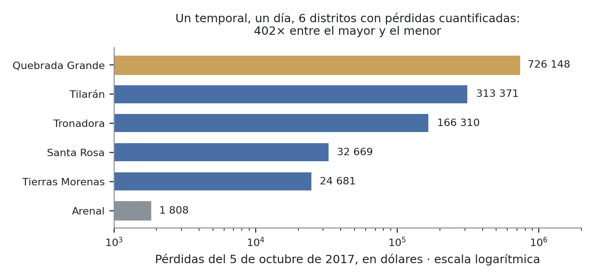
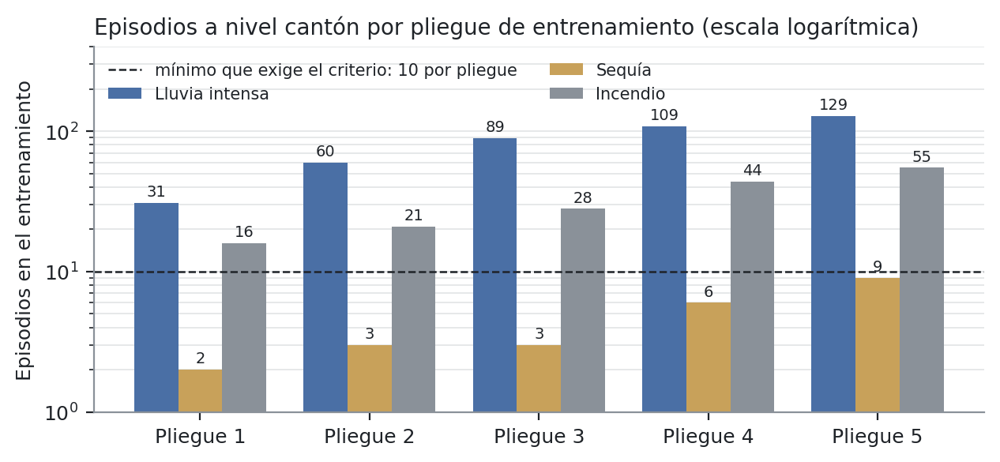
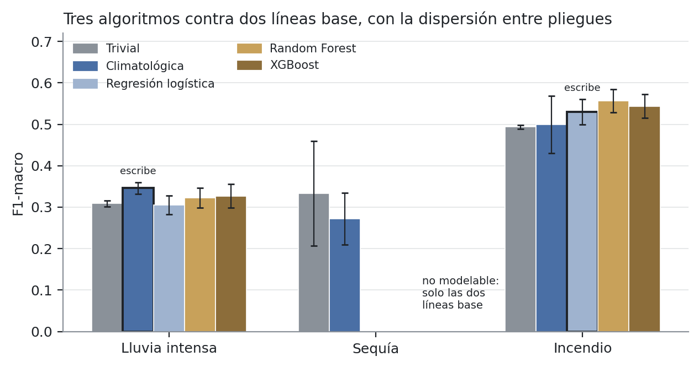

---
author:
  - "Alejandro Josué Rodríguez Zamora"
  - "César Andrés Ubau Calvo"
  - "Luis Alejandro Luna García"
  - "Avril Madrigal Elizondo"
institute: "Universidad Invenio · Ingeniería en Tecnologías de Información · III Trimestre 2026"
date: "10 de septiembre de 2026"
lang: es
---

# ¿Bastan los datos abiertos para estimar riesgo climático por distrito? Un estudio de caso en el cantón de Tilarán, Costa Rica

::: no-entregable

**Historia:** H10.5c · **Rúbrica:** IEEE · **Responsable:** Alejandro
**Depende de:** H10.5b (cerrada) · **Bloquea a:** H10.6, el cartel académico

---

> ## Estado de este documento
>
> **Versión de entrega, 10 de septiembre de 2026.** Reescrito sobre la versión
> del 30 de agosto para incorporar la retroalimentación docente del 27 de agosto
> (`docs/evidencias/entregables/retroalimentacion-docente-2026-08-27.md`) y los
> resultados cerrados desde entonces: los tres algoritmos entrenados y afinados
> (H3.3 a H3.8), la decisión de modelabilidad de la sequía (D-34), la regla de
> escritura (D-39, D-42), la importancia de variables y las explicaciones
> locales (H4.1, H4.2) y el despliegue público con datos reales.
>
> **Qué cambió respecto de la versión anterior, y por qué:**
>
> | Cambio | Motivo |
> |---|---|
> | Tres preguntas de investigación numeradas, y cada una se responde en VI | «Plantear preguntas de investigación y responderlas en el desarrollo» |
> | Introducciones en II y en I-C | Pedidas el 27 de agosto |
> | La metodología abre diciendo cómo resuelve el problema de I-A | «Metodología = cómo vamos a resolver el problema» |
> | Se retiró la sección de arquitectura, la verificación continua y el anexo de procedencia de cifras | «Documentación técnica no va en IEEE». Están en `docs/17-documento-tecnico.md` |
> | Seis figuras, cada una con su tabla y referida desde el texto | «Tabular los datos para hacer los gráficos», «poner ver figura tal» |
> | La hipótesis H1 se reporta **rechazada** con la medición cerrada | «No mostrar avances donde no hemos llegado». Ningún algoritmo supera a la línea base fuera del ruido |
> | Conclusiones reescritas desde lo medido; el trabajo futuro va aparte | «La conclusión sale de la investigación realizada» |
>
> **Actualizado el 14 de setiembre.** La versión anterior declaraba que no
> reportaba la medición de H3.9 —calendario y geografía en la matriz— porque la
> historia estaba abierta. Cerró el 13 de setiembre y está en producción: entra a
> V-D con su tabla (XVIII) y cambia quién escribe la estimación de incendio
> (V-E). Con el mismo corte entra el contraste de las **estimaciones publicadas**
> contra el catálogo de eventos reales (V-G, Tabla XVII), que hasta ahora solo se
> había hecho sobre el etiquetado.
>
> **Las cifras.** Las que la integración continua puede recalcular las vigila
> `verificar_documentacion.py`. Las que salen del conjunto etiquetado —que no se
> versiona— están transcritas de las evidencias que se citan al pie de cada
> tabla, y las dos figuras nuevas se dibujan desde `docs/figuras/datos/`.

:::

---

## Resumen

Este trabajo pregunta si los datos climáticos y satelitales de acceso abierto
bastan para estimar el nivel de riesgo de lluvia intensa, sequía e incendio
forestal **por distrito** en el cantón de Tilarán, Guanacaste, Costa Rica, a un
horizonte de siete días. Se construyó un sistema completo sobre esas fuentes
—precipitación de CHIRPS, reanálisis de NASA POWER, focos de calor de FIRMS y
geometrías oficiales del SNIT—, se etiquetó la variable objetivo con umbrales
tomados de estándares publicados, se validó ese etiquetado contra 46 eventos
históricos con daños documentados, y se compararon tres algoritmos supervisados
—regresión logística, Random Forest y XGBoost— contra dos líneas base bajo
validación temporal por ventana expansiva, con F1-macro como métrica y con la
regla de decisión fijada antes de entrenar.

Los resultados responden en tres planos. Primero, cuatro de las cinco variables
climáticas consideradas **no distinguen distritos**: la celda del reanálisis
global cubre el cantón entero, y solo la precipitación cae en una celda distinta
por distrito. Segundo, la hipótesis de que un modelo supervisado supera a la
línea base climatológica **se rechaza**: sobre 99 296 filas y 34 años, ningún
algoritmo la supera fuera de la dispersión entre pliegues en lluvia intensa ni
en incendio, y la sequía no alcanza el mínimo de episodios independientes que
el propio diseño exigía para modelarse (13 episodios en 34 años, 2 en el peor
pliegue; al rehacer la cuenta sobre 76 años de reanálisis, 24 y 1). Tercero, el etiquetado sí reconoce los eventos reales: marca riesgo
en la semana previa a un evento histórico 4,74 veces más a menudo que en una
semana cualquiera en lluvia intensa y 6,31 veces en sequía.

El aporte no es el modelo, que no gana: es la medición de por qué no gana, con
siete hallazgos sobre la aptitud de los datos abiertos globales a escala
cantonal, cuatro de los cuales habrían producido resultados aparentemente
válidos y silenciosamente incorrectos. El sistema está publicado con datos
reales y sirve, para lluvia intensa e incendio, la estimación del estimador
más simple que la medición no pudo distinguir de los demás.

*Palabras clave:* riesgo climático, datos abiertos, aprendizaje automático,
línea base climatológica, resolución espacial, SPI, validación temporal, Costa
Rica.

---

## I. Introducción

### A. Definición del problema

**Contexto.** El cantón de Tilarán, en la vertiente del embalse Arenal, tiene
un régimen de precipitación abundante que lo distingue del resto de Guanacaste,
y tres afectaciones recurrentes: la lluvia intensa, que satura el suelo,
provoca deslizamientos y corta caminos rurales; el déficit hídrico de la
estación seca; y los incendios forestales que la acompañan. Las decisiones que
esos eventos exigen —evacuar, cerrar un paso, mover ganado, adelantar una
cosecha, asignar cuadrillas— las toman la Municipalidad, su Comité Municipal
de Emergencias y los productores, **y las toman por distrito**, porque el
cantón tiene ocho distritos con relieve, uso del suelo y exposición distintos.

**El problema.** La información para anticipar esos eventos existe y es
pública: series climáticas de reanálisis, precipitación satelital, detección
de focos de calor y los registros históricos de daños. Pero llega en tres
condiciones que la vuelven inutilizable para decidir por distrito. Primero,
**está dispersa** entre instituciones y formatos, sin un tratamiento que la
traduzca a una respuesta concreta: qué tan expuesto está cada distrito esta
semana. Segundo, **los avisos operativos se emiten a escala nacional o
regional** (sección II), de modo que un valor único para todo el cantón es a la
vez exagerado para unos distritos e insuficiente para otros. Tercero, **las
fuentes abiertas de cobertura global se distribuyen en celdas más grandes que
un distrito de Tilarán**, así que ni siquiera está establecido que contengan la
diferencia entre distritos que se necesita. La consecuencia es operativa: sin
una lectura anticipada y desagregada, la respuesta institucional se activa
cuando el evento ya ocurrió.

**Evidencia de que la escala importa.** El 5 de octubre de 2017 la tormenta
tropical Nate cruzó el cantón. Los siete distritos con registro reportaron
daños **ese mismo día**, y lo que reportaron no se parece (Tabla I).

**Tabla I.** Daños por distrito el 5 de octubre de 2017, tormenta tropical Nate.
Fuente: catálogo de eventos históricos de este trabajo, compilado desde
DesInventar Costa Rica `[37]`.

| Distrito | Daño principal | Pérdidas |
|---|---|---|
| Quebrada Grande | 93 fincas de ganadería de leche, 31 de plátano, una escuela | **726 148 USD** |
| Tilarán | puentes, derrumbe de carril, tomate y aves | 313 371 USD |
| Tronadora | puentes, carril y cuneta obstruidos | 166 310 USD |
| Santa Rosa | colapso de alcantarillado, corte de carretera | 32 669 USD |
| Tierras Morenas | media calzada obstruida, maíz y tomate | 24 681 USD |
| Arenal | socavación de calzada, cuatro fincas de ganado | **1 808 USD** |
| Líbano | cortes totales de carretera por socavación | 15 400 m de vía |

En total, **1,26 millones de dólares y 223 km de vías dañadas en un día**, y
entre el distrito más afectado y el menos afectado un factor de
**cuatrocientos**, que la Fig. 1 hace visible en escala logarítmica: en escala
lineal seis de las siete barras quedan pegadas al cero y se pierde justamente
lo que importa, que es el rango. El Instituto Meteorológico Nacional emitió
aviso; lo que ese aviso no podía decir es que en Quebrada Grande había que
mover ganado lechero y en Arenal vigilar una calzada.

**Fig. 1.** Pérdidas por distrito el 5 de octubre de 2017, en escala logarítmica.
Datos de la Tabla I. Líbano no aparece porque su ficha reporta el daño en metros
de vía y no en dólares; Cabeceras no tiene ficha para este evento, y la ausencia
de ficha es ausencia de reporte, no de lluvia (ver VIII-C).

No es un evento aislado. El catálogo de este trabajo reúne **46 registros de 29
eventos con daños documentados en Tilarán entre 1970 y 2026**, incluido un
fallecido por deslizamiento en Río Chiquito en 1976, y los siete distritos con
registro aparecen en él.

**Enunciado.** El problema que este trabajo aborda no es la falta de datos ni la
falta de un pronóstico, sino **la ausencia de un método reproducible que
integre las fuentes abiertas disponibles y las traduzca a un nivel de riesgo por
distrito y por semana, y la incertidumbre previa sobre si esas fuentes tienen la
resolución para hacerlo**. Los beneficiarios directos son la Municipalidad de
Tilarán y su Comité Municipal de Emergencias; los indirectos, los productores
agropecuarios y las asociaciones de acueductos comunales del cantón. El problema
tiene, entonces, tres partes que hay que separar y responder por su cuenta: si
el dato *resuelve* el distrito, si un modelo *aprende* algo que el calendario
no diga ya, y si la variable objetivo con la que se entrena *reconoce* los
eventos que de verdad ocurrieron.

### B. Preguntas de investigación e hipótesis

La pregunta general es:

> ¿En qué medida permiten los datos climáticos y satelitales de acceso abierto
> estimar el nivel de riesgo de lluvia intensa, sequía e incendio forestal por
> distrito en el cantón de Tilarán, con un desempeño superior al de una línea
> base climatológica?

Se descompone en tres preguntas, cada una con una sección que la responde:

- **PI1.** ¿Distinguen las fuentes abiertas globales entre los ocho distritos
  del cantón? Es una pregunta sobre el dato, anterior a cualquier modelo. Se
  responde en la sección IV y se discute en VI-A.
- **PI2.** ¿Supera un modelo supervisado, entrenado sobre variables derivadas de
  esas fuentes, a una línea base construida solo con el calendario? Se responde
  en V-B a V-F y se discute en VI-B.
- **PI3.** ¿Reconoce la variable objetivo —construida con umbrales publicados—
  los eventos con daños que ocurrieron de verdad en el cantón? Se responde en V-G
  y se discute en VI-C.

**Hipótesis H1.** Un modelo supervisado entrenado sobre variables derivadas de
fuentes abiertas alcanza un F1-macro superior al de una línea base construida a
partir de la normal climatológica 1991–2020, a un horizonte de siete días.

La hipótesis se declaró **refutable por diseño** antes de entrenar: se fijó la
métrica, la partición temporal, la regla que decide cuándo una diferencia cuenta
y el mínimo de datos por debajo del cual un evento no se modela. Con eso, las
dos respuestas son informativas. Si los modelos superan la línea base, el
resultado es un sistema utilizable. Si no la superan, el resultado es que en
este cantón y a siete días la estacionalidad explica casi todo lo que estas
fuentes permiten explicar, y eso responde igual de bien.

### C. Aportes

Los aportes se separan en tres planos porque tienen distinta naturaleza: uno es
un artefacto, otro es una medición sobre los datos y el tercero es un resultado
experimental. Conviene no confundirlos, porque el segundo se sostiene con
independencia del tercero.

1. **Un sistema completo, reproducible y publicado**, construido exclusivamente
   sobre datos abiertos, que sirve por distrito y por día la estimación del
   estimador que la medición eligió, y que declara cuándo no tiene estimación en
   vez de rellenarla. Su arquitectura, tecnologías, verificación y despliegue
   están en la documentación técnica que acompaña a este artículo `[38]`; aquí
   solo entra lo que hace falta para entender la medición.
2. **Siete hallazgos medidos sobre la aptitud de los datos abiertos globales a
   escala cantonal** (sección IV), con las herramientas que los producen. Cuatro
   de ellos habrían producido resultados con forma válida y contenido
   equivocado.
3. **Una comparación de tres algoritmos contra dos líneas base bajo validación
   temporal estricta, con la regla de decisión fijada antes de entrenar**, cuyo
   resultado es negativo y se reporta como tal (sección V), junto con una
   validación externa del etiquetado que no requiere modelo (V-G).

---

## II. Trabajo relacionado

Esta sección sitúa el trabajo en tres coordenadas: qué sistema opera hoy en Costa
Rica para el evento mejor cubierto, qué se ha establecido sobre el fenómeno más
estudiado de la región, y qué queda sin ocupar entre ambos. El orden es
deliberado: primero lo que existe y funciona, después lo que la literatura da por
resuelto, y solo al final el vacío que este trabajo aborda. La revisión cubrió
literatura indexada y tesis de posgrado del país, y cada referencia entró con su
contenido verificado; este documento cita las que sostienen una afirmación
concreta.

### A. Existe un sistema nacional, y declara sus límites

Costa Rica opera desde 2020 el **Sistema de Alerta Temprana de Incendios
Forestales (SATIF)**, gestionado por el Programa Nacional de Manejo del Fuego del
SINAC-MINAE con apoyo del Instituto Meteorológico Nacional. Implementa el Fire
Weather Index canadiense adaptado al país, con cuatro categorías de peligro `[25]`.

Su propio operador declara el alcance: el SATIF **"se basa únicamente"** en
temperatura, humedad relativa, velocidad del viento y lluvia, y **"no toma en
cuenta el riesgo, topografía o combustibles (vegetación)"** `[25]`.

Esa declaración delimita el aporte de este trabajo con precisión y sin inflarlo.
Un índice meteorológico de peligro no es una estimación de riesgo, y al depender de
estaciones no produce un valor por distrito. Son cosas distintas.

**Y no las reemplaza.** El SATIF lleva cinco años operando con respaldo
institucional; este proyecto es un prototipo de un trimestre. La comparación
honesta es de naturaleza, no de calidad.

### B. La sequía en el Pacífico Norte está estudiada

El Centro de Investigaciones Geofísicas de la Universidad de Costa Rica tiene
trabajo sostenido sobre sequía en Guanacaste, y el SPI está establecido como el
índice pertinente para la región `[15]`. Ese trabajo asocia índices de sequía con
impactos socioproductivos en tres cantones de la provincia usando, entre otras
fuentes, el mismo inventario de desastres que emplea este proyecto. Este
proyecto no discute esa elección de índice: la adopta, y toma de `[15]` la
escala de seis meses como la que mejor representa la estación lluviosa de la
vertiente del Pacífico.

Sobre la relación entre el ENOS y la precipitación del Área de Conservación
Guanacaste existe además evidencia regional `[16]`, que este trabajo no
incorpora al modelado y anota como línea futura (sección X).

### C. Ya existe estimación de riesgo por distrito en Costa Rica

**Y es el antecedente más cercano a este trabajo.** Rojas Morales `[29]` estima
índices de riesgo de desastre por lluvia extrema **para los 459 distritos de
Costa Rica**, con precipitación de CHIRPS a 0,05° y un modelo Probit que combina
la anomalía de precipitación con variables socioeconómicas, biofísicas y
geográficas. Mismo país, misma unidad administrativa, misma fuente de
precipitación, mismo evento.

De ese trabajo se toman dos resultados que este proyecto no vuelve a discutir:

- **CHIRPS v2 ajusta mejor en época lluviosa que en seca**, y en época seca
  tiende a subestimar en la mayoría de las estaciones de validación.
- **Ajusta mejor en zonas de relieve suave que en zonas montañosas**, donde el
  relieve gobierna el patrón de lluvia. Tilarán es montañoso, y eso entra en las
  amenazas a la validez (VIII-A).

### D. El vacío que este trabajo ocupa

Dado ese antecedente, el aporte no puede formularse como «estimar riesgo por
distrito», que ya está hecho. Lo que no se localizó es trabajo publicado que, en
un cantón costarricense, **compare algoritmos supervisados contra una línea base
climatológica bajo validación temporal**, con datos exclusivamente abiertos, y
que **valide la variable objetivo antes de entrenar**. La Tabla II resume las
diferencias con `[29]`, que son de método más que de tema.

**Tabla II.** Diferencias metodológicas con el antecedente más cercano.

| | Rojas Morales `[29]` | Este trabajo |
|---|---|---|
| Alcance | 459 distritos, un evento | 8 distritos, tres eventos |
| Modelo | Probit, un ajuste | Tres algoritmos contra dos líneas base |
| Validación | Ajuste sobre el período completo | Ventana expansiva, cinco pliegues, con embargo |
| Verdad de terreno | Se asume | Se contrasta contra 46 registros antes de modelar |
| Operación | Estudio retrospectivo | Sistema publicado que se ejecuta y sirve |

La formulación es deliberada: **«no se localizó» no equivale a «no existe»**. La
búsqueda cubrió literatura indexada, y `[29]` es precisamente una tesis de
posgrado que **no** apareció en la primera revisión y sí en la segunda. Eso es un
dato sobre el alcance de la búsqueda, no sobre la literatura.

En el plano metodológico, este trabajo se apoya en resultados establecidos que
no reproduce: la validación cruzada para series temporales `[11]` y sus
extensiones a datos con estructura espacial `[32]`, las métricas para clases
desbalanceadas `[12]`, `[20]`, el problema del cambio de soporte al llevar una
celda a una unidad administrativa `[30]`, `[31]`, y la evidencia de que los
errores de etiqueta invierten el orden de una comparación de modelos `[33]`.

---

## III. Metodología

La sección I-A planteó un problema con tres partes: saber si el dato **resuelve**
el distrito, saber si un modelo **aprende** algo que el calendario no diga ya, y
saber si la variable objetivo **reconoce** los eventos reales. Esta sección
describe cómo se resuelve cada parte, en ese orden, y cierra diciendo qué
sección responde qué pregunta.

La primera parte se resuelve **midiendo la resolución de cada fuente contra la
geometría oficial del cantón** antes de usarla, y declarando cuáles no distinguen
distritos en vez de descartarlas en silencio (III-B, IV-A). La segunda se
resuelve con un **diseño experimental fijado antes de entrenar**: partición
temporal por ventana expansiva, dos líneas base, una métrica, una regla que dice
cuándo una diferencia cuenta y un mínimo de datos por debajo del cual un evento
no se modela (III-E). La tercera se resuelve **contrastando el etiquetado contra
un catálogo independiente de eventos históricos** antes de que exista modelo
alguno (III-F). Es una metodología de investigación con un artefacto en el
medio: el sistema existe para producir la medición, no al revés. Lo que del
sistema no hace falta para seguir la medición —contratos entre módulos,
esquema de datos, interfaz de programación, integración continua,
despliegue— se documenta aparte `[38]`.

### A. Área de estudio

Cantón de Tilarán, provincia de Guanacaste, código 508 de la División Territorial
Administrativa. Ocho distritos, códigos 50801 a 50808: Tilarán, Quebrada Grande,
Tronadora, Santa Rosa, Líbano, Tierras Morenas, Arenal y Cabeceras.

Las geometrías provienen de la capa distrital del **Sistema Nacional de
Información Territorial (SNIT)** `[8]`, filtradas por código de cantón, con
registro de procedencia —fecha, sumas de verificación y número de entidades
devueltas—. **Extensión medida:** 30,7 × 36,6 km de caja envolvente, 669,23 km²
de superficie efectiva.

### B. Fuentes de datos

Todas las fuentes son públicas y gratuitas, sin credenciales de pago ni
instrumentación propia (Tabla III). La ventana temporal es **1991–2025**: la
línea base climatológica se define sobre la normal 1991–2020 `[6]` y con menos
registro no se puede calcular como está declarada.

**Tabla III.** Fuentes de datos, resolución y aptitud para distinguir distritos.

| Variable | Fuente | Resolución | ¿Distingue distritos? |
|---|---|---|---|
| Precipitación | CHIRPS v2 `[28]` | 0,05° ≈ 5,5 km | **Sí**: ocho celdas distintas (IV-A) |
| Temperatura, humedad, radiación, viento | NASA POWER, MERRA-2 `[1]` | 0,625° × 0,5° ≈ 68 × 55 km | **No**: una celda cubre el cantón (IV-A) |
| Focos de calor | NASA FIRMS `[2]`, `[14]` | 1 km (MODIS, desde 2001) y 375 m (VIIRS, desde 2012) | Puntual |
| Geometrías distritales | SNIT, IGN `[8]` | vectorial | Fuente oficial |

**La fuente de precipitación es distinta de la del resto de variables por una
razón medida, no por conveniencia**: el motivo está en IV-A. Las dos fuentes no
son intercambiables —para un mismo día y punto, POWER reportó 0,0 mm y CHIRPS
18,72 mm— y por eso no se mezclan en una misma serie.

### C. Índices derivados y umbrales

Sobre las series se calculan dos familias de índices, ambas tomadas de
estándares publicados:

- **SPI** (Standardized Precipitation Index) `[4]`, `[24]`, por convolución de
  ventana móvil sobre el acumulado mensual, con ajuste gamma **por mes
  calendario** y corrección para ceros mediante distribución mixta
  `H(x) = q + (1−q)·G(x)` `[27]`. La escala de integración es de **seis meses**;
  la elección entre 3, 6 y 12 meses se hizo midiendo (V-G) y no por convención.
- **Percentiles 95 y 99 del acumulado de 72 horas** de precipitación, por
  distrito, sobre el período base 1991–2020, siguiendo el criterio de percentiles
  extremos del ETCCDI `[18]` pero **no su índice R95p**, que se define sobre
  precipitación diaria de días húmedos. La diferencia está medida en IV-D.

Para el resto de variables se implementa filtrado de ruido con Savitzky-Golay,
elegido sobre la media móvil porque preserva los máximos (conserva el 48,6 % de
la amplitud de un pico aislado contra el 20,0 % de la media móvil). **El filtro
no se aplica a la precipitación**, y esa decisión se tomó midiendo (IV-B).

### D. Etiquetado de la variable objetivo

La variable objetivo son tres niveles —bajo, medio, alto— por evento, distrito y
día, y describe la ventana de los siete días siguientes. Los umbrales están en la
Tabla IV.

**Tabla IV.** Umbrales de la variable objetivo, por evento.

| Evento | Umbral | Origen |
|---|---|---|
| Lluvia intensa | Percentiles 95 (medio) y 99 (alto) del acumulado de 72 h, por distrito | Criterio de percentiles extremos del ETCCDI `[18]` |
| Sequía | SPI-6: alto si ≤ −1,5; medio si −1,5 < SPI ≤ −1,0 | McKee et al. `[4]`, adoptado por la OMM `[24]` |
| Incendio forestal | Al menos un foco de calor en la ventana de 7 días: alto. No existe nivel medio | **Criterio del equipo**, corregido tras medir. No hay estándar equivalente |

El umbral de incendio es el único propio y se declara como tal en el sistema y en
la interfaz. **Y es el único de los tres que la medición obligó a rehacer.** La
definición original —bajo si 0 focos, medio si entre 1 y el percentil 90, alto por
encima— no producía tres clases sobre estos datos sino dos: con **242 focos en 24
años** y entre el 97 % y el 99,9 % de ventanas vacías, el percentil 90 vale 0,0
en los ocho distritos y la condición intermedia queda vacía. Los dos umbrales
tomados de estándares publicados resistieron la verificación; el propio, no.

El alcance del evento de incendio se acota además a **tres de los ocho
distritos** —Santa Rosa, Líbano y Tierras Morenas, que concentran el 88 % de los
focos—. Los otros cinco se reportan como «sin datos suficientes»: dos de ellos
registran un solo foco en veinticuatro años.

Dos reglas transversales gobiernan el etiquetado. **La ausencia de dato es
ausencia, nunca cero**: un período sin observación devuelve etiqueta nula, no
«bajo» (el hallazgo IV-G muestra lo que cuesta olvidarlo). Y **la unidad de
muestra son episodios, no filas**: un solo foco de calor marca siete filas como
«alto», y una sequía que pega en los ocho distritos a la vez es una sequía, no
ocho. Los episodios se cuentan **a nivel cantón** —una racha de días en que
algún distrito está en alto— porque los ocho distritos comparten el fenómeno
meteorológico y, para cuatro de las cinco variables, literalmente la misma celda
de la fuente.

### E. Diseño experimental: cómo se responde PI2

Todo lo que sigue se fijó **antes de entrenar el primer modelo**, y se declara en
ese orden porque el orden es la garantía.

**Algoritmos.** Tres, elegidos por familia y no por moda: regresión logística
`[17]` como modelo lineal interpretable, Random Forest `[9]` como ensamble por
agregación robusto ante ruido, y XGBoost `[5]` como ensamble por refuerzo, el
estado del arte en tabulares. Implementados sobre scikit-learn `[19]` y la
biblioteca de XGBoost. Los hiperparámetros se afinaron sobre una rejilla
declarada y acotada (28 combinaciones), usando **únicamente la ventana de
entrenamiento del primer pliegue**, que es la única enteramente anterior a todos
los bloques de prueba; los estimadores afinados son los que se reportan y los que
escribe el sistema.

**Matriz de características.** 27 columnas derivadas de cuatro variables diarias
—precipitación, temperatura máxima, humedad relativa y viento— mediante rezagos
de uno a tres días y medias móviles de 3, 7 y 30 días. Ninguna de esas columnas
dice qué día del año es ni de qué distrito se trata, y esa asimetría frente a la
línea base es deliberada: se discute en VI-B.

El **13 de setiembre** se cerró agregando cinco columnas —seno y coseno del día
del año, y la longitud, la latitud y el tamaño del distrito, leídos de la
geometría oficial—: la matriz pasa a **32 columnas** y los modelos ven la fecha y
el lugar. La comparación se rehízo entera con esa matriz y el resultado está en
V-D (Tabla XIII). Todo lo que este documento reporta sobre importancia de
variables y explicaciones locales (V-F) se midió **antes** de ese cambio, sobre
las 27, y se indica donde corresponde.

**Dos líneas base, no una.** La **trivial** predice siempre la clase mayoritaria
del entrenamiento y es el piso absoluto. La **climatológica** predice, para cada
distrito y mes calendario, la clase de mayor *realce* —tasa en esa celda dividida
por la tasa en todo el entrenamiento—. No se define como la clase modal, que es la
formulación de manual, porque sobre estos datos esa formulación degenera en la
trivial: con clases positivas de entre el 1 % y el 7 %, «bajo» es la clase modal
en las noventa y seis celdas de distrito por mes. Ambas miran **solo el
calendario**; en cuanto una línea base usa precipitación deja de ser línea base.

**Métrica.** F1-macro `[12]`, por el desbalance entre clases `[20]`. La trivial no
es un artificio retórico: sobre incendio alcanza F1-macro 0,494 acertando el
98,8 % de las filas, porque la clase minoritaria es el 1,23 % del conjunto. Un
informe que reportara solo exactitud haría parecer excelente a un modelo que no
predice nada.

**Partición temporal.** Ventana expansiva `[11]` con **cinco pliegues**, cada uno
entrena con todo el pasado disponible y evalúa el bloque siguiente. El corte
aleatorio está prohibido: sobre una serie temporal permite que el modelo vea el
futuro y produce métricas altas sin significado. Tres propiedades adicionales,
que la implementación obligó a fijar: un **embargo de siete días** entre
entrenamiento y prueba, porque la etiqueta de la fila *t* describe la ventana
(*t*, *t*+7]; **cortes en frontera de mes calendario**, porque el SPI-6 no cambia
dentro del mes; y **cada evento se parte sobre su propio período observado**,
porque el archivo de focos empieza en 2001 y no en 1991.

**Regla de decisión.** Se fijó antes de mirar ningún resultado: *si la ventaja de
un estimador sobre el siguiente es menor que lo que ese mismo estimador se mueve
entre pliegues, no se declara ganador.* Con cinco pliegues correlacionados esa es
toda la resolución disponible, y **no se reportan pruebas de significancia**:
cinco pliegues de ventana expansiva no son cinco muestras independientes, y un
valor *p* calculado sobre ellos sonaría riguroso sin serlo. Se reportan la
media y el rango entre pliegues.

**Qué estimador escribe.** Cuando ningún estimador gana fuera del ruido, el
sistema publica la estimación del **más simple** de los que quedan dentro del
ruido del mejor, con un orden de simplicidad fijo: climatológica, regresión
logística, Random Forest, XGBoost. La trivial nunca escribe, porque «siempre
bajo» convertiría la ausencia de señal en riesgo bajo; y nadie escribe por
debajo del piso trivial. La regla se recalcula en cada corrida.

**Mínimo para modelar.** Un evento no se modela si tiene **menos de 30 episodios
independientes en total, o menos de 10 en el entrenamiento de cualquier
pliegue**. El umbral se escribió antes de contar, para que la decisión no
dependiera del resultado.

### F. Validación externa del etiquetado: cómo se responde PI3

Antes de que exista un modelo hay una pregunta previa: ¿la verdad de terreno
reconoce los eventos que de verdad ocurrieron? Northcutt et al. `[33]` auditaron
los conjuntos de prueba de diez de los repositorios más usados en aprendizaje
automático, encontraron un 3,4 % de error de etiqueta en promedio, y mostraron
que con suficiente proporción de etiquetas mal puestas **el orden del ranking de
modelos se invierte**. Comparar tres algoritmos sobre una variable objetivo no
auditada es comparar contra un criterio que puede estar ordenando al revés.

Se compiló un **catálogo de 46 registros de 29 eventos históricos** con daños
documentados en Tilarán entre 1970 y 2026, principalmente desde DesInventar
Costa Rica `[37]` —41 de los 46 registros, con distrito explícito— y, para dos
eventos fuera de su cobertura, desde prensa nacional y partes de la Comisión
Nacional de Emergencias. Un evento del día *E* se considera anunciado si alguna
etiqueta en la ventana [*E*−7, *E*−1] marcaba riesgo medio o alto. Se reporta la
**cobertura** (fracción de eventos anunciados) con su intervalo de Wilson al 95 %
`[34]`, la **tasa base** (fracción de días cualesquiera con marca) y el **realce**,
que es el cociente entre ambas y la métrica que importa: una cobertura alta se
consigue marcando siempre; el realce, no. **No se reporta precisión**, porque el
catálogo registra daños reportados y está incompleto por construcción: una
marca sin registro no es un falso positivo.

### G. Correspondencia entre preguntas, métodos y secciones

La Tabla V resume qué método responde cada pregunta y en qué sección se lee la
respuesta; es la guía de lectura del resto del documento.

**Tabla V.** Qué sección responde cada pregunta, y con qué.

| Pregunta | Método | Se responde en | Se discute en |
|---|---|---|---|
| PI1 · ¿el dato resuelve el distrito? | Medición de la resolución de cada fuente contra la geometría oficial | IV-A, IV-C, IV-G | VI-A |
| PI2 · ¿el modelo supera al calendario? | Tres algoritmos contra dos líneas base, cinco pliegues, regla de decisión previa | V-B a V-F | VI-B |
| PI3 · ¿la etiqueta reconoce los eventos reales? | Contraste contra 46 registros históricos, cobertura y realce | V-G | VI-C |

---

## IV. Hallazgos sobre la aptitud de los datos abiertos a escala cantonal

**Esta sección responde PI1 y es el aporte que se sostiene con independencia de
cómo salgan los modelos.** Los siete hallazgos se obtuvieron durante la
construcción, se midieron con herramientas que se publican con el proyecto, y
**cuatro de ellos (B, C, D y G) habrían producido resultados aparentemente
válidos y silenciosamente incorrectos**.

### A. Las fuentes climáticas globales de reanálisis no resuelven el cantón

NASA POWER sirve MERRA-2 en una malla de 0,625° × 0,5°, unos **68 × 55 km** a la
latitud de Tilarán. El cantón mide 669,23 km² y **cabe entero dentro de una sola
celda**. Comprobado empíricamente: dos puntos separados dentro del cantón
devuelven valores idénticos hasta el último decimal, e incluso la misma
elevación.

**La consecuencia no es pérdida de precisión, es imposibilidad.** Dos de los tres
eventos se definen sobre precipitación. Con una sola celda, los ocho distritos
habrían dado el mismo riesgo siempre, **por construcción**, y el sistema habría
respondido su propia pregunta de investigación por artefacto de la fuente.

CHIRPS, a 0,05°, sí distingue: los ocho distritos caen en **ocho celdas
distintas**, con una diferencia del 20,3 % en el acumulado semanal entre los
extremos. Y el orden entre distritos **se invierte entre días**, lo que descarta
que sea un sesgo constante del método y confirma variación espacial real.

Un detalle metodológico que costó una corrección: las mallas no se anclan igual.
POWER ancla los **centros** de celda en múltiplos del paso y CHIRPS ancla los
**bordes**. La primera versión de la herramienta de medición suponía lo
contrario y contradecía la observación directa; se corrigió y se le agregó una
autoprueba contra el dato observado.

### B. Filtrar la precipitación destruye los índices que se calculan sobre ella

El filtro de ruido de la sección III-C es correcto para variables con ruido
instrumental. Aplicado a la precipitación produce series que **no son series de
lluvia** (Tabla VI).

**Tabla VI.** Efecto de un filtro Savitzky-Golay (ventana 7, orden 2) sobre 35
años de precipitación diaria.

| Efecto | Magnitud |
|---|---|
| Días con precipitación negativa | **12,47 %**, mínimo −13,47 mm |
| Días secos que pasan a contar como húmedos | **31,62 %** |
| Caída del P99 de días húmedos | **−53,6 %** |
| Días del 1 % más extremo que sobreviven al umbral original | **0 de 37** |

No es un defecto de implementación: los coeficientes de Savitzky-Golay para
ventana 7 y orden 2 son **negativos en los extremos**, así que un día contiguo a un
aguacero recibe contribución negativa. Es una propiedad del método. El 31,62 % es
el más grave de los dos: el umbral de día húmedo del ETCCDI es exactamente 1 mm,
y filtrar **reescribe el denominador** de los índices. Con ventana 3 y orden 2 el
filtro no cambia nada, porque con tres puntos una parábola pasa exactamente por
los tres: *la única configuración que no daña la precipitación es aquella en la
que el filtro no hace nada.*

### C. Un SPI sin ajuste por mes calendario mide estacionalidad, no anomalía

El SPI ajusta una distribución gamma **por cada mes calendario**: los eneros
contra la distribución histórica de los eneros `[24]`. Eso es lo que lo convierte
en un índice de anomalía. Con ajuste único para toda la serie, sobre 35 años de
régimen del Pacífico Norte, el resultado es el de la Tabla VII.

**Tabla VII.** SPI medio por estación según el tipo de ajuste.

| | Ajuste único | Ajuste por mes |
|---|---|---|
| SPI medio en estación seca | **−0,84** | −0,00 |
| SPI medio en estación lluviosa | **+0,60** | −0,00 |

Un índice de anomalía cuya media es −0,84 en una estación y +0,60 en la otra no
está midiendo anomalía. **De los 99 meses que el ajuste único declara en sequía,
los 99 caen en estación seca**: el índice no detecta sequía, detecta que es
verano. La correlación entre ambos métodos es 0,425, lo que impide tratarlos como
dos versiones de lo mismo con distinta precisión.

**Dónde se paga.** Una etiqueta de sequía correlacionada con el mes calendario
haría que un modelo entrenado sobre ella aprendiera el calendario en lugar del
clima, **y en la evaluación se vería bien**, porque la estación seca es
predecible. Es la misma familia de resultado engañoso que la fuga temporal.

### D. El percentil del acumulado de 72 h no es el índice R95p

Dos cantidades que el proyecto llegó a nombrar igual, medidas sobre el mismo
período base de 30 años (Tabla VIII).

**Tabla VIII.** Percentiles de precipitación según la definición.

| | P95 | P99 |
|---|---|---|
| ETCCDI, diario sobre días húmedos `[18]` | 39,90 mm | 54,86 mm |
| Acumulado de 72 h (este trabajo) | 63,40 mm | 87,70 mm |

Aplicar el umbral equivocado **multiplica por 8,5** los días declarados en riesgo
alto: de 110 a 934 sobre 10 956 ventanas. El umbral del proyecto no cambia —el
acumulado de 72 h es el adecuado para riesgo de inundación, porque un evento de
lluvia intensa dura más de un día—; lo que cambió fue el nombre. **Un umbral
atribuido a una fuente equivocada es peor que un umbral sin citar.**

### E. No hay registro histórico de incendios forestales en el cantón

DesInventar Costa Rica `[37]` devuelve 98 fichas para Tilarán entre 1968 y 2017,
cada una con distrito explícito. **Ninguna es un incendio forestal.** La base
distingue el tipo *FIRE* del tipo *FORESTFIRE*, y las cuatro fichas *FIRE* de
Tilarán son incendios estructurales —locales comerciales, una bodega—.

Consecuencia directa: el contraste del componente de incendio **no se puede hacer
contra este inventario**, y no por una limitación de este trabajo sino porque el
inventario no contiene el fenómeno. Queda como limitación declarada (VII-B).

La afirmación es sobre **esta fuente**, no sobre la existencia del fenómeno. El
catálogo de eventos que se usa en V-G incorpora un incendio forestal del cantón
documentado por prensa en 2026, fuera del período etiquetado y por lo tanto
inútil para validar el etiquetado, pero utilizable contra las estimaciones
publicadas, que proyectan más allá de la última etiqueta.

### F. La sequía histórica no está desagregada por distrito

Las sequías de 1972, 1973, 1976, 1977, 1982 y 1983 existen en el registro **con el
campo de distrito vacío**. La de 2014 sí está desagregada, y solo porque una
declaratoria de emergencia obligó a inventariar la afectación finca por finca.
De ahí sale la observación más general de esta sección:

> **La disponibilidad de datos históricos a escala distrital no depende de la
> severidad del evento, sino de si existió un instrumento administrativo que
> obligara a levantarlos.** Es un sesgo de registro, no de ocurrencia.

### G. Dos fuentes con distinta fecha de inicio producen una ausencia que parece un dato

El hallazgo más caro de esta sección se detectó **después** de que el etiquetado
pasara todas sus comprobaciones automáticas, y es generalizable a cualquier
trabajo que combine una serie climática larga con un archivo satelital corto.

La serie de precipitación arranca en **1991**; el archivo de focos de calor, en
**2001**, porque antes no existía el instrumento que los detecta. Al unir las dos
en una sola tabla, la regla de etiquetado del incendio —«alto si hay al menos un
foco en la ventana, bajo si no hay ninguno»— devolvía **bajo** para toda la década
de los noventa. La cuenta de focos daba cero, correctamente, y la razón no era que
no hubiera incendios: era que **no había satélite observando**.

Son **29 216 filas, el 29,4 % del conjunto etiquetado**, afirmando ausencia de
evento sobre un período sin observación. El efecto sobre la clase minoritaria es
directo: el incendio en alto pasa del 0,87 % sobre las 99 296 filas al 1,23 %
sobre las 70 080 observadas. Y un modelo entrenado sobre el conjunto sin corregir
habría aprendido que la década de los noventa era segura.

Lo instructivo es que **el criterio que lo prohíbe ya estaba escrito y
verificado**: el etiquetado exige que la ausencia de dato no se convierta en una
clase, y su comprobación automática aplicaba esa regla a la precipitación y al
índice de sequía, pero no al incendio, que es el único de los tres eventos cuya
fuente empieza en otra fecha. La corrección consiste en declarar el período de
cobertura del instrumento como una constante explícita y devolver etiqueta nula
fuera de él. No se infiere del dato cargado: inferirla del mínimo de las
detecciones diría que un distrito sin focos nunca fue observado, que es la misma
confusión en la otra dirección.

---

## V. Resultados

Todas las cifras de esta sección salen del conjunto etiquetado real —derivado de
las series climáticas y del archivo de focos de calor descritos en III-B— y del
arnés de comparación aplicado a los cinco estimadores por igual. Ninguna proviene
de datos simulados. Se reportan media y rango entre pliegues, sin pruebas de
significancia, por lo dicho en III-E.

### A. El conjunto sobre el que se mide

El etiquetado produce **99 296 filas**: ocho distritos por 12 412 fechas, del 1
de enero de 1991 al 24 de diciembre de 2024, con tres etiquetas por fila. La
Tabla IX resume la distribución de clases y la Fig. 2 el período que describe
cada etiqueta.

**Tabla IX.** Distribución de la clase positiva y unidades de muestra, por
evento. La cobertura es el período que describen las etiquetas; la serie
climática llega a 2025 pero el etiquetado se acota al 24 de diciembre de 2024
porque el archivo de focos termina antes. Los episodios se cuentan a nivel
cantón (III-D); entre paréntesis, la cuenta por distrito que los infla.

| Evento | Cobertura | Filas sin dato | Filas en alto (% observado) | Episodios, cantón (por distrito) |
|---|---|---|---|---|
| Lluvia intensa | 1991–2024 | 0 | 3 195 (3,22 %) | **163** (496) |
| Sequía | 1991–2024 | — | — | **13** (78) |
| Incendio | **2001–2024** | 29 216 | 865 (1,23 %) | **67** (106) |

El conteo por distrito sobreestima la muestra por factores distintos —3,0× en
lluvia, 6,0× en sequía, 1,6× en incendio—, así que no solo infla: **distorsiona
la comparación entre eventos**. Seis de las trece sequías del período pegan en
los ocho distritos a la vez.

**Fig. 2.** Período que describe cada etiqueta. La franja con trama es la década
en que el archivo de focos no existe (IV-G), y es la razón de que el componente
de incendio sea el más débil de los tres.

### B. La sequía no alcanza el mínimo para modelarse

El criterio de III-E exige 30 episodios independientes en total y 10 en el
entrenamiento de cualquier pliegue. La Tabla X y la Fig. 3 muestran la cuenta.

**Tabla X.** Episodios independientes a nivel cantón en el entrenamiento de cada
pliegue, contra el mínimo del criterio.

| Evento | Pliegue 1 | Pliegue 2 | Pliegue 3 | Pliegue 4 | Pliegue 5 | Mínimo | Total | ¿Modelable? |
|---|---|---|---|---|---|---|---|---|
| Lluvia intensa | 31 | 60 | 89 | 109 | 129 | 31 | 163 | Sí |
| Sequía | 2 | 3 | 3 | 6 | 9 | **2** | **13** | **No** |
| Incendio | 16 | 21 | 28 | 44 | 55 | 16 | 67 | Sí |

**Fig. 3.** Episodios a nivel cantón en el entrenamiento de cada pliegue, en
escala logarítmica, contra el mínimo de 10 que exige el criterio. Datos de la
Tabla X.

**La sequía no falla por poco: falla en los cinco pliegues.** El más rico tiene 9
y el umbral es 10; el total, 13, no llega a la mitad de los 30 exigidos. No es un
problema de ingeniería: las sequías son raras, una cada 2,6 años en 34 años de
serie. Y es un compromiso medido entre detectar y modelar: la misma escala del
índice que hizo pasar la validación externa de 0 de 7 a 7 de 7 (V-G) alargó las
rachas —de 66 a 100 filas por episodio— y redujo los episodios independientes
por debajo del umbral. Bajar el umbral se descartó porque se fijó antes de ver
el dato precisamente para esto, y ya no sería de 10 a 9: sería de 10 a 2.

Para la sequía, entonces, **PI2 no se puede responder con estos datos**, y el
sistema publicado la muestra como «sin estimación» en vez de rellenarla con la
clase mayoritaria.

### C. Las dos líneas base: qué informa el mes, por evento

La Tabla XI y la Fig. 4 reportan las dos líneas base sobre los cinco pliegues.

**Tabla XI.** F1-macro de las dos líneas base: media sobre los cinco pliegues
y, entre paréntesis, rango entre pliegues.

| Evento | Trivial | Climatológica | Diferencia | Veredicto |
|---|---|---|---|---|
| Lluvia intensa | 0,309 (0,015) | **0,346 (0,027)** | **+0,036** | la climatológica gana |
| Sequía | 0,333 (0,252) | 0,272 (0,126) | −0,061 | empate técnico |
| Incendio | 0,494 (0,009) | 0,500 (0,138) | +0,006 | empate técnico |

**Fig. 4.** F1-macro de las dos líneas base con la dispersión entre pliegues.
Datos de la Tabla XI. En lluvia intensa los intervalos no se tocan; en sequía e
incendio se solapan por completo.

**Lluvia intensa.** El mes informa. La ventaja (+0,036) supera el rango entre
pliegues de la climatológica (0,027). Es el único de los tres eventos donde el
calendario, por sí solo, aporta capacidad predictiva medible.

**Sequía.** El mes no informa, **y eso confirma que el ajuste del índice
funciona**: el SPI-6 se calibra por mes calendario precisamente para remover la
estacionalidad, y si la climatológica predijera bien la sequía sería señal de
que ese ajuste no está operando.

**Incendio.** El rango de la climatológica entre pliegues (0,138) es
veintitrés veces su ventaja sobre la trivial (+0,006). **La medición no tiene
resolución para distinguir las dos hipótesis.** Con tres distritos, una clase
positiva del 1,23 % y veinticuatro años de cobertura, es un límite del dato
disponible, no un hallazgo sobre el clima.

### D. Tres algoritmos contra las líneas base

La Tabla XII y la Fig. 5 reportan los tres algoritmos, con hiperparámetros
afinados como se describe en III-E, contra las dos líneas base, sobre los mismos
cinco pliegues.

**Tabla XII.** F1-macro de los cinco estimadores por evento (media y rango entre
pliegues), y veredicto de la regla de decisión. La sequía se reporta solo con
sus líneas base porque no se modela (V-B).

| Evento | Estimador | F1-macro | Rango entre pliegues | |
|---|---|---|---|---|
| Lluvia intensa | Climatológica | **0,346** | 0,027 | escribe |
| | XGBoost | 0,327 | 0,057 | |
| | Random Forest | 0,322 | 0,048 | |
| | Trivial | 0,309 | 0,015 | piso |
| | Regresión logística | 0,305 | 0,045 | |
| | *Veredicto* | *empate técnico: la climatológica saca +0,019 a XGBoost y se mueve 0,027* | | |
| Incendio | Random Forest | **0,557** | 0,055 | |
| | XGBoost | 0,544 | 0,057 | |
| | Regresión logística | 0,530 | 0,061 | escribe |
| | Climatológica | 0,500 | 0,138 | |
| | Trivial | 0,494 | 0,009 | piso |
| | *Veredicto* | *empate técnico: Random Forest saca +0,013 a XGBoost y se mueve 0,055* | | |
| Sequía | Trivial | 0,333 | 0,252 | piso |
| | Climatológica | 0,272 | 0,126 | |
| | *Veredicto* | *no modelable; ningún estimador elegible alcanza el piso* | | |

**Fig. 5.** Los tres algoritmos contra las dos líneas base, con el rango entre
pliegues como barra de error. Datos de la Tabla XII. El borde grueso marca el
estimador que escribe la estimación publicada.

**En ninguno de los dos eventos modelables la regla declara un ganador, y en
ninguno un algoritmo supera a la climatológica por más de lo que la
climatológica se mueve entre pliegues.** En lluvia intensa la climatológica
queda además *por encima* de los tres algoritmos afinados, y su ventaja (+0,019)
no alcanza su propio rango (0,027). En incendio el bosque queda primero por
media, con una ventaja sobre el siguiente (+0,013) cuatro veces menor que su
rango (0,055); frente a la climatológica saca +0,057, apenas por encima de su
propio rango y muy por debajo del rango de la climatológica (0,138), que es la
referencia contra la que se formuló H1. Con cinco pliegues correlacionados, una
diferencia de ese tamaño en incendio no distingue hipótesis (V-C).

Tres observaciones sobre cómo se llegó a esa tabla, que importan para leerla:

1. **El afinado empeoró a XGBoost en lluvia intensa** (de 0,371 con parámetros de
   fábrica a 0,327). La búsqueda solo pudo mirar la ventana del primer pliegue
   —cinco años y medio— y eligió la esquina más regularizada de su rejilla, que
   sobre treinta y cuatro años subajusta. Se aplicó igual, porque decidir después
   de ver el resultado es lo que el diseño existe para impedir; y no cambia quién
   escribe, porque XGBoost no escribía antes ni escribe ahora.
2. **El bosque de fábrica en incendio estaba degenerado, no flojo.** Sus cinco
   valores por pliegue eran los de la trivial, decimal por decimal: con
   profundidad sin límite sobre un evento raro, memorizaba el entrenamiento y en
   la prueba predecía siempre la clase mayoritaria. Limitar la profundidad a 6 y
   exigir 20 filas por hoja lo hizo aprender: +0,063, el efecto más grande de
   todo el afinado.
3. **En las seis búsquedas de hiperparámetros, todas las combinaciones de la
   rejilla cayeron dentro del ruido de la mejor.** Con tres pliegues internos
   sobre una ventana corta, el rango entre pliegues es mayor que toda la
   dispersión de la rejilla. La búsqueda no pudo separar una combinación de otra
   y decidió el desempate por simplicidad; presentar la esquina ganadora como un
   ajuste fino sería falso.

**La misma comparación, con la matriz simétrica.** La Tabla XII compara estimadores que **no ven lo mismo**: la climatológica *es* el
calendario, y las 27 columnas no lo contienen. Esa asimetría se cerró el 13 de
setiembre (III-E) y la comparación se rehízo entera: misma partición, mismas
99 296 filas, misma métrica, mismos estimadores afinados. Lo único distinto es el
ancho de la matriz.

**Tabla XIII.** F1-macro con la matriz de 27 columnas y con la de 32 (media y
rango entre pliegues). Las dos líneas base no cambian por construcción, y esa
igualdad es la comprobación de que solo cambió el ancho de la matriz.

| Evento | Estimador | 27 col | rango | 32 col | rango | Δ |
|---|---|---|---|---|---|---|
| Lluvia intensa | XGBoost | 0,327 | 0,057 | **0,348** | 0,037 | +0,021 |
| | Random Forest | 0,322 | 0,048 | 0,345 | 0,035 | +0,023 |
| | Regresión logística | 0,305 | 0,045 | 0,324 | 0,051 | +0,019 |
| | Climatológica | 0,346 | 0,027 | 0,346 | 0,027 | — |
| | Trivial | 0,309 | 0,015 | 0,309 | 0,015 | — |
| | *Veredicto* | *la climatológica gana +0,019* | | *empate técnico, XGBoost +0,002* | | |
| Incendio | Random Forest | 0,557 | 0,055 | 0,553 | 0,064 | −0,004 |
| | XGBoost | 0,544 | 0,057 | 0,547 | 0,061 | +0,003 |
| | Regresión logística | 0,530 | 0,061 | 0,529 | 0,063 | −0,001 |
| | Climatológica | 0,500 | 0,138 | 0,500 | 0,138 | — |
| | Trivial | 0,494 | 0,009 | 0,494 | 0,009 | — |
| | *Banda de la regla* | *0,502* | | *0,489* | | |

**En lluvia intensa las columnas sirven y no alcanzan.** Los tres algoritmos
suben entre 0,019 y 0,023, y XGBoost además se estabiliza: su rango entre
pliegues baja de 0,057 a 0,037. Con eso pasa de perder por 0,019 contra la
climatológica a superarla por **0,002**, que sobre un rango de 0,037 es empate
técnico. **Deja de perder; no gana.** La objeción de que la comparación era
asimétrica queda respondida con una medición, y H1 sigue sin sostenerse.

**En incendio las columnas no mueven nada** —−0,004, +0,003, −0,001 son ruido—
**y aun así cambia quién escribe.** El rango del líder sube de 0,055 a 0,064, la
banda de la regla —el mejor menos su propio rango— baja de 0,502 a 0,489, y la
climatológica, que estaba fuera por 0,002, **entra**. Dentro de la banda la regla
elige el más simple, que es ella.

Eso expone una propiedad de la regla que conviene decir en voz alta: **el
estimador que escribe puede cambiar porque el líder se volvió más ruidoso, no
porque alguien haya mejorado.** Ya había ocurrido en sentido contrario al afinar
los modelos. No se corrige aquí: cambiar la regla después de ver el resultado es
exactamente lo que la regla existe para impedir.

### E. Qué estimador escribe la estimación publicada

La regla de III-E, aplicada a la Tabla XII y actualizada con la Tabla XIII, da:
en **lluvia intensa** escribe la **climatológica**, porque nadie gana fuera del
ruido y es la más simple de las que quedan dentro. En **incendio** escribe
también la **climatológica**, desde el 13 de setiembre. En **sequía** no escribe
nadie.

El caso del incendio hay que enunciarlo con cuidado, porque **cambió dos veces
sin que ningún estimador demostrara nada**. Primero escribía la regresión
logística: el bosque afinado subió el techo de la banda a 0,502 y la
climatológica, en 0,500, quedó fuera por 0,002 —o sea que cambió quién escribe
por afinar un modelo que no escribe—. Después, con la matriz de 32 columnas, el
rango del bosque creció, la banda bajó a 0,489 y la climatológica entró: escribe
ella, por ser la más simple dentro de la banda. **Ninguno de los dos cambios lo
produjo una mejora de desempeño**; los produjo el movimiento del ruido del
líder.

Se aplicó la regla tal como estaba escrita, las dos veces, y el borde queda
registrado como una debilidad de la regla, a decidir por sus propios méritos y
sin estos resultados a la vista.

En producción el cambio se hace efectivo en la primera corrida programada
posterior a la fusión: la del 14 de setiembre todavía escribió la regresión
logística, con el código anterior. Cada estimación publicada declara el nombre y
las cifras de quien la escribió, así que qué estimador está activo **se lee de
cualquier fila**, no se supone.

Cada estimación publicada declara quién la escribió y con qué cifras, de modo
que se puede reproducir y se puede retirar. La tubería que aplica la regla y
escribe las filas se describe en `[38]`.

### F. Lo que los modelos usan, y lo que explican

Dos mediciones independientes, hechas sobre los estimadores afinados, confirman
desde otro ángulo el resultado de la Tabla XII.

**Importancia de variables por permutación**, medida sobre la matriz de 27
columnas y **antes** de que entraran el calendario y la geografía (III-E). Sobre
el conjunto de prueba de cada pliegue, con cinco repeticiones por columna,
**ningún modelo se apoya en ninguna de las 27 columnas de forma estable entre
pliegues** (Tabla XIV): de seis
combinaciones, cinco no tienen una sola columna cuya caída media supere su propio
rango, y la sexta tiene exactamente una, y es *negativa* —permutar la media
móvil de tres días de la temperatura máxima *mejora* a la regresión logística en
incendio, en los cinco pliegues—. Sobre 162 columnas evaluadas, que una cruce su
banda es lo que se espera por azar; es una pista para revisar, no una
conclusión. XGBoost en incendio, además, **no usa ninguna de las seis columnas
de precipitación**: permutarlas no cambió una sola predicción.

**Tabla XIV.** Columnas cuya importancia por permutación supera su propio rango
entre pliegues, de 27.

| Evento | Regresión logística | Random Forest | XGBoost |
|---|---|---|---|
| Lluvia intensa | 0 | 0 | 0 |
| Incendio | 1 (negativa) | 0 | 0 |

**Explicaciones locales con SHAP** `[10]`. Se explicaron cuatro predicciones por
estimador y evento, elegidas por una regla fijada antes de mirarlas que obligaba
a incluir un acierto y un falso positivo. **La explicación de un acierto y la de
un error son indistinguibles**: para el bosque en lluvia intensa, distrito
50808, las mismas ocho columnas en el mismo orden y con los mismos valores hasta
el tercer decimal explican un acierto (P = 0,720) y un falso positivo cuatro
días antes (P = 0,704). Lo mismo ocurre con XGBoost y con la regresión en
incendio. Las cuatro figuras del acierto, solas, se ven convincentes; el hallazgo
aparece únicamente al poner el error al lado.

Un modelo que distinguiera algo produciría explicaciones distintas para un
acierto y un error; estos producen la misma. Es la confirmación local de lo que
la importancia global midió y de lo que la Tabla XII dice por otro camino.

### G. Validación externa del etiquetado contra eventos reales

Esta subsección responde PI3 y **no requiere modelo**. Se contrastó el etiquetado
contra el catálogo de 46 registros de III-F, con la ventana estricta de siete
días (Tabla XV, Fig. 6).

**Tabla XV.** Cobertura, tasa base y realce del etiquetado sobre los eventos
históricos, ventana [*E*−7, *E*−1]. Intervalos de Wilson al 95 %.

| Evento | Registros | Contrastables | Detecta | Cobertura (IC 95 %) | Tasa base | **Realce** |
|---|---|---|---|---|---|---|
| Lluvia intensa | 38 | 34 | 22 | 64,7 % [47,9 %, 78,5 %] | 13,7 % | **4,74×** |
| Sequía | 7 | 7 | 7 | 100,0 % [64,6 %, 100 %] | 15,9 % | **6,31×** |
| Incendio | 1 | 0 | — | — | 2,7 % | — |

**Fig. 6.** Cobertura contra tasa base, y el realce resultante. Datos de la Tabla
XV. El incendio no aparece: su único registro en el catálogo es de 2026,
posterior a la serie etiquetada, lo que confirma la limitación anticipada en
IV-E antes de medir.

Las coberturas salen de 34 y 7 observaciones; la tasa base, de casi cien mil.
Por eso se acompañan de su intervalo de Wilson y no del de Wald, que con esos
tamaños tiene cobertura errática y colapsa a un punto cuando la proporción es 0
o 1 `[34]`. El realce de sequía de esta tabla (6,31×, tasa base 15,9 %) y el de
la Tabla XVI (6,50, tasa base 15,4 %) provienen de dos herramientas distintas
—el contraste general y la comparación de escalas— que cuentan la tasa base
sobre conjuntos de días ligeramente distintos; la diferencia no altera ninguna
conclusión y se declara en vez de unificarse a mano.

**La escala del SPI se eligió con este contraste.** Con SPI-3 la sequía daba **0
de 7**, y la marca más cercana quedaba a −37 días, *el mismo −37 en los ocho
distritos*. Una coincidencia de fechas se dispersa entre distritos; un valor
idéntico en los ocho es la firma de algo estructural. Medidas las tres escalas
contra el mismo catálogo (Tabla XVI), SPI-6 y SPI-12 detectan los siete con la
ventana estricta: el SPI-3 no fallaba por un desajuste de relojes, fallaba
porque **sale de sequía antes de que el daño se declare** —integra tres meses, y
para el 30 de septiembre de 2014 las lluvias de setiembre ya lo habían
recuperado mientras la declaratoria se emitía—.

**Tabla XVI.** Las tres escalas del SPI contra el mismo catálogo, ventana
estricta.

| Escala | Cobertura a 7 días | Realce (IC 95 %) | Episodios por distrito |
|---|---|---|---|
| SPI-3 | 0 % [0 %, 35,4 %] | 0,00 [0,00, 2,38] | 204 |
| SPI-6 | 100 % [64,6 %, 100 %] | 6,50 [4,13, 6,59] | 129 |
| SPI-12 | 100 % [64,6 %, 100 %] | 5,39 [3,43, 5,46] | 68 |

El resultado es asimétrico y así hay que leerlo. Los siete registros son *una
fecha en siete distritos*, así que el tamaño de muestra efectivo está más cerca
de uno: el 0 % del SPI-3, fallando de forma idéntica en los ocho distritos,
**basta para descartarlo**; el 100 % de las otras dos **no corona a ninguna**.
Entre SPI-6 y SPI-12 el catálogo no decide, y se adoptó SPI-6 por número de
episodios y porque es la escala que `[15]` toma para la estación lluviosa de la
vertiente del Pacífico. Ese criterio no es evidencia externa y se declara como
tal.

**Los fallos de lluvia intensa apuntan a un desfase, no a una omisión.** De los 12
eventos no detectados, 9 tenían una marca a 14 días o menos, y en 9 de los 12 la
marca llegó *después* del evento. El patrón admite tres explicaciones que este
contraste no separa: imprecisión de fecha en la fuente, que el máximo del
acumulado de 72 h caiga uno o dos días después del daño, o daño sin extremo
meteorológico sobre una cuenca ya saturada. Se retoma en VIII-A.

**El mismo catálogo, ahora contra las estimaciones publicadas.** Todo lo anterior mide **el etiquetado**: si la variable objetivo reconoce los
eventos que ocurrieron. Queda una pregunta distinta y más exigente, que ninguna
sección anterior responde: **qué dijo el sistema publicado**, el día y el
distrito donde ocurrió cada evento.

Se midió el 14 de setiembre leyendo la interfaz pública del sistema —sin
credenciales, 62 peticiones— y cruzándola con el mismo catálogo. De los 46
registros, 35 son contrastables: se excluyen los 7 de sequía, que no se estima, y
4 anteriores al inicio de la serie. Cada fila leída conserva el nombre y las
cifras del estimador que la escribió.

El denominador no es la tasa base del etiquetado sino **la del propio estimador**:
la proporción de sus 96 celdas de distrito por mes en las que dice «alto». Es la
comparación que responde si la estimación distingue un día con evento de
cualquier otro día del mismo mes.

**Tabla XVII.** Las estimaciones publicadas contra el catálogo de eventos reales.
La tasa base es la del estimador que escribe cada evento, sobre sus celdas con
estimación. El realce pareado usa la tasa del mes de cada evento como
denominador, porque los eventos del catálogo se concentran en setiembre y
octubre.

| Evento | Contrastables | Anticipados | Cobertura (IC 95 %) | Tasa base | Realce | Realce pareado |
|---|---|---|---|---|---|---|
| Lluvia intensa | 34 | 8 | 23,5 % [12,4 %, 40,0 %] | 26,0 % | **0,90×** | **0,63×** |
| Incendio | 1 | 1 | 100 % [20,7 %, 100 %] | 42,9 % | 2,33× | 1,00× |

**La estimación publicada de lluvia intensa no anticipa los eventos del catálogo
mejor que su propia tasa de decir «alto».** El intervalo de la cobertura contiene
a la tasa base, así que con 34 eventos no se puede afirmar que acierte *peor*;
lo que queda cerrado es que no acierta *mejor*. Pareado mes a mes —la comparación
justa, porque el estimador ya dice «alto» más seguido en setiembre y octubre— se
esperaban 12,8 aciertos por azar y hubo 8, a 1,8 desviaciones.

Tres observaciones sobre cómo leer esa tabla:

1. **Veintiuno de los 34 eventos quedaron en «medio»**, y cinco en «bajo». Sobre
   un evento con daños registrados, el sistema publicado dijo «riesgo medio» seis
   de cada diez veces.
2. **Cinco eventos ocurrieron en celdas donde el estimador da probabilidad cero**
   de riesgo alto: en ese distrito y ese mes el etiquetado histórico nunca marcó
   alto, y aun así hubo daños. Cuatro de los cinco son de mayo.
3. **Seis de los ocho aciertos provienen de dos temporales** que afectaron varios
   distritos el mismo día. El catálogo tiene una fila por distrito afectado, de
   modo que ocho aciertos por fila son **tres episodios**, y cualquier conteo por
   filas infla el resultado.

El incendio se contrasta aquí y no antes por la razón de IV-E: su único registro
es posterior al período etiquetado, pero las estimaciones lo cubren porque el
estimador vigente proyecta más allá de la última etiqueta. **El acierto no
sostiene nada**: en abril ese estimador dice «alto» en el 100 % de sus celdas con
estimación, de modo que el realce pareado es 1,00× y el intervalo sobre un solo
evento va del 20,7 % al 100 %. Se reporta porque un acierto vacío declarado es
más útil que un acierto vacío presentado como logro.

**Que PI3 se responda que sí y esta tabla que no, no es una contradicción.** Las
dos mediciones miran cosas distintas: el etiquetado se construye con la lluvia
que efectivamente cayó en esos días, y por eso reconoce los eventos; la
estimación publicada solo mira el distrito y el mes calendario, y devuelve el
mismo valor todos los días de ese mes y todos los años. **Un almanaque no
distingue el 5 de octubre de 2017 del 12 de octubre de 2017.** La etiqueta
describe bien lo que ocurrió; lo que ocurrió no es, a siete días y con estas
fuentes, deducible del calendario.

Por la misma razón que en la Tabla XV, no se reporta precisión: que una fecha no
esté en el catálogo no significa que no ocurriera nada, así que una estimación
«alto» sin registro no es un falso positivo comprobado.

---

## VI. Discusión

Esta sección responde las tres preguntas de I-B con lo medido en IV y V, en el
orden en que se plantearon, y después dice por qué el resultado negativo es
informativo y cómo se sitúa frente al trabajo relacionado.

### A. PI1: las fuentes abiertas globales resuelven el distrito solo en una variable

**Respuesta: parcialmente no, con una excepción.** De las cinco variables
climáticas consideradas, cuatro provienen de un reanálisis global cuya celda
cubre el cantón entero: temperatura, humedad, viento y radiación toman el mismo
valor en los ocho distritos, medido sobre 102 272 días-distrito con **0,00 % de
días con al menos dos valores distintos**. Solo la precipitación, con una celda
de 0,05°, cae en cada distrito por separado y varía entre ellos el 61,62 % de
los días (IV-A).

Esa respuesta **no depende de ningún modelo y no va a cambiar**: es una propiedad
de las fuentes, medida sobre la geometría oficial del cantón. Y tiene una
consecuencia sobre todo lo demás: la afirmación «riesgo por distrito» de este
sistema se sostiene sobre una única variable. Es la limitación más importante
del trabajo y está medida, no supuesta (VII-A).

### B. PI2 y la hipótesis H1: el modelo no supera al calendario, y H1 se rechaza

**Respuesta: no, en ninguno de los dos eventos modelables; y en el tercero la
pregunta no se puede plantear.** Con la métrica, la partición y la regla de
decisión fijadas antes de entrenar, ningún algoritmo supera a la línea base
climatológica por más de lo que esta se mueve entre pliegues (Tabla XII). En
lluvia intensa la climatológica queda incluso por encima de los tres; en
incendio la diferencia entre el primero y la climatológica (+0,057) cae dentro
del rango de esta última, que es de 0,138, y la regla no declara ganador. En
sequía, los 13 episodios en 34 años no alcanzan el mínimo que el diseño exigía
(Tabla X), y rehacer la cuenta sobre 76 años no lo cambia: 24 episodios y 1 en
el peor pliegue (IX-C).

**La hipótesis H1 se rechaza.** No se rechaza por falta de intento: se
entrenaron los tres algoritmos, se afinaron sus hiperparámetros sobre una
ventana limpia, y se midieron sobre 99 296 filas con la misma partición y la
misma métrica que las líneas base. Se rechaza porque, en este cantón y a siete
días, **la estacionalidad explica casi todo lo que estas fuentes permiten
explicar**, y un almanaque de treinta y cinco años por distrito y mes resulta
tan bueno como un ensamble de árboles que mira las variables meteorológicas de
los treinta días anteriores.

Hay una razón estructural que la medición hace visible. La climatológica *es* el
calendario, y en la Tabla XII los modelos competían contra ella sin poder verlo:
la matriz de 27 columnas no contenía el día del año ni el distrito (III-E). Se
les pedía reconstruir la estación a partir de temperatura, humedad y lluvia
recientes, y la reconstruían aproximadamente igual de bien que quien la lee del
almanaque.

**Esa objeción dejó de ser hipotética y se midió.** Con las cinco columnas de
calendario y geografía —la matriz simétrica de 32 columnas, Tabla XIII— los tres
algoritmos suben entre 0,019 y 0,023 en lluvia intensa y el mejor pasa a superar
a la climatológica por **0,002**, sobre un rango entre pliegues de 0,037. Es
decir: **darles exactamente lo que la línea base ve no produce un ganador, lo que
produce es un empate.** El resultado de este trabajo no descansa entonces en una
comparación asimétrica, que era la lectura alternativa más razonable, sino en
que lo que las variables meteorológicas de corto plazo aportan **por encima** de
la estacionalidad, a siete días, no es distinguible del ruido entre pliegues con
34 años de datos.

Dos resultados independientes son coherentes con esa lectura y la refuerzan
(V-F). Ningún modelo se apoya en ninguna columna de forma estable entre
pliegues, y la explicación local de un acierto es indistinguible de la de un
error. **Un modelo que no gana no debería tener una explicación nítida**, y si
la tuviera habría que sospechar de ella antes que celebrarla.

Lo que el diseño **no** permite afirmar también hay que decirlo. No se puede
afirmar que ningún modelo pueda ganar: en dos de los tres eventos la dispersión
entre pliegues supera a la diferencia entre estimadores, así que el diseño no
tiene resolución para declarar ganador aunque lo hubiera. Eso no se arregla
entrenando mejor; se arreglaría con más cobertura temporal para el incendio o
con una definición de sequía que produzca episodios menos correlacionados entre
pliegues.

### C. PI3: la variable objetivo reconoce los eventos reales

**Respuesta: sí, para los dos eventos con registro en el inventario nacional.**
El etiquetado marca riesgo en la semana previa a un evento histórico 4,74 veces
más a menudo que en una semana cualquiera en lluvia intensa, y 6,31 veces en
sequía (Tabla XV). Para el incendio el inventario nacional no contiene el
fenómeno (IV-E), así que el etiquetado no se pudo contrastar contra él.

El catálogo sí incorpora **un** incendio forestal del cantón, documentado por
prensa y fuera del período etiquetado. Contra el etiquetado seguía siendo
incontrastable; contra las **estimaciones publicadas** no, porque el estimador
vigente proyecta más allá de la última etiqueta. Ese contraste está en V-G.

Esto establece un **piso interpretable** que no requiere modelo: un modelo que no
supere ese realce sobre eventos reales no está aportando sobre la verdad de
terreno. Y sirvió para algo que no se había previsto: descartar la escala del
índice de sequía que la convención sugería (Tabla XVI). Con SPI-3, la más común en
la literatura de sequía agrícola, el contraste daba cero de siete, y la
explicación cómoda —un desajuste entre la fecha del índice y la de la
declaratoria— no explicaba que la marca más cercana quedara a exactamente −37
días en los ocho distritos. Someter esa explicación a una medición que pudiera
refutarla es lo que mostró que el índice de tres meses sale de sequía antes de
que el daño se declare.

Que PI3 se responda afirmativamente mientras PI2 se responde negativamente **no es
una contradicción**: dice que la etiqueta describe bien lo que ocurrió, y que lo
que ocurrió es, a siete días, mayormente estacional.

### D. Por qué el resultado negativo es más informativo que el que se esperaba

Un modelo que superara a la línea base por 0,02 de F1-macro habría producido un
sistema con «aprendizaje automático» en la pantalla y una explicación de
importancia de variables de aspecto razonable. Cuatro de los siete hallazgos de
la sección IV muestran cuánto cuesta un resultado así cuando la variable
objetivo está mal construida: filtrar la precipitación, ajustar el SPI sin
separar meses, confundir dos percentiles del mismo nombre o etiquetar como «sin
evento» una década sin satélite **no habrían hecho fallar nada**. Habrían
producido métricas plausibles sobre una variable objetivo equivocada, y —por lo
que muestra `[33]`— posiblemente el orden inverso entre algoritmos.

El resultado que sí se obtuvo es más modesto y más sólido: en este cantón, con
estas fuentes y a este horizonte, la estacionalidad domina, el modelo no la
supera, y el sistema publicado lo dice. El estimador que escribe la estimación
para lluvia intensa es la climatológica, y cada fila publicada lleva su nombre,
la fecha de la corrida, el F1-macro y el veredicto «empate técnico». **Lo que se
pierde —que el mapa no lleve un modelo de aprendizaje— se pierde por una razón
medida, no por una omisión.**

### E. Frente al trabajo relacionado

Rojas Morales `[29]` estima riesgo por lluvia extrema para los 459 distritos con
la misma fuente de precipitación y una unidad administrativa idéntica, y valida
su ajuste sobre el período completo. Este trabajo, sobre ocho distritos y con
validación temporal, encuentra que la señal de corto plazo no supera a la
estacional; ambos resultados son compatibles, porque `[29]` no compara contra
una línea base climatológica y este trabajo no incorpora variables
socioeconómicas ni biofísicas, que en `[29]` explican buena parte del índice.
Los dos sesgos de CHIRPS que `[29]` documenta —peor ajuste en montaña y
subestimación en época seca— se dan aquí y fijan la dirección del error
esperado (VIII-A).

Frente al SATIF `[25]`, la comparación es de naturaleza y no de calidad: aquel es
un índice meteorológico de peligro operado por estaciones, este es una
estimación estadística por distrito sobre fuentes satelitales. Que el componente
de incendio sea el más débil de este trabajo (VII-B) es coherente con que el
SATIF no dependa de un registro histórico de incendios que, como muestra IV-E,
no existe a escala cantonal.

### F. De hallazgo a decisión: lo que la evidencia cambió en el sistema

Ninguno de los resultados anteriores se archivó: cada uno se tradujo en una
decisión concreta que se puede comprobar contra el sistema construido (Tabla
XVIII). La tabla existe para que se vea dónde termina el dato y dónde empieza la
decisión, que es la distinción que este trabajo más cuida.

**Tabla XVIII.** Qué decisión salió de cada hallazgo, y dónde se comprueba.

| Hallazgo | Decisión tomada | Dónde se comprueba |
|---|---|---|
| Cuatro de cinco variables no distinguen distritos (IV-A) | La precipitación se toma de CHIRPS y no del reanálisis; las otras cuatro se conservan como contexto y la limitación se declara | Tabla III; VII-A |
| Filtrar la precipitación destruye los índices (IV-B) | La precipitación no se filtra; el filtro se aplica solo al resto de variables | III-C |
| El SPI con ajuste único mide estacionalidad (IV-C) | El SPI se ajusta por mes calendario | III-C, Tabla VII |
| El percentil de 72 h no es R95p (IV-D) | Se conserva el umbral y se corrige su atribución | Tabla IV |
| Una década sin satélite parecía una década sin incendios (IV-G) | El período de cobertura de cada fuente es una constante explícita; fuera de él la etiqueta es nula | Tabla IX, Fig. 2 |
| El SPI-3 sale de sequía antes de que el daño se declare (V-G) | La escala del índice pasa a seis meses | Tabla XVI |
| 13 episodios de sequía, 2 en el peor pliegue (V-B); 24 y 1 al rehacerlo sobre 76 años (IX-C) | La sequía no se modela; el sistema la publica como «sin estimación» en vez de rellenarla con la clase mayoritaria | Tabla X, Fig. 3 |
| Ningún algoritmo supera a la climatológica fuera del ruido (V-D) | Escribe el estimador más simple dentro del ruido: la climatológica en lluvia intensa; cada fila publicada lleva el veredicto | Tabla XII, V-E |
| El umbral propio de incendio no producía tres clases (III-D) | El evento pasa a binario y se acota a los tres distritos con señal | Tabla IV |
| La explicación de un acierto es indistinguible de la de un error (V-F) | No se construyó una vista de explicación por variable; la ficha de cada distrito muestra el estimador que escribió y su desempeño medido | V-E |

---

## VII. Limitaciones

Esta sección enumera **lo que el sistema no hace**. La siguiente enumera algo
distinto: por qué las conclusiones podrían estar equivocadas aun siendo correcto
todo el cálculo.

### A. El riesgo por distrito descansa sobre una sola variable

De las cinco variables climáticas, **solo la precipitación tiene resolución
suficiente para distinguir distritos** (IV-A, VI-A). Las otras cuatro no son
parecidas entre distritos: son idénticas. La afirmación «riesgo por distrito» se
sostiene sobre esa única variable, y es la limitación más importante del trabajo.

### B. El componente de incendio es el más débil de los tres

Concentra tres debilidades a la vez: **no tiene estándar internacional** para su
umbral, **no tiene registro histórico** contra el cual validarse (IV-E), y su
volumen de datos es el más escaso: 242 focos en 24 años, tres distritos, una
clase positiva del 1,23 % y entre 33 y 38 ventanas positivas por distrito. Con
eso, la comparación de algoritmos **no es concluyente para este evento** (V-C), y
se declaró que podía no serlo antes de medir ningún resultado, para que la
elección de modelo no se justificara a posteriori.

Hay además una heterogeneidad instrumental dentro de la propia serie: el archivo
de focos es solo MODIS de 2001 a 2011 (69 focos, 6,3 por año) y MODIS más VIIRS
de 2012 a 2024 (173 focos, 13,3 por año) `[14]`. El salto de 2,1× es del sensor,
no del clima; por eso ninguna variable de tendencia temporal entra al modelo de
incendio y toda afirmación sobre tendencia se restringe a 2012–2024. Restringir
la serie a la era VIIRS habría costado la mitad de las ventanas positivas —de
38, 33 y 34 a 20, 18 y 18 en los tres distritos— y con veinte no se valida.

### C. La sequía no se modela, pero sí se mide

La sequía queda fuera del modelado por número de episodios (V-B). El índice que
la define sí se calcula con la lluvia que ya cayó y es un hecho observado, del
mismo tipo que «ayer llovieron 12 mm»; el sistema puede mostrar el valor del
índice y su categoría estándar sin fingir que predice. Lo que no puede hacer,
con estos datos, es estimar su nivel a siete días.

### D. La latencia de las fuentes limita la operación con dato final

Medida contra la documentación oficial de cada proveedor (Tabla XIX), la
precipitación final de CHIRPS llega entre 21 y 51 días después del día que
describe. El SPI-6 mira una ventana de 180 días que termina hoy, así que **entre
el 12 % y el 28 % de esa ventana no es dato final** al momento de estimar. La
fracción mejoró al pasar de SPI-3 a SPI-6 —era del 23 % al 57 %— como efecto
secundario de una decisión tomada por otro motivo, y conviene no presentarlo
como argumento a favor de la escala. El producto preliminar de CHIRPS no es el
mismo dato menos pulido: para Costa Rica se queda sin la corrección por
estaciones, que es justamente lo que se valoró de la fuente.

**Tabla XIX.** Latencia declarada por cada fuente.

| Fuente | Alimenta | Latencia declarada |
|---|---|---|
| FIRMS | Incendio | ~3 horas |
| POWER | Temperatura, humedad, viento, radiación | días, en el producto reciente |
| CHIRPS final | Precipitación → sequía y lluvia intensa | **21 a 51 días** |

POWER, además, cambia de modelo a mitad de la serie —MERRA-2 en el histórico,
GEOS-5.12.4 FP-IT en los últimos meses— de modo que un modelo entrenado sobre la
serie operaría sobre otro producto, y la frontera cae justamente en el dato que
el sistema usaría en producción. Esa heterogeneidad no está cuantificada.

### E. Las mediciones de IV-B y IV-C son sobre series sintéticas

Ambas se hicieron sobre series generadas con el régimen del Pacífico Norte,
porque las series reales no estaban descargadas al medirlas. **Miden una
propiedad del método**, que no depende de los valores exactos del cantón, y las
herramientas quedan publicadas para repetirlas sobre los datos reales.

### F. La estimación se renueva sola; la ingesta todavía no

La corrida que escribe las estimaciones cubre hasta siete días después de su
ejecución. Hasta el 11 de setiembre era un comando manual, y esa dependencia de
que alguien se acordara es la que dejaba el horizonte vencido sin que nadie lo
notara. Desde el **12 de setiembre** la ejecuta un servicio programado diario en
el entorno publicado, con la cadena completa —etiquetas, características,
estimación— y salida verificada.

Lo que **sigue siendo manual es la ingesta de datos**: la fecha de la última
carga es anterior a la de este documento, y el sistema la muestra en pantalla
por separado de la fecha de estimación, precisamente para que no se confundan.
Automatizarla es trabajo pendiente (sección X).

### G. Sin validación con usuarios todavía

La sesión de usabilidad con el Comité Municipal de Emergencias, el puntaje SUS
`[7]`, `[36]` y la sesión de contraste entre la estimación y lo que la gente
vivió tienen sus materiales preparados y no se han realizado.

---

## VIII. Amenazas a la validez

Una limitación se resuelve con más trabajo; una amenaza a la validez puede
seguir ahí después de todo el trabajo del mundo, y lo único honesto es
declararla.

### A. La serie diaria de CHIRPS no se mide: se reparte

Es la amenaza más seria y se descubrió leyendo la fuente primaria. Los autores
de CHIRPS escriben `[28]`:

> «The basic time step of the CHIRP is the pentad. All other time steps are
> either aggregates (dekadal and monthly) or **disaggregations (daily)**.
> Pentadal CHIRP values are disaggregated to daily precipitation estimates based
> on daily CFS fields rescaled to 0.05° resolution.»

Es decir: **el día de CHIRPS es el total de cinco días repartido entre ellos
según la forma que da un modelo de reanálisis.** La etiqueta de lluvia intensa
se construye sobre acumulados de 72 h de esa serie, o sea sobre un reparto
interno al péntada cuya distribución temporal no proviene de la observación.

**El efecto se ve en los propios datos.** De los 12 eventos de lluvia no
detectados, nueve tenían una marca a catorce días o menos, y en nueve la marca
llegó *después* del evento (V-G). Un error de fecha por debajo del péntada es
exactamente lo que este diseño produce. La consecuencia práctica: el etiquetado
de lluvia es más confiable sobre **si** ocurrió un episodio que sobre **qué día**
ocurrió, y como el horizonte del sistema es de siete días, ese desfase cabe
entero dentro del horizonte.

Hay una segunda amenaza sobre la misma fuente, geográfica. Rojas Morales `[29]`
validó CHIRPS v2 contra estaciones terrestres en Costa Rica y reporta dos sesgos
con dirección conocida: peor ajuste en zonas montañosas y subestimación en época
seca. Las dos condiciones se cumplen aquí. Esto no invalida el etiquetado, pero
fija la dirección del error esperado: **en época seca la precipitación estimada
tiende a quedar por debajo de la real**, lo que empuja el SPI hacia abajo y hace
que el sistema marque sequía antes y más seguido de lo que justifica la
observación. Un falso positivo de sequía es el error barato de los dos; el punto
es que la asimetría está declarada y no descubierta después.

### B. La validación cruzada bloquea el tiempo y no el espacio

El diseño experimental corta en frontera de mes y aplica un embargo de siete
días, lo que impide que una fila de entrenamiento mire dentro del bloque de
prueba **en el eje temporal**. No hace nada equivalente en el eje espacial: los
ocho distritos comparten celdas de las fuentes gruesas, de modo que dos filas del
mismo día en distritos vecinos no son observaciones independientes. Roberts et
al. `[32]` muestran que ignorar una estructura de dependencia al validar
**subestima el error predictivo**, y que la subestimación no se detecta mirando
los residuos del modelo ajustado. No se corrigió aquí; se declara. Y apunta en
una dirección precisa: si las cifras de la Tabla XII están sesgadas, lo están
**a favor** de los modelos, no de la línea base, con lo que el rechazo de H1 no
se debilita.

### C. El catálogo registra daños donde hay gente que los reporte

El contraste contra eventos reales es la única validación externa de este
trabajo, y su fuente tiene un sesgo conocido: DesInventar cataloga cuando hubo
**pérdidas reportadas**, no cuando ocurrió un fenómeno. Se ve en la propia
distribución: **19 de los 46 registros son de Tilarán centro**, el distrito con
más población y más camino. No es que ahí llueva más. Por eso se mide cobertura
y **no se reporta precisión** (III-F). Y dejó de ser una deducción: en la sesión
de contraste con habitantes del cantón, un ganadero de Cabeceras —el único
distrito sin filas en el catálogo— documentó con un recibo fechado daños por Nate
que nadie reportó. La ausencia de ficha es ausencia de reporte, no de evento
(D-55).

### D. El veredicto sobre la escala del SPI descansa sobre un solo episodio

Los siete registros de sequía del catálogo son **una fecha, 2014-09-30, en siete
distritos**. El intervalo de Wilson los cuenta como siete extracciones
independientes, así que los intervalos de cobertura de la Tabla XVI son
**optimistas**. La consecuencia es asimétrica y se reporta como tal: descartar el
SPI-3 es defendible con un episodio; coronar al SPI-6 o al SPI-12 no lo sería.

### E. Asignar una celda de 5,5 km a un distrito más chico es una operación con nombre

Lo que este sistema hace con cada fuente es *downscaling*: inferir el valor de
una unidad pequeña a partir de un dato definido sobre una unidad mayor. Gotway y
Young `[31]` lo clasifican dentro del **problema de cambio de soporte**, y lo
emparentan con el **problema de la unidad de área modificable** de Openshaw
`[30]`. Aquí la asignación se hace de la forma más simple —el valor de la celda
que contiene al distrito— sin modelo de desagregación. Es defendible por
transparencia y **no es neutral**: hereda la heterogeneidad interna de la celda
sin representarla. Esta amenaza y el hallazgo IV-A son la misma cosa vista desde
dos lados.

### F. El catálogo lo construyó una sola persona

Las 46 fichas se extrajeron y codificaron por un único integrante del equipo,
sin segunda lectura independiente ni medida de acuerdo entre codificadores. Las
decisiones de asignar un evento a un distrito y de clasificarlo por tipo son
juicios, y no hay forma de saber cuánto variarían con otro lector.

### G. La ventana del afinado es corta por una razón que no se negocia

Los hiperparámetros se buscaron sobre la ventana de entrenamiento del primer
pliegue —cinco años y medio— porque es la única enteramente anterior a todos los
bloques de prueba. Unos parámetros elegidos sobre una muestra chica pueden no ser
los mejores para la grande, y es esperable que pidan más regularización de la
necesaria; es exactamente lo que le pasó a XGBoost en lluvia intensa (V-D). Lo
correcto sería una validación anidada, que cuesta cinco veces más y deja un
juego de parámetros por pliegue. Se declara, no se hizo.

---

## IX. Conclusiones

Estas conclusiones se apoyan **solo en lo que se midió**, y cada una remite a la
sección que la sostiene.

### A. La resolución espacial de la fuente decide el problema antes que el modelo

De las cinco variables climáticas consideradas, cuatro no distinguen entre
distritos y solo la precipitación cae por separado en cada uno (IV-A, VI-A). La
consecuencia es más general que este cantón: **en un problema a escala
subcantonal, la elección de fuente no es un paso preparatorio sino la decisión
que fija el techo de todo lo demás.** Ningún algoritmo puede recuperar una
diferencia entre distritos que el dato de entrada no contiene.

### B. En este cantón y a siete días, el calendario explica casi todo lo que estas fuentes permiten explicar

La hipótesis H1 se rechaza (VI-B). Tres algoritmos de familias distintas,
afinados y evaluados bajo validación temporal estricta sobre 99 296 filas y 34
años, no superan a una línea base que solo mira el distrito y el mes calendario,
en ninguno de los dos eventos modelables; en lluvia intensa quedan por debajo de
ella. Dos mediciones independientes —importancia de variables y explicaciones
locales— son coherentes con ese resultado: ningún modelo se apoya en ninguna
variable de forma estable, y la explicación de un acierto es indistinguible de
la de un error (V-F).

**Y no es un artefacto de la comparación.** La objeción más razonable era que los
modelos competían a ciegas contra el calendario. Se les dio el calendario y la
geografía, se rehízo la medición entera con la misma regla, y el mejor pasó de
perder por 0,019 a ganar por 0,002 sobre un rango de 0,037 (V-D, Tabla XIII):
**dejó de perder, no pasó a ganar.**

El resultado se sostiene porque la regla que lo declara se fijó antes de
entrenar. **Si hoy se relajara para que ganara un modelo, la tabla dejaría de
significar lo que dice.**

### C. La sequía no es modelable, y no por falta de años: se midió dos veces

Trece episodios independientes en 34 años, dos en el peor pliegue de
entrenamiento, contra un mínimo de diez fijado antes de contar (V-B). No es un
problema de ingeniería: las sequías son raras. Y es un compromiso medido entre
detectar y modelar: la escala del índice que hace que el etiquetado reconozca
los siete registros históricos es la misma que deja los episodios por debajo del
umbral. El sistema muestra «sin estimación» en vez de rellenar con la clase
mayoritaria.

La réplica evidente a ese resultado es que faltaban datos. **Se comprobó.** Con
una serie de reanálisis ERA5 del cantón entero desde 1950 —28 011 días, 76,7
años, más del doble de período— el recuento da **24 episodios contra el mínimo de
30, y 1 en el peor pliegue contra el mínimo de 10**. No alcanza por ninguno de los
dos criterios.

Tres controles sostienen esa comparación. Primero, el método se validó contra el
recuento original: contando con la serie del cantón sobre el mismo período
1991–2026 salen **11 episodios contra los 13** medidos con ocho series de CHIRPS
por distrito, pese a que las dos mediciones difieren en fuente (0,25° contra
0,05°) y en orden de agregación. Segundo, la tasa es estable: 0,309 episodios por
año sobre 35,6 años y 0,313 sobre 76,7; la serie larga no describe otro clima.
Tercero —y es el control que evita un error de lectura— el índice SPI se
normaliza contra el período sobre el que se ajusta, de modo que ampliar la serie
cambia la vara al mismo tiempo que la muestra: sobre la **misma** ventana
1991–2026, ajustar el índice sobre 76 años en lugar de sobre 35 sube el recuento
de 11 a 15. Sin separar ese efecto, ese 36 % adicional se habría atribuido al
período y no al método.

Los episodios, además, no se reparten de manera uniforme: los entrenamientos de
los cinco pliegues dan `1, 1, 7, 16, 20` donde una tasa constante esperaría
`4, 8, 12, 16, 20`, con el quiebre alrededor de 1988. Ese patrón admite al menos
dos lecturas —un cambio en el régimen de sequías, o la menor capacidad del
reanálisis para resolver precipitación antes de la era satelital, que produce
series más suaves y por lo tanto menos valores extremos del índice— y los datos
disponibles no permiten separarlas, de modo que **no se afirma ninguna de las
dos**. Lo que sí queda establecido, y es lo que la decisión necesita, es que la
mitad temprana de la serie no aporta muestra utilizable cualquiera sea la causa.

La conclusión de diseño no cambia, pero el enunciado sí: no es que no se
intentara con más datos, es que se midió con más datos y con otra fuente, y el
resultado se repite.

### D. La verdad de terreno se puede validar antes de existir un modelo, y conviene hacerlo

Contrastar el etiquetado contra un catálogo independiente de eventos históricos
dio un realce de 4,74× en lluvia intensa y de 6,31× en sequía frente a la
frecuencia base de marca (V-G, VI-C). Ese contraste no requiere modelo,
establece un piso interpretable y descartó una escala del índice de sequía que la
convención sugería. De ahí salen dos lecciones que se separan a propósito:
contrastar contra registros institucionales exige alinear qué fecha registra
cada fuente; y **una explicación que salva el resultado merece más sospecha que
una que lo condena**, porque hace que el problema deje de serlo sin haberlo
medido.

El mismo catálogo, aplicado después a **las estimaciones publicadas** y no al
etiquetado, dio un realce de 0,90× —0,63× pareado por mes— en lluvia intensa
(V-G, Tabla XVII). Las dos mediciones juntas dicen algo que ninguna dice sola:
**la etiqueta reconoce los eventos y la estimación no los anticipa**, porque la
primera se construye con la lluvia que cayó y la segunda solo mira el mes. Es la
forma más directa de enunciar el resultado de este trabajo, y conviene medirla:
un sistema puede tener una variable objetivo bien construida y aun así no
estimar nada útil sobre ella.

### E. Cuatro de los siete hallazgos habrían pasado desapercibidos

Es la observación que este trabajo considera más transferible (IV, VI-D).
Filtrar la precipitación antes de calcular índices de extremos elimina los
extremos; un SPI sin ajuste por mes calendario mide estacionalidad; el percentil
del acumulado de 72 h no es el índice R95p; y dos fuentes con distinta fecha de
inicio producen una ausencia que parece un dato. Ninguno de los cuatro habría
hecho fallar nada: habrían producido métricas plausibles sobre una variable
objetivo mal construida.

### F. Con el dato disponible, dos de los tres eventos no admiten la comparación

Es una conclusión sobre el diseño experimental, no sobre el clima (V-C, VI-B).
En sequía e incendio, la dispersión entre pliegues supera a la diferencia entre
estimadores —en incendio, por un factor de veintitrés—. Eso no se arregla
entrenando mejor. **Reportarlo es preferible a presentar una diferencia que el
diseño no sostiene.**

---

## X. Trabajo futuro

Lo que sigue **no** es conclusión: es lo que las conclusiones dejan abierto, y
se separa para no confundirlo con lo medido.

1. **Darle al modelo el calendario y la geografía — cerrado el 13 de
   setiembre**, mientras se escribía este documento. La tabla de V-D se recalculó
   con la misma regla: los modelos suben entre 0,019 y 0,023 en lluvia intensa y
   pasan a empatar con la climatológica, sin superarla fuera del ruido (Tabla
   XIII). El punto se conserva numerado para no alterar las referencias del resto
   del documento.
2. **El ENOS como característica.** Para la vertiente del Pacífico, El Niño y La
   Niña modulan la estación seca `[16]`; el calendario dice qué mes es, el índice
   ONI diría que este marzo no es como los otros. Su efecto esperado está sobre
   la sequía, que no se modela, así que se medirá donde sí se puede: en lluvia
   intensa.
3. **Recontar los episodios de sequía sobre una serie más larga.** A la misma
   tasa, 75 años darían unos 29 episodios, pegados al umbral de 30, pero el
   mínimo por pliegue seguiría en torno a 5 contra los 10 exigidos. La predicción
   honesta es que no destraba; medido vale más que supuesto.
4. **Automatizar la ingesta de datos** (VII-F). La renovación de las
   estimaciones dejó de ser trabajo futuro el 12 de setiembre: la ejecuta un
   servicio programado diario. La carga de datos nuevos sigue siendo manual, y es
   la que fija la antigüedad del dato que la pantalla muestra. Y **realizar la
   validación con usuarios** (VII-G), que no cambia ninguna cifra de este
   documento pero es la única forma de saber si la pantalla se entiende.
5. **Bloquear también el espacio en la validación cruzada** (VIII-B) y hacer el
   afinado con validación anidada (VIII-G). Son los dos cambios que le
   corresponden al diseño experimental antes que a los modelos.

---

## Referencias

La bibliografía reúne 38 referencias, 29 con ficha de contenido cuyo DOI o
fuente se comprobó contra la editorial. Este documento cita 31 de forma directa,
y son las que se listan; las restantes sostienen el estado del arte y las
fichas de contenido del proyecto. La numeración es la del fichero bibliográfico
del proyecto y se conserva para trazabilidad, por eso no es consecutiva.

[1] NASA Langley Research Center, "POWER Data Access Viewer and API Documentation," Prediction of Worldwide Energy Resources Project.

[2] NASA LANCE, "Fire Information for Resource Management System (FIRMS): API and Archive Download," NASA Earthdata.

[4] T. B. McKee, N. J. Doesken y J. Kleist, "The relationship of drought frequency and duration to time scales," in Proc. 8th Conf. Applied Climatology, Anaheim, CA, EE. UU., 1993, pp. 179-184.

[5] T. Chen y C. Guestrin, "XGBoost: A scalable tree boosting system," in Proc. 22nd ACM SIGKDD Int. Conf. Knowledge Discovery and Data Mining, San Francisco, CA, EE. UU., 2016, pp. 785-794.

[6] World Meteorological Organization, WMO Guidelines on the Calculation of Climate Normals, WMO-No. 1203. Ginebra, Suiza: WMO, 2017.

[7] J. Brooke, "SUS: A quick and dirty usability scale," in Usability Evaluation in Industry, P. W. Jordan et al., Eds. Londres, Reino Unido: Taylor & Francis, 1996, pp. 189-194.

[8] Sistema Nacional de Información Territorial, "Servicios OGC del Instituto Meteorológico Nacional," SNIT, Costa Rica.

[9] L. Breiman, "Random forests," Machine Learning, vol. 45, no. 1, pp. 5-32, 2001.

[10] S. M. Lundberg y S.-I. Lee, "A unified approach to interpreting model predictions," in Proc. 31st Int. Conf. Neural Information Processing Systems (NeurIPS), Long Beach, CA, EE. UU., 2017.

[11] C. Bergmeir y J. M. Benítez, "On the use of cross-validation for time series predictor evaluation," Information Sciences, vol. 191, pp. 192-213, 2012.

[12] M. Sokolova y G. Lapalme, "A systematic analysis of performance measures for classification tasks," Information Processing & Management, vol. 45, no. 4, pp. 427-437, 2009.

[14] L. Giglio, W. Schroeder y C. O. Justice, "The collection 6 MODIS active fire detection algorithm and fire products," Remote Sensing of Environment, vol. 178, pp. 31-41, 2016.

[15] L. E. Quesada-Hernández, H. G. Hidalgo y E. J. Alfaro, "Asociación entre algunos índices de sequía e impactos socio-productivos en el Pacífico Norte de Costa Rica," Revista de Ciencias Ambientales, vol. 54, no. 1, pp. 16-32, 2020.

[16] M. Vega Araya, "El fenómeno ENOS y el análisis de la variabilidad de las series de tiempo de precipitación en el Área de Conservación Guanacaste, Costa Rica," Revista Geográfica de América Central, no. 72, pp. 491-513, 2024.

[17] D. W. Hosmer, S. Lemeshow y R. X. Sturdivant, Applied Logistic Regression, 3rd ed. Hoboken, NJ, EE. UU.: John Wiley & Sons, 2013.

[18] X. Zhang et al., "Indices for monitoring changes in extremes based on daily temperature and precipitation data," WIREs Climate Change, vol. 2, no. 6, pp. 851-870, 2011.

[19] F. Pedregosa et al., "Scikit-learn: Machine learning in Python," Journal of Machine Learning Research, vol. 12, pp. 2825-2830, 2011.

[20] H. He y E. A. Garcia, "Learning from imbalanced data," IEEE Transactions on Knowledge and Data Engineering, vol. 21, no. 9, pp. 1263-1284, 2009.

[24] M. Svoboda, M. Hayes y D. Wood, Standardized Precipitation Index User Guide, WMO-No. 1090. Ginebra, Suiza: World Meteorological Organization, 2012.

[25] Instituto Meteorológico Nacional y Sistema Nacional de Áreas de Conservación, "Sistema de Alerta Temprana de Incendios Forestales (SATIF)," CONIFOR Costa Rica. [En línea]. Disponible: https://www.imn.ac.cr/alerta

[27] J. H. Stagge, L. M. Tallaksen, L. Gudmundsson, A. F. Van Loon y K. Stahl, "Candidate distributions for climatological drought indices (SPI and SPEI)," International Journal of Climatology, vol. 35, no. 13, pp. 4027-4040, 2015.

[28] C. Funk et al., "The climate hazards infrared precipitation with stations—a new environmental record for monitoring extremes," Scientific Data, vol. 2, art. 150066, 2015.

[29] N. Rojas Morales, "Índices distritales de riesgo de desastres por eventos lluviosos extremos en Costa Rica," tesis de Magister Scientiae, Centro Agronómico Tropical de Investigación y Enseñanza (CATIE), Turrialba, Costa Rica, 2018.

[30] S. Openshaw, The Modifiable Areal Unit Problem, Concepts and Techniques in Modern Geography (CATMOG) 38. Norwich, Reino Unido: Geo Books, 1984.

[31] C. A. Gotway y L. J. Young, "Combining incompatible spatial data," Journal of the American Statistical Association, vol. 97, no. 458, pp. 632-648, 2002.

[32] D. R. Roberts et al., "Cross-validation strategies for data with temporal, spatial, hierarchical, or phylogenetic structure," Ecography, vol. 40, no. 8, pp. 913-929, 2017.

[33] C. G. Northcutt, A. Athalye y J. Mueller, "Pervasive label errors in test sets destabilize machine learning benchmarks," in Proc. 35th Conf. Neural Information Processing Systems (NeurIPS) Datasets and Benchmarks Track, 2021.

[34] L. D. Brown, T. T. Cai y A. DasGupta, "Interval estimation for a binomial proportion," Statistical Science, vol. 16, no. 2, pp. 101-133, 2001.

[36] M. D. R. Sevilla-Gonzalez, L. Moreno Loaeza, L. S. Lazaro-Carrera, B. Bourguet Ramirez, A. Vázquez Rodríguez, M. L. Peralta-Pedrero y P. Almeda-Valdes, "Spanish version of the System Usability Scale for the assessment of electronic tools: Development and validation," JMIR Human Factors, vol. 7, no. 4, e21161, 2020.

[37] UNDRR, "DesInventar Sendai: Sistema de inventario de desastres, base nacional de Costa Rica," desinventar.net. Consulta del 18 de agosto de 2026, filtro provincia Guanacaste, cantón Tilarán.

[38] A. J. Rodríguez Zamora, C. A. Ubau Calvo, L. A. Luna García y A. Madrigal Elizondo, "GeoGuardian · Documentación técnica del MVP," Universidad Invenio, Costa Rica, 2026. Documento 2 de esta misma entrega.

---

## Disponibilidad de código y datos

El código, las herramientas de medición citadas a lo largo del texto, las tablas
de las que salen las figuras y el visor se publican con licencia abierta en
`https://github.com/HumanoidCat/geoguardian`. El sistema está desplegado con
datos reales en `https://visor-production-40b5.up.railway.app/`, y una versión
del visor con datos declarados como simulados —la degradación que el propio
sistema ejerce cuando no alcanza la API— en `https://humanoidcat.github.io/geoguardian/`.

Las series climáticas y el archivo de focos de calor provienen de las fuentes
públicas citadas en III-B; el manifiesto del conjunto consolidado, con sumas
SHA-256 de cada fuente, permite reconstruirlo y verificar que coincide. El
conjunto etiquetado es un artefacto derivado y se regenera desde la base con las
herramientas publicadas.
