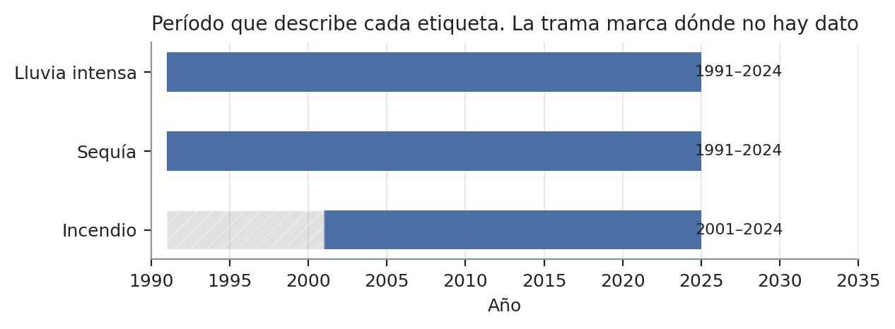
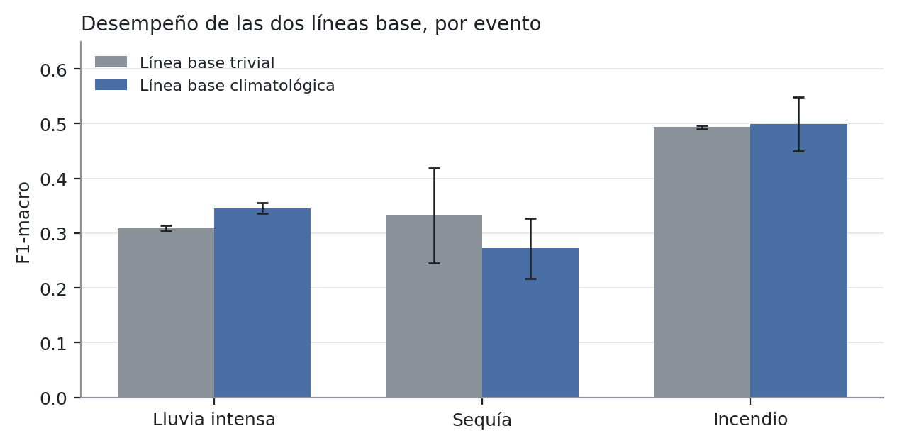
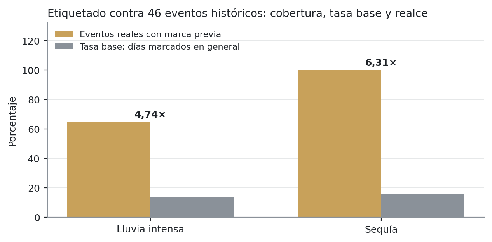

---
author:
  - "Alejandro Josué Rodríguez Zamora"
  - "César Andrés Ubau Calvo"
  - "Luis Alejandro Luna García"
  - "Avril Madrigal Elizondo"
institute: "Universidad Invenio · Ingeniería en Tecnologías de Información · III Trimestre 2026"
date: "27 de agosto de 2026"
lang: es
---

# Estimación de riesgo climático por distrito con datos abiertos: el caso del cantón de Tilarán, Costa Rica

::: no-entregable

**Historia:** H10.5c · **Rúbrica:** IEEE · **Responsable:** Alejandro
**Depende de:** H10.5b (cerrada) · **Bloquea a:** H10.6, el cartel académico

---

> ## Estado de este documento
>
> **Borrador de trabajo, 26 de agosto de 2026.** Contiene las secciones que ya no
> van a cambiar y **declara vacías las que dependen de resultados que todavía no
> existen**.
>
> | Sección | Estado |
> |---|---|
> | I. Introducción | Redactada |
> | II. Trabajo relacionado | Redactada, sobre H10.5a y H10.5b |
> | III. Metodología | Redactada. **Ampliada el 26 de agosto** con el etiquetado, la partición y las dos líneas base |
> | IV. Arquitectura | Redactada |
> | V. Hallazgos sobre disponibilidad de datos | **Redactada. Es el aporte que ya existe.** Siete subsecciones desde el 26 de agosto |
> | VI. Resultados | **Parcial desde el 27 de agosto.** Seis subsecciones con lo medido; VI-E declara lo que falta y VI-F trae la validación externa contra 46 eventos reales |
> | VII. Discusión | **Vacía. Necesita los tres algoritmos (H3.3 a H3.5)** |
> | VIII. Limitaciones | Redactada, se amplía con resultados |
> | IX. Conclusiones | **Redactada el 27 de agosto** sobre lo medido. Cinco subsecciones; IX-E declara lo que falta |
>
> **Qué cambió el 26 de agosto.** Cerraron el etiquetado de la variable objetivo,
> la partición temporal y las dos líneas base. La sección III describía un
> modelado que todavía no existía cuando se escribió, y en particular decía «una
> línea base climatológica» cuando son dos. La sección V ganó el hallazgo G, que
> es el más generalizable de todos los que trae este trabajo.
>
> **Y desde hoy las cifras de este documento las cruza una máquina.** Era el único
> documento del proyecto sin ese control, y ocho días bastaron para que **cinco de
> sus cifras dejaran de ser ciertas**. El anexo del final ya no es una promesa:
> cada número que declara lo comprueba `verificar_documentacion.py` en cada
> ejecución del pipeline.
>
> Las secciones vacías declaran **qué van a contener y qué hace falta para
> escribirlas**. Un apartado en blanco sin explicación es indistinguible de un
> olvido.
>
> **Ninguna cifra de este documento está escrita de memoria.** Todas salen de una
> herramienta del repositorio o de una fuente citada, y la sección de verificación
> al final dice de cuál.

:::

---

## Resumen

Se presenta el diseño y la construcción de un sistema de estimación de riesgo
climático a escala distrital para el cantón de Tilarán, Guanacaste, Costa Rica,
construido exclusivamente sobre datos abiertos. El sistema estima tres eventos
—lluvia intensa, sequía e incendio forestal— para cada uno de los ocho distritos
del cantón, a un horizonte de siete días, comparando tres algoritmos de
aprendizaje supervisado contra una línea base climatológica bajo validación
temporal por ventana expansiva.

El trabajo reporta, además del sistema, **seis hallazgos medidos sobre la
disponibilidad y la aptitud de los datos abiertos globales a escala cantonal**,
obtenidos durante la construcción y verificados con herramientas que se publican
con el proyecto. Cuatro de esos hallazgos habrían producido resultados
aparentemente válidos y silenciosamente incorrectos.

*Palabras clave:* riesgo climático, datos abiertos, aprendizaje automático,
resolución espacial, SPI, Costa Rica.

---

## I. Introducción

### A. Problema

El 5 de octubre de 2017, la tormenta tropical Nate cruzó el cantón de Tilarán.
Los siete distritos con registro reportaron daños **ese mismo día**, y lo que
reportaron no se parece:

| Distrito | Daño principal | Pérdidas |
|---|---|---|
| Quebrada Grande | 93 fincas de ganadería de leche, 31 de plátano, una escuela | **726 148 USD** |
| Tilarán | puentes, derrumbe de carril, tomate y aves | 313 371 USD |
| Tronadora | puentes, carril y cuneta obstruidos | 166 310 USD |
| Santa Rosa | colapso de alcantarillado, corte de carretera | 32 669 USD |
| Tierras Morenas | media calzada obstruida, maíz y tomate | 24 681 USD |
| Arenal | socavación de calzada, cuatro fincas de ganado | **1 808 USD** |
| Líbano | cortes totales de carretera por socavación | 15 400 m de vía |

En total, **1,26 millones de dólares y 223 km de vías dañadas en un día**. Y
entre el distrito más afectado y el menos afectado hay un factor de **cuatrocientos**.

Ahí está el problema, y no es la falta de un pronóstico. El Instituto
Meteorológico Nacional emitió aviso; lo que ese aviso no podía decir es que en
Quebrada Grande había que mover ganado lechero y en Arenal vigilar una calzada.
**Un valor único para todo el cantón es simultáneamente exagerado para unos
distritos e insuficiente para otros**, y quien decide —evacuar, cerrar un paso,
adelantar una cosecha— decide por distrito.

No es un evento aislado. El catálogo de este trabajo reúne **46 eventos con
daños documentados en Tilarán entre 1970 y 2026**, incluido un fallecido por
deslizamiento en Río Chiquito en 1976. Los siete distritos aparecen.

Las herramientas de alerta disponibles operan a escala nacional o regional. La
pregunta de este proyecto no es si se puede estimar riesgo climático —eso está
resuelto— sino **si esa estimación se puede llevar hasta el distrito, para un
cantón concreto, usando únicamente datos abiertos y sin infraestructura de
observación propia**.

Y hay una razón para dudar antes de empezar, que es la que vuelve interesante la
pregunta: **los datos abiertos globales se distribuyen en celdas más grandes que
un distrito de Tilarán.** Si la fuente no distingue lo que hay que distinguir,
ningún modelo lo recupera. La sección V lo mide.

### B. Pregunta de investigación

> ¿Permiten los datos abiertos globales disponibles estimar el nivel de riesgo de
> lluvia intensa, sequía e incendio forestal **por distrito** en el cantón de
> Tilarán, con un desempeño superior al de una línea base climatológica?

La pregunta está formulada de modo que **las dos respuestas son informativas**. Si
los modelos superan la línea base, el resultado es un sistema utilizable. Si no la
superan, el resultado es que los datos abiertos globales no bastan a escala
cantonal, y eso responde igual de bien.

Esa simetría no es retórica: la sección V muestra que parte de la respuesta
negativa **ya está medida**, antes de entrenar ningún modelo.

### C. Aporte

El trabajo aporta en tres planos que conviene distinguir, porque tienen distinto
grado de madurez: uno de ingeniería, que está construido y desplegado; uno
empírico, que está medido y es el que ya se sostiene solo; y uno comparativo, que
tiene fijado el método y espera los modelos.

1. Un sistema completo, reproducible y desplegable, construido sobre datos
   abiertos y publicado con su procedencia.
2. Seis hallazgos medidos sobre la aptitud de esos datos a escala cantonal, con
   las herramientas que los producen.
3. Una comparación de tres algoritmos contra una línea base climatológica bajo
   validación temporal estricta, para tres eventos distintos.

---

## II. Trabajo relacionado

Esta sección sitúa el trabajo en tres coordenadas: qué sistema opera hoy en Costa
Rica para el evento mejor cubierto, qué se ha establecido sobre el fenómeno más
estudiado de la región, y qué queda sin ocupar entre ambos. El orden es
deliberado: primero lo que existe y funciona, después lo que la literatura da por
resuelto, y solo al final el vacío que este trabajo aborda.

### A. Existe un sistema nacional, y declara sus límites

Costa Rica opera desde 2020 el **Sistema de Alerta Temprana de Incendios
Forestales (SATIF)**, gestionado por el Programa Nacional de Manejo del Fuego del
SINAC-MINAE con apoyo del Instituto Meteorológico Nacional. Implementa el Fire
Weather Index canadiense adaptado al país, con cuatro categorías de peligro `[25]`.

Su propio operador declara el alcance: el SATIF **"se basa únicamente"** en
temperatura, humedad relativa, velocidad del viento y lluvia, y **"no toma en
cuenta el riesgo, topografía o combustibles (vegetación)"** `[25]`.

Esa declaración delimita el aporte de este trabajo con precisión y sin inflarlo.
Un índice meteorológico de peligro no es una estimación de riesgo, y al depender de
estaciones no produce un valor por distrito. Son cosas distintas.

**Y no las reemplaza.** El SATIF lleva cinco años operando con respaldo
institucional; este proyecto es un prototipo de un trimestre sin validación
externa. La comparación honesta es de naturaleza, no de calidad.

### B. La sequía en el Pacífico Norte está estudiada

El Centro de Investigaciones Geofísicas de la Universidad de Costa Rica tiene
trabajo sostenido sobre sequía en Guanacaste, y el SPI está establecido como el
índice pertinente para la región `[15]`. Este proyecto no discute esa elección: la
adopta.

### C. El vacío que este trabajo ocupa

Hasta donde la revisión bibliográfica realizada pudo verificar, **no se localizó** trabajo
publicado que estime riesgo climático por distrito para un cantón costarricense
comparando algoritmos supervisados contra una línea base climatológica bajo
validación temporal, con datos exclusivamente abiertos.

La formulación es deliberada: **"no se localizó" no equivale a "no existe"**. La
búsqueda cubrió literatura indexada y no alcanzó literatura gris, tesis no
indexadas ni trabajo institucional no publicado.

---

## III. Metodología

La sección I planteó un problema con dos partes: estimar riesgo climático **por
distrito** para un cantón concreto, y hacerlo **solo con datos abiertos**. Esta
sección describe cómo se resuelve cada una.

La escala distrital se resuelve eligiendo fuentes cuya celda quepa dentro de un
distrito, y declarando cuáles no lo hacen. La restricción de datos abiertos se
resuelve con una cadena que va de la fuente pública al indicador estandarizado y
de ahí a una variable objetivo etiquetada, sin ninguna instrumentación propia. Y
como la pregunta exige comparar contra una referencia, la sección cierra fijando
la validación temporal y las dos líneas base contra las que se mide todo lo demás.

### A. Área de estudio

Cantón de Tilarán, provincia de Guanacaste, código 508 de la División Territorial
Administrativa. Ocho distritos, códigos 50801 a 50808.

Las geometrías provienen de la capa distrital del **Sistema Nacional de
Información Territorial (SNIT)**, servicio WFS del IGN, filtradas por código de
cantón. La carga es transaccional e idempotente y deja registro de procedencia con
URL, fecha, sumas de verificación y número de entidades devueltas.

**Extensión medida del cantón:** 30,7 × 36,6 km, o 1124 km² de caja envolvente,
con 669,23 km² de superficie efectiva y una ocupación del 59,5 %.

### B. Fuentes de datos

| Variable | Fuente | Resolución | Justificación |
|---|---|---|---|
| Precipitación | CHIRPS | 0,05° ≈ 5,5 km | Es la única que distingue distritos. Sección V-A |
| Temperatura, humedad, radiación, viento | NASA POWER (MERRA-2) | 0,625° × 0,5° | No definen ningún umbral del sistema |
| Focos de calor | NASA FIRMS | 375 m | — |
| Geometrías distritales | SNIT, IGN | vectorial | Fuente oficial |

**La fuente es híbrida por una razón medida, no por conveniencia.** El motivo está
en la sección V-A y quedó registrado como decisión de arquitectura.

Ventana temporal: **1991-2025**, 35 años. No es arbitraria: la línea base
climatológica se define sobre la normal 1991-2020 y con menos registro no se puede
calcular como está declarada.

> **Las dos fuentes no son intercambiables.** Para un mismo día y punto, POWER
> reportó 0,0 mm y CHIRPS 18,72 mm. No es un error de ninguna de las dos: son
> productos distintos con procesos de asimilación distintos. Mezclarlas en una
> misma serie produciría discontinuidades que el modelo leería como señal.

### C. Procesamiento de señales

Se implementa filtrado de ruido con **Savitzky-Golay**, elegido sobre la media
móvil porque preserva los máximos: sobre un pico aislado conserva el 48,6 % de la
amplitud contra el 20,0 % de la media móvil. En un sistema cuyos umbrales se
definen sobre percentiles extremos, achatar los picos sesga los umbrales de forma
sistemática.

**El filtro no se aplica a la precipitación**, y esa decisión se tomó midiendo. El
resultado está en la sección V-B.

Índices derivados:

- **SPI** a 1 y 3 meses, por convolución de ventana móvil sobre el acumulado
  mensual, con ajuste gamma y corrección para ceros mediante distribución mixta
  `H(x) = q + (1−q)·G(x)` `[4]`.
- **Percentiles 95 y 99 del acumulado de 72 horas**, por distrito, sobre el
  período base 1991-2020.

> **Precisión terminológica.** El umbral de lluvia intensa **no es el índice R95p
> del ETCCDI**, aunque siga su criterio de percentiles extremos. R95p se define
> sobre precipitación diaria de días húmedos; este umbral, sobre acumulado de 72
> horas. La diferencia está medida en la sección V-D.

### D. Etiquetado de la variable objetivo

Tres niveles —bajo, medio, alto— por evento y distrito:

| Evento | Umbral | Origen |
|---|---|---|
| Lluvia intensa | Percentiles 95 y 99 del acumulado de 72 h, por distrito | Criterio de percentiles extremos del ETCCDI `[18]` |
| Sequía | SPI-6: alto si ≤ −1,5; medio si −1,5 < SPI ≤ −1,0 | McKee et al. `[4]`, adoptado por la OMM. **La escala se eligió midiendo**, ver VI-E |
| Incendio forestal | Focos FIRMS en ventana de 7 días: **alto si hay al menos un foco**. No existe nivel medio | **Criterio del equipo**, corregido tras medir. No hay estándar equivalente |

El umbral de incendio es el único propio y se declara como tal en el sistema y en
la interfaz. Se somete a validación externa con el Comité Municipal de Emergencias.

**Y es el único de los tres que la medición obligó a rehacer.** La definición
original —bajo si 0, medio si 1 ≤ n ≤ P90, alto si n > P90— no producía tres
clases sobre estos datos sino dos: con **242 focos en 24 años** y entre el 97 % y
el 99,9 % de ventanas vacías, el percentil 90 vale 0,0 en los ocho distritos y la
condición intermedia queda vacía. Los dos umbrales tomados de estándares
publicados resistieron la verificación; el propio, no.

El alcance del evento se acota además a **tres de los ocho distritos** —Santa
Rosa, Líbano y Tierras Morenas, que concentran el 88 % de los focos—. Los otros
cinco se reportan como «sin datos suficientes»: dos de ellos registran **un solo
foco en veinticuatro años**.

El etiquetado produce **99 296 filas**: ocho distritos por 12 412 fechas, de
1991-01-01 a 2024-12-24. Los tres eventos resultan modelables, incluido el
incendio, que era el que más probabilidades tenía de no serlo:

| Evento | Filas sin dato | Filas en alto | % observado | Episodios |
|---|---|---|---|---|
| Lluvia intensa | 0 | 3 195 | 3,22 % | 496 |
| Sequía | 664 | 7 290 | 7,39 % | 110 |
| Incendio | 29 216 | 865 | 1,23 % | 106 |

**La unidad de muestra son episodios, no filas**, y la distinción no es cosmética.
Un solo foco de calor marca siete filas como «alto»: es la misma detección vista
desde siete fechas distintas, con etiqueta idéntica y casi todas las
características compartidas. Contar filas sobreestima la muestra por un factor de
hasta siete, y una partición que corte por el medio de un episodio deja el mismo
evento a ambos lados del corte. El caso extremo es la sequía, cuyos episodios
promedian **66,3 filas** —más de dos meses consecutivos— porque el índice no
cambia dentro del mes.

El reparto por distrito reproduce el criterio de acotamiento **sin que esté
programado**, y cae dentro de la banda medida de forma independiente sobre los
focos cargados: Santa Rosa 2,93 %, Líbano 2,59 % y Tierras Morenas 2,56 %, contra
un rango esperado de 2,6 % a 2,9 %.

### E. Modelos y validación

Se comparan **tres algoritmos** —Regresión Logística, Random Forest y XGBoost—
contra **dos líneas base**, no una. La métrica principal es **F1-macro**, por el
desbalance entre clases.

| Línea base | Qué predice | Para qué sirve |
|---|---|---|
| **Trivial** | siempre la clase mayoritaria del entrenamiento | el piso absoluto |
| **Climatológica** | la clase de mayor realce en ese distrito y ese mes calendario | el piso informado |

**La trivial no es un artificio retórico.** Sobre el evento de incendio alcanza
**F1-macro 0,494** acertando el 98,8 % de las filas, porque la clase minoritaria
es el 1,23 % del conjunto observado. Un informe que reportara solo exactitud haría
parecer excelente a un modelo que no predice nada, y ese es exactamente el número
que hay que superar.

La climatológica **no puede definirse como la clase más frecuente** del
distrito-mes, que es la formulación de manual: sobre estos datos degenera en la
trivial por construcción. Con una clase minoritaria de entre el 1 % y el 7 %, la
clase modal es «bajo» en las **noventa y seis** celdas de distrito por mes. Se
define entonces sobre el **realce** de cada clase respecto de su propia tasa base,
que sí discrimina sin dejar de mirar únicamente el calendario.

**La validación es por ventana expansiva y el corte aleatorio está prohibido.** Una
partición aleatoria sobre una serie temporal permite que el modelo vea el futuro:
produce métricas altas y sin significado. La prohibición está codificada en los
contratos del proyecto y verificada automáticamente.

La partición son **cinco pliegues expansivos** —cada uno entrena con todo el
pasado disponible y evalúa el bloque siguiente— con tres propiedades que la
implementación obligó a fijar:

1. **Un embargo de siete días entre entrenamiento y prueba.** La etiqueta de la
   fila `t` describe la ventana `(t, t+7]`, así que pegar los conjuntos filtraría
   el futuro aunque el corte pareciera limpio.
2. **Los cortes caen en frontera de mes calendario.** El SPI-6 no cambia dentro
   del mes: un episodio de sequía ocupa **100,1 filas consecutivas** en promedio, y
   cortar a mitad de mes dejaría el mismo valor del índice a ambos lados.
3. **Cada evento se parte sobre su propio período observado.** La serie climática
   arranca en 1991 y el archivo de focos de calor en 2001, de modo que el evento
   de incendio se particiona sobre 2001-2024. Partirlo sobre la serie completa
   dejaría el primer bloque de entrenamiento **sin un solo episodio observado**.

Las dos primeras se escribieron por separado y resultan no ser independientes: con
el corte en frontera de mes, exigir que la etiqueta de sequía no mire dentro de la
prueba equivale a exigir que `t+7` caiga en un mes anterior, y el embargo colapsa
de los treinta y ocho días que su alcance sugiere a siete.

---

## IV. Arquitectura del sistema

### A. Estructura

Seis módulos con **interfaces congeladas antes de implementar**, cada una con un
simulado que la cumple:

```
extraccion  ->  almacenamiento  ->  senales  ->  modelado  ->  api  ->  visor
   (ETL)        (PostgreSQL/          (SPI,      (3 algoritmos   (REST)  (mapa)
                  PostGIS)         percentiles)   + linea base)
```

Cada contrato se declara como `Protocol` de PEP 544 con verificación estructural en
tiempo de ejecución. El propósito es que **nadie quede bloqueado esperando código
ajeno**: se trabaja contra el simulado y se sustituye por el módulo real en una
línea.

### B. Tres invariantes verificadas automáticamente

El proyecto declara tres reglas que ninguna implementación puede violar, y las
comprueba en integración continua:

1. **La ausencia de dato es `None`, nunca `0`.** Un cero es una medición; una
   ausencia no lo es. Confundirlos convierte una estación seca en un mes sin
   lluvia registrada.
2. **No hay estimación sin modelo entrenado detrás.** El sistema devuelve nivel
   nulo antes que un valor por defecto, y la interfaz lo distingue visualmente del
   riesgo bajo.
3. **La validación temporal no admite fuga.** Ver III-E.

### C. Verificación continua

Cada cambio pasa por cinco trabajos de integración continua y **ocho controles**
que comprueban desde la coherencia de los contratos hasta que las cifras escritas
en la documentación sigan siendo ciertas.

Ese último control existe por una razón: **contar a mano falló cinco veces en dos
días** durante la construcción, y uno de esos errores infló el avance reportado en
un documento ya entregado. La corrección no fue pedir más cuidado.

---

## V. Hallazgos sobre la disponibilidad de datos a escala cantonal

**Esta sección es el aporte que el proyecto ya tiene, con independencia de cómo
salgan los modelos.** Los seis hallazgos se obtuvieron durante la construcción, se
midieron con herramientas que se publican con el proyecto, y **cuatro de ellos
habrían producido resultados aparentemente válidos y silenciosamente
incorrectos**.

### A. Las fuentes climáticas globales de reanálisis no resuelven el cantón

NASA POWER sirve MERRA-2 en una malla de 0,625° × 0,5°, unos **68 × 55 km** a la
latitud de Tilarán. El cantón mide 669,23 km² y **cabe entero dentro de una sola
celda**.

Comprobado empíricamente: dos puntos separados dentro del cantón devuelven valores
idénticos hasta el último decimal, e incluso la misma elevación.

**La consecuencia no es pérdida de precisión, es imposibilidad.** Dos de los tres
eventos se definen sobre precipitación. Con una sola celda, los ocho distritos
habrían dado el mismo riesgo siempre, **por construcción**, y el sistema habría
respondido su propia pregunta de investigación por artefacto de la fuente.

CHIRPS, a 0,05°, sí distingue: los ocho distritos caen en **ocho celdas distintas**,
con una diferencia del 20,3 % en el acumulado semanal entre los extremos. Y el
orden entre distritos **se invierte entre días**, lo que descarta que sea un sesgo
constante del método y confirma variación espacial real.

*Reproducible con `verificar_resolucion_fuente.py`, publicada con el proyecto.*

> **Detalle metodológico que costó una corrección.** La primera versión de la
> herramienta suponía que todas las mallas se anclan igual. No es cierto: POWER
> ancla los **centros** de celda en múltiplos del paso y CHIRPS ancla los
> **bordes**. Con el supuesto equivocado la herramienta contradecía la observación
> directa. Se corrigió y se le agregó una autoprueba contra el dato observado.

### B. Filtrar la precipitación destruye los índices que se calculan sobre ella

El filtro de ruido de la sección III-C es correcto para variables con ruido
instrumental. Aplicado a la precipitación produce series que **no son series de
lluvia**:

| Efecto sobre 35 años de serie diaria | Magnitud |
|---|---|
| Días con precipitación negativa | **12,47 %**, mínimo −13,47 mm |
| Días secos que pasan a contar como húmedos | **31,62 %** |
| Caída del P99 de días húmedos | **−53,6 %** |
| Días del 1 % más extremo que sobreviven al umbral original | **0 de 37** |

No es un defecto de implementación: los coeficientes de Savitzky-Golay para
ventana 7 y orden 2 son **negativos en los extremos**, así que un día contiguo a un
aguacero recibe contribución negativa. Es una propiedad del método.

El 31,62 % es el más grave de los dos. El umbral de día húmedo del ETCCDI es
exactamente 1 mm: filtrar **reescribe el denominador** de los índices.

Resultado que cierra la discusión: con ventana 3 y polinomio de orden 2 el filtro
**no cambia nada**, porque con tres puntos una parábola pasa exactamente por los
tres. *La única configuración que no daña la precipitación es aquella en la que el
filtro no hace nada.*

*Reproducible con `medir_efecto_filtro.py`, publicada con el proyecto.*

### C. Un SPI sin ajuste por mes calendario mide estacionalidad, no anomalía

El SPI ajusta una distribución gamma **por cada mes calendario**: los eneros contra
la distribución histórica de los eneros. Eso es lo que lo convierte en un índice de
anomalía `[4]`.

Con ajuste único para toda la serie, sobre 35 años de régimen del Pacífico Norte:

| | Ajuste único | Ajuste por mes |
|---|---|---|
| SPI medio en estación seca | **−0,84** | −0,00 |
| SPI medio en estación lluviosa | **+0,60** | −0,00 |

Un índice de anomalía cuya media es −0,84 en una estación y +0,60 en la otra no
está midiendo anomalía. Y el dato que lo remata: **de los 99 meses que el ajuste
único declara en sequía, los 99 caen en estación seca.** El índice no detecta
sequía, detecta que es verano.

La correlación entre ambos métodos es **0,425**, lo que impide tratarlos como dos
versiones de lo mismo con distinta precisión.

**Dónde se paga.** Una etiqueta de sequía correlacionada con el mes calendario
haría que un modelo entrenado sobre ella aprendiera el calendario en lugar del
clima, **y en la evaluación se vería bien**, porque la estación seca es predecible.
Es la misma familia de resultado engañoso que la fuga temporal.

*Reproducible con `medir_spi_por_mes.py`, publicada con el proyecto.*

### D. El percentil del acumulado de 72 h no es el índice R95p

Dos cantidades que el proyecto llegó a nombrar igual, medidas sobre el mismo
período base de 30 años:

| | P95 | P99 |
|---|---|---|
| ETCCDI, diario sobre días húmedos | 39,90 mm | 54,86 mm |
| Acumulado de 72 h | 63,40 mm | 87,70 mm |

Aplicar el umbral equivocado **multiplica por 8,5** los días declarados en riesgo
alto: de 110 a 934 sobre 10 956 ventanas.

El umbral del proyecto no cambia —el acumulado de 72 h es el adecuado para riesgo
de inundación, porque un evento de lluvia intensa dura más de un día—. Lo que
cambió fue el nombre. **Un umbral atribuido a una fuente equivocada es peor que un
umbral sin citar.**

*Reproducible con `medir_percentiles.py`, publicada con el proyecto.*

### E. No hay registro histórico de incendios forestales en el cantón

DesInventar Costa Rica devuelve 98 fichas para Tilarán entre 1968 y 2017, cada una
con distrito explícito. **Ninguna es un incendio forestal.** Las cuatro fichas de
tipo FIRE son incendios estructurales.

Consecuencia directa: el contraste del componente de incendio contra eventos
históricos **no se puede hacer con registro documental**. Queda como limitación
declarada y obliga a apoyarse en los focos FIRMS.

### F. La sequía histórica no está desagregada por distrito

Las sequías de 1972, 1973, 1976, 1977, 1982 y 1983 existen en el registro **con el
campo de distrito vacío**. La de 2014 sí está desagregada, y solo porque una
declaratoria de emergencia obligó a inventariar la afectación finca por finca.

De ahí sale la observación más general de esta sección:

> **La disponibilidad de datos históricos a escala distrital no depende de la
> severidad del evento, sino de si existió un instrumento administrativo que
> obligara a levantarlos.** Es un sesgo de registro, no de ocurrencia.

*Fuente de E y F:* el catálogo de eventos históricos compilado para este
trabajo desde DesInventar Costa Rica `[26]`, con 46 registros de 29 eventos
distintos entre 1970 y 2026.

### G. Dos fuentes con distinta fecha de inicio producen una ausencia que parece un dato

El hallazgo más caro de esta sección se detectó **después** de que el etiquetado
pasara todas sus comprobaciones automáticas, y es generalizable a cualquier
trabajo que combine una serie climática larga con un archivo satelital corto.

La serie de precipitación arranca en **1991**; el archivo de focos de calor, en
**2001**, porque antes no existía el instrumento que los detecta. Al unir las dos
en una sola tabla, la regla de etiquetado del incendio —«alto si hay al menos un
foco en la ventana, bajo si no hay ninguno»— devolvía **bajo** para toda la década
de los noventa. La cuenta de focos daba cero, correctamente, y la razón no era que
no hubiera incendios: era que **no había satélite observando**.

Son **29 216 filas, el 29,4 % del conjunto etiquetado**, afirmando ausencia de
evento sobre un período sin observación. El efecto sobre la clase minoritaria es
directo:

    incendio en alto, sobre las 99 296 filas         0,87 %
    incendio en alto, sobre las 70 080 observadas    1,23 %

Y un modelo entrenado sobre ese conjunto habría aprendido que la década de los
noventa era segura.

Lo instructivo es que **el criterio que lo prohíbe ya estaba escrito y verificado**.
El etiquetado exige explícitamente que la ausencia de dato no se convierta en una
clase, y su comprobación automática aplicaba esa regla a la precipitación y al
índice de sequía —donde funcionaba, produciendo etiquetas nulas— pero no al
incendio, que es el único de los tres eventos cuya fuente empieza en otra fecha.

También estaba puesta la cota del extremo derecho: el etiquetado se acota a 2024
porque los focos terminan antes que la serie climática. **Una cota puesta en un
extremo invita a suponer que el otro no hace falta.**

La corrección consiste en declarar el período de cobertura del instrumento como
una constante explícita, y devolver etiqueta nula fuera de él. No se infiere del
dato cargado: inferirla del mínimo de las detecciones diría que un distrito sin
focos nunca fue observado, que es la misma confusión en la otra dirección.

---

## VI. Resultados

> **PARCIAL, desde el 27 de agosto de 2026.** Se reporta lo que está medido —el
> piso contra el que se comparará todo— y se declara lo que falta.
>
> **Lo que hay:** el etiquetado de la variable objetivo, la partición temporal,
> las dos líneas base y el arnés de comparación.
>
> **Lo que falta:** los tres entrenamientos —Regresión Logística, Random Forest y
> XGBoost— y, con ellos, las matrices de confusión y la importancia de variables.
> Se detalla en la subsección VI-E.
>
> **Ninguna cifra de esta sección proviene de los simulados.** El sistema opera
> hoy contra datos simulados y lo declara en pantalla; esos valores existen para
> construir la representación visual y no aparecen aquí. Todo lo que sigue sale
> del conjunto etiquetado, derivado de las series climáticas y del archivo de
> focos de calor descritos en la sección III.

### A. El dato sobre el que se mide

El etiquetado produce **99 296 filas** —ocho distritos × días, de 1991 a
2025— con tres etiquetas por fila, una por evento.

La distribución de clases es fuertemente desbalanceada, y esa es la primera
condición que gobierna todo lo demás:

| Evento | Clase positiva | Cobertura temporal |
|---|---|---|
| Lluvia intensa | percentil 95 y 99 del acumulado de 72 h | 1991–2025 |
| Sequía | SPI-6 ≤ −1,0 (medio) y ≤ −1,5 (alto), por mes calendario | 1991–2025 |
| Incendio | binario, ≥ 1 foco en la ventana de 7 días | **2001–2024** |

La ventana del incendio no arranca en 1991 porque el archivo FIRMS de MODIS
C6.1 empieza en 2001. Etiquetar como «bajo» los diez años anteriores habría
producido **29 216 filas falsamente negativas, el 29,4 % del conjunto**; se
detectó al revisar la distribución de clases, y las filas fuera de cobertura
devuelven ausencia, no cero: un período no observado no es un período sin
eventos.

El incendio se estima además solo en **Santa Rosa, Líbano y Tierras Morenas**,
porque en los demás la señal es demasiado escasa para sostener una estimación.

La Fig. 1 muestra el período que describe cada etiqueta. La franja con trama es
la década en que el archivo de focos no existe, y es la razón de que el
componente de incendio sea el más débil de los tres.



### B. La partición temporal, y un resultado que no se esperaba

La validación es por ventana expansiva (Bergmeir y Benítez, 2012) `[4]`, con
**cinco pliegues** y cortes en frontera de mes.

El embargo entre entrenamiento y prueba **no se fijó como constante: se calcula**
a partir de hasta dónde mira la etiqueta de la última fila de entrenamiento. Los
criterios de aceptación, escritos antes de implementar, estimaron tres valores
distintos; la medición dio uno solo:

| Evento | Embargo estimado | Embargo calculado |
|---|---|---|
| Incendio | 7 días | 7 días |
| Lluvia intensa | 9 días | **7 días** |
| Sequía | 38 días | **7 días** |

Las dos correcciones tienen la misma causa —se supuso el alcance en vez de
calcularlo— pero la de la sequía es la interesante. La etiqueta de sequía sí
alcanza el fin del mes que contiene a *t+7*; lo que ocurre es que **el corte en
frontera de mes absorbe ese alcance**: con el corte ahí, exigir que la etiqueta
no mire dentro de la prueba equivale a exigir que *t+7* caiga en un mes anterior.

Los dos criterios se escribieron por separado y juntos resultan más baratos que
cada uno por su lado. No estaba previsto.

### C. Las dos líneas base

El contraste se hace contra dos referencias, y las dos se reportan:

- **Trivial:** siempre la clase mayoritaria del entrenamiento.
- **Climatológica:** la clase de mayor **realce** en ese distrito y ese mes
  calendario, donde realce(clase) = tasa en la celda ÷ tasa en todo el
  entrenamiento.

La climatológica se definió por realce y no por clase modal tras medir que la
segunda **degenera en la trivial**: con clases positivas entre el 1 % y el 7 %,
«bajo» es la clase modal en las noventa y seis celdas distrito-mes, y las dos
líneas base daban F1-macro idéntico hasta el tercer decimal en los cinco
pliegues. Una línea base indistinguible del piso absoluto no sirve como piso
informado.

Ambas miran **solo el calendario**: distrito y fecha. Ninguna variable
meteorológica entra. En cuanto una línea base usa precipitación deja de ser línea
base y el contraste compara dos modelos en vez de comparar un modelo contra el
almanaque.

### D. Qué informa el mes, por evento

Medido sobre los cinco pliegues, con F1-macro:

| Evento | Trivial | Climatológica | Diferencia | Veredicto |
|---|---|---|---|---|
| **Lluvia intensa** | 0,309 ± 0,005 | **0,346 ± 0,010** | **+0,036** | la climatológica gana |
| **Sequía** | 0,333 ± 0,087 | 0,272 ± 0,055 | −0,061 | empate técnico |
| **Incendio** | 0,494 ± 0,003 | 0,500 ± 0,049 | +0,006 | empate técnico |

**El criterio de decisión se fijó antes de mirar los datos:** si la ventaja de un
estimador sobre el siguiente es menor que lo que ese mismo estimador se mueve
entre pliegues, no se declara ganador. Con cinco pliegues correlacionados esa es
toda la resolución disponible.

**Lluvia intensa.** El mes informa. La ventaja (+0,036) supera el rango entre
pliegues de la climatológica (0,027). Es el único de los tres eventos donde el
calendario, por sí solo, aporta capacidad predictiva medible.

**Sequía.** El mes no informa, **y eso confirma que el ajuste del índice
funciona.** El SPI-6 se calibra por mes calendario precisamente para remover la
estacionalidad; si la climatológica predijera bien la sequía, sería señal de que
ese ajuste no está operando, y el defecto habría reaparecido un nivel más arriba.
La línea base climatológica queda **0,070 por debajo** del piso trivial.

La Fig. 2 hace visible por qué dos de los tres veredictos son empates. Las barras
de error son la dispersión entre pliegues: en lluvia intensa los intervalos no se
tocan, y en sequía e incendio se solapan por completo.



**Incendio.** Es el resultado que exige más cuidado al enunciar. Los criterios
previos esperaban que el mes informara —la estación seca del Pacífico Norte está
bien delimitada— y la diferencia medida fue de +0,006. Pero la afirmación
defendible no es «el mes no informa sobre el incendio», sino esta:

> **La dispersión de la línea base climatológica entre pliegues (0,138) es
> veintitrés veces su ventaja sobre la trivial (+0,006). La medición no tiene
> resolución para distinguir las dos hipótesis.**

Con tres distritos, una clase positiva del 1,23 % y veinticuatro años de
cobertura, el diseño experimental no alcanza. Es un límite del dato disponible,
no un hallazgo sobre el clima.

### E. Lo que falta, y por qué no se rellena

**Los tres algoritmos comparados —Regresión Logística, Random Forest y
XGBoost— no están entrenados.** Sin ellos no hay matrices de confusión, ni curvas
de desempeño, ni importancia de variables, ni explicaciones locales con SHAP.

Lo que sí está decidido y verificado es **cómo se van a comparar**. El arnés de
comparación fija, para los cinco estimadores por igual, tres cosas: la partición
temporal, la métrica y el tratamiento de las predicciones ausentes —una fila sin
predicción no se evalúa y se cuenta aparte, para no castigar a un estimador por
declarar que no sabe—. Los tres pendientes están declarados dentro del propio
registro de estimadores, de modo que la tabla no pueda leerse como completa.

**Una advertencia metodológica que queda fijada para cuando se llene.** Los
resultados de esta sección se reportarán **sin prueba de significancia**. Cinco
pliegues de una serie temporal no son cinco muestras independientes: la ventana
es expansiva, los conjuntos de entrenamiento se solapan por construcción y las
métricas están correlacionadas. Una prueba que suponga independencia produciría
un valor *p* que suena riguroso y no lo es. Se reportarán la media, la desviación
y los cinco valores individuales.

### F. Validación externa del etiquetado contra eventos reales

Antes de que exista un modelo hay una pregunta previa que casi nunca se plantea:
**¿la verdad de terreno reconoce los eventos que de verdad ocurrieron?** Si las
etiquetas no los reconocen, ningún modelo entrenado sobre ellas podrá hacerlo.

Se contrastó el etiquetado contra el catálogo de **46 eventos históricos de
Tilarán** extraídos de DesInventar Costa Rica. Un evento del día *E* se considera
anunciado si alguna etiqueta en la ventana previa marcaba riesgo medio o alto.

| Evento | Registros | Contrastables | Detecta | Cobertura (IC 95 %) | Tasa base | **Realce** |
|---|---|---|---|---|---|---|
| Lluvia intensa | 38 | 34 | 22 | 64,7 % [47,9 %, 78,5 %] | 13,7 % | **4,74×** |
| Sequía | 7 | 7 | 7 | 100,0 % [64,6 %, 100 %] | 15,9 % | **6,31×** |
| Incendio | 1 | 0 | — | — | 2,7 % | — |

**Las coberturas se acompañan de su intervalo de Wilson al 95 %.** Reportarlas
como valores puntuales las hacía parecer tan firmes como la tasa base, y no lo
son: la cobertura sale de 34 y 7 observaciones, la tasa base de casi cien mil.
Con esos tamaños el intervalo de Wald —el que suele escribirse— tiene cobertura
errática y colapsa a un punto cuando la proporción es 0 o 1 `[34]`.

La Fig. 3 pone la cobertura al lado de la tasa base, que es lo que vuelve
interpretable al realce. El incendio no aparece: su único registro en el catálogo
es posterior a la serie etiquetada.



**La métrica que importa es el realce, no la cobertura.** Una cobertura alta se
consigue marcando siempre; el realce —cuántas veces más frecuente es la marca
ante un evento real que en un día cualquiera— no.

**No se reporta precisión, y la omisión es deliberada.** El catálogo registra
daños reportados, no fenómenos, y está incompleto por construcción: una marca sin
registro no es un falso positivo, puede ser un evento real que nadie reportó.
Calcular precisión contra un catálogo incompleto produce un número que aparenta
rigor y está mal por definición.

#### El cero de la sequía no eran dos relojes: era la escala del índice

Con SPI-3 y ventana de siete días la sequía daba **0 de 7**. La lectura inicial
fue que el catálogo registra la fecha de la **declaratoria administrativa**
—emitida después de evaluar los daños— mientras el índice marca el mes en que
cae bajo el umbral, y que por tanto la pregunta no era contestable a siete días.
Se agregó entonces una ventana ampliada del tamaño del período de integración
del índice, con la que el SPI-3 recuperaba los siete.

**Esa explicación era cómoda y estaba incompleta.** El detalle que no encajaba
es que la marca más cercana quedaba a **−37 días, el mismo −37 en los ocho
distritos**. Una coincidencia de fechas se dispersa entre distritos; un valor
idéntico en los ocho es la firma de algo estructural.

Al medir las tres escalas del índice contra el mismo catálogo, con intervalo de
Wilson al 95 %:

| Escala | Cobertura a 7 días | Realce | Episodios |
|---|---|---|---|
| SPI-3 | 0 % [0 %, 35,4 %] | 0,00 [0,00, **2,38**] | 204 |
| SPI-6 | 100 % [64,6 %, 100 %] | 6,50 [4,13, 6,59] | 129 |
| SPI-12 | 100 % [64,6 %, 100 %] | 5,39 [3,43, 5,46] | 68 |

**SPI-6 y SPI-12 detectan los siete con la ventana estricta**, sin ampliar nada.
El intervalo del SPI-3 queda enteramente por debajo del de las otras dos, y el
1,0 cae dentro del rango de su realce: ante el único episodio que el catálogo
permite probar, marcaba con la misma frecuencia que un día cualquiera.

La causa es física y se puede enunciar: **el SPI-3 sale de sequía antes de que
el daño se declare.** Integra tres meses, y para el 30 de septiembre de 2014 las
lluvias de setiembre ya lo habían recuperado mientras la declaratoria se emitía.

**El resultado es asimétrico, y así hay que leerlo.** Los siete registros son
*una fecha en siete distritos*, no siete episodios independientes: el tamaño de
muestra efectivo está más cerca de uno. Por eso el 100 % de SPI-6 y SPI-12 **no
corona a ninguna de las dos** —confirmar con una observación no establece nada
general— mientras que el 0 % del SPI-3, fallando de forma idéntica en los ocho
distritos, **sí basta para descartarlo**. Falsar es más barato que confirmar.

Entre SPI-6 y SPI-12 el catálogo no decide: sus intervalos se solapan. Se adoptó
**SPI-6** por número de episodios —129 contra 68, casi el doble de muestra
efectiva para el modelado posterior— con menor tasa base para la misma
detección, y porque es la escala que `[15]` toma para la estación lluviosa de la
vertiente del Pacífico. **Ese criterio no es evidencia externa y se declara como
tal.**

#### Los fallos de lluvia intensa apuntan a un desfase, no a una omisión

De los 12 eventos no detectados, **9 tenían una marca a 14 días o menos, y en 9
de los 12 la marca llegó *después* del evento**. El patrón admite tres
explicaciones que este contraste no puede separar: imprecisión de fecha en la
fuente —DesInventar suele registrar la fecha del reporte—, que el máximo del
acumulado de 72 h caiga uno o dos días después del daño, o daño sin extremo
meteorológico sobre una cuenca ya saturada.

Distinguirlas requeriría la serie horaria y las fichas completas. Queda anotado
como línea abierta.

#### Lo que esto establece, y lo que no

Establece un **piso para los modelos**: el etiquetado alcanza realce 4,74× en
lluvia intensa sobre eventos reales verificados por una fuente externa. Un modelo
que no lo supere no está aportando sobre la verdad de terreno.

No establece nada sobre incendio —el único registro del catálogo es de 2026,
posterior a la serie— lo que confirma la limitación anticipada en V-E antes de
medir.

### G. Qué responde esto de la pregunta de investigación

La pregunta de la sección I-B tiene dos partes, y **la evidencia reunida responde
una y deja la otra abierta**. Conviene separarlas porque se responden con cosas
distintas.

**«¿Permiten los datos abiertos globales estimar por distrito?»** — Respondida, y
la respuesta es **parcialmente no, con una excepción**. De las cinco variables
climáticas consideradas, cuatro provienen de reanálisis global cuya celda cubre
el cantón entero: temperatura, humedad relativa, viento y radiación **toman el
mismo valor en los ocho distritos**. Solo la precipitación, con una celda de
0,05°, cae dentro de cada distrito por separado.

Esa parte de la respuesta **no depende de ningún modelo** y no va a cambiar: es
una propiedad de las fuentes, medida sobre la geometría del cantón.

**«¿Con un desempeño superior al de una línea base climatológica?»** — **Abierta.**
Requiere los tres algoritmos entrenados. Lo que sí quedó fijado es contra qué se
mide: la sección VI-D reporta el piso por evento, y la VI-F establece que el
etiquetado alcanza un realce de 4,74× sobre eventos históricos verificados por
una fuente externa.

**Y hay una tercera cosa que la pregunta no anticipaba**, y que la medición
obligó a formular: en dos de los tres eventos, la dispersión entre pliegues
supera a la diferencia entre estimadores. Es decir que, con el dato disponible,
**el diseño experimental no tiene resolución para responder la segunda parte en
sequía ni en incendio**, por bien entrenados que estén los modelos. Solo en
lluvia intensa la comparación va a poder distinguir.

Esa limitación no se puede resolver con mejor modelado. Se resolvería con más
años de cobertura para el incendio, o con una definición de sequía que produzca
episodios menos correlacionados entre pliegues.

## VII. Discusión

> **VACÍA. Depende de los tres entrenamientos.**
>
> La sección VI ya reporta el piso —qué informa el calendario, por evento— pero
> la discusión compara **modelos** contra ese piso, y los modelos no existen.
> Escribirla ahora sería discutir un contraste que no se hizo.
>
> **Qué va a contener:**
>
> 1. Respuesta a la pregunta de investigación, en la dirección que resulte.
> 2. Interpretación física de las variables que resulten importantes, contrastada
>    contra lo que la literatura de la sección II establece para el Pacífico Norte.
> 3. Comparación de naturaleza —no de calidad— con el SATIF.
> 4. Contraste de las estimaciones contra el catálogo de eventos históricos, con la
>    salvedad de V-E: el contraste será sólido para lluvia intensa, débil para
>    sequía e inexistente para incendio.
>
> **Ya está decidido cómo se redacta el caso negativo.** Si los modelos no superan
> la línea base, la sección lo reporta como respuesta a la pregunta y no como
> fracaso del sistema, apoyándose en los hallazgos de la sección V, que apuntan en
> esa dirección desde antes de entrenar.

---

## VIII. Limitaciones

### A. El riesgo por distrito descansa hoy sobre una sola variable

De las cinco variables climáticas, **solo la precipitación tiene resolución
suficiente para distinguir distritos** (sección V-A). Temperatura, humedad,
radiación y viento son, para este cantón, constantes en el eje espacial.

La afirmación "riesgo por distrito" se sostiene sobre esa única variable. Es la
limitación más importante del trabajo y está medida, no supuesta.

### B. El componente de incendio es el más débil de los tres

Concentra tres debilidades a la vez: **no tiene estándar internacional** para su
umbral, **no tiene registro histórico** contra el cual validarse (V-E), y su
volumen de datos de entrenamiento es el más escaso de los tres.

**Ya no está supuesto: está medido.** El riesgo R16 se cerró el 20 de agosto con
**242 focos de FIRMS en 24 años** dentro del cantón. De ahí salieron tres hechos:

- El umbral por percentiles del conteo **no producía tres clases sino dos**. El
  P90 vale 0,0 en los ocho distritos, porque entre el 97 % y el 99,9 % de las
  ventanas de 7 días están vacías. Se corrigió a un objetivo binario.
- **Cinco de los ocho distritos no tienen datos suficientes**, y dos de ellos
  registran **un solo foco en veinticuatro años**. El alcance del evento se acotó
  a Santa Rosa, Líbano y Tierras Morenas, que concentran el 88 %.
- Con 33 a 38 ventanas positivas por distrito, **la comparación de algoritmos
  puede no ser concluyente para este evento**. Se declaró antes de medir ningún
  AUC, para que la elección de modelo no se justifique a posteriori.

De los tres umbrales del trabajo, los dos tomados de estándares publicados
resistieron la verificación. **El único que fijó el equipo, no.**

### C. Las dos deudas de verificación bibliográfica, saldadas

Se declararon el 19 de agosto en lugar de resolverse por conveniencia, y se
pagaron el 22 leyendo WMO-No. 1090 completo. El resultado no fue el esperado en
ninguno de los dos casos.

**1. El ajuste por mes calendario sí tiene respaldo, y está en otra sección.** La
5.1.1 describe el SPI de 1 mes como la comparación del total de noviembre de un
año contra los totales de noviembre de todos los años del registro; la 5.1.2 dice
lo equivalente para el trimestre y la 5.1.5 para los doce meses. Es
**descriptivo, no imperativo** —la guía nunca escribe «ajústese por mes
calendario»— pero define el conjunto de comparación como el mismo mes a través de
los años, que es el fundamento del ajuste por mes calendario. La cita se
restituye acotada a eso.

Lo buscábamos en la sección 6, que es donde no está.

**2. La fuente del tratamiento de ceros no era la que se creía, y había una
atribución falsa que nadie había detectado.** El código atribuía a WMO-No. 1090
la distribución mixta `H(x) = q + (1−q)·G(x)`. **La guía no contiene ninguna
fórmula**: su sección 6 remite a McKee et al. (1993, 1995) y a Edwards y McKee
(1997) para el procedimiento de cálculo.

La atribución correcta es Stagge et al. (2015). Y la verificación se declara
parcial: **el artículo está tras muro de pago y no se leyó**; lo que se leyó es la
documentación de `fitSCI` del paquete R `SCI`, firmada por dos de sus cinco
autores. Además, el `q/2` que usa esta implementación **no es la fórmula de
Stagge sino su límite** cuando el tamaño de muestra crece: la forma exacta es
`(n0 + 1) / (2(n + 1))`. Con 35 años la diferencia es despreciable, y se documenta
como simplificación y no como equivalencia.

**Lo que esto deja como aprendizaje metodológico.** El 19 de agosto se retiró una
atribución a esa fuente por no poder confirmarla, y **se dejó en pie otra a la
misma fuente, en el mismo archivo, ochenta líneas más abajo, sin revisarla**.
Retirar una cita dudosa no sirve si no se revisan sus vecinas, y una revisión que
no declara su alcance no permite saber qué quedó sin mirar.

**Ninguna de las dos afectaba a los resultados**: la decisión de V-C se sostiene
sobre la medición, no sobre la cita. Lo que sí habría llegado al documento es una
atribución falsa.

### C-bis. La latencia de las fuentes, y dos propiedades que no conocíamos

Medida el 23 de agosto contra la documentación oficial de cada proveedor, porque
nunca se había comprobado **cuándo llega el dato**.

| Fuente | Alimenta | Latencia |
|---|---|---|
| FIRMS | Incendio | ~3 horas |
| POWER | Temperatura, humedad, viento, radiación | días, en el producto reciente |
| CHIRPS final | Precipitación → sequía y lluvia intensa | **21 a 51 días** |

**1. La sequía no se puede estimar con dato final en tiempo operativo.** El
SPI-6 mira una ventana de 180 días que termina hoy, y CHIRPS final llega en la
tercera semana del mes siguiente: **entre el 12 % y el 28 % de esa ventana no es
dato final** al momento de estimar.

La fracción **mejoró** al pasar de SPI-3 a SPI-6 —era del 23 % al 57 % sobre los
90 días de la escala anterior— porque la misma latencia pesa menos sobre una
ventana más larga. Es un efecto secundario de una decisión que se tomó por otro
motivo, y conviene no presentarlo como un argumento a favor de la escala: no lo
fue, se descubrió después.

Y el producto rápido no es el mismo dato menos pulido: es **«GTS and Mexico
only»**, así que para Costa Rica se queda sin la corrección por estaciones, que es
precisamente lo que se valoró de CHIRPS frente a una estimación satelital
cualquiera.

**2. POWER cambia de modelo a mitad de la serie.** El histórico proviene de
**MERRA-2**; los últimos meses, de **GEOS-5.12.4 FP-IT**. Un modelo entrenado
sobre la serie se entrenaría con uno y operaría con el otro, y la frontera cae
justamente en el dato que el sistema usaría en producción.

Es la misma heterogeneidad instrumental que la sección V-E documenta para FIRMS
—MODIS hasta 2011, MODIS+VIIRS después— pero en la fuente que se daba por
homogénea, y **no está medida**: cuantificar el solape requiere descargarlo y
compararlo.

**3. La producción de CHIRPS v2 termina después de diciembre de 2026.** No afecta
al trabajo, que concluye antes, pero sí a cualquier afirmación sobre que el
sistema sea utilizable por la Municipalidad más allá de esa fecha sin migrar a
CHIRPS v3.

**Alcance de la verificación:** son las latencias que cada fuente **declara**;
no se midieron empíricamente descargando archivos y comparando fechas.

### D. Las mediciones de V-B y V-C son sobre series sintéticas

Ambas se hicieron sobre series generadas con el régimen del Pacífico Norte, porque
las series reales no estaban descargadas al medirlas. **Miden una propiedad del
método**, que no depende de los valores exactos del cantón, y las herramientas
quedan publicadas para repetirlas sobre los datos reales.

### E. Sin validación externa todavía

La validación con el Comité Municipal de Emergencias y el cálculo del puntaje SUS
no se han realizado.

### F. El sistema no está publicado, y esa es la limitación más grande

GeoGuardian se desplegó sobre Kubernetes local con k3d: el
curso exige orquestación de contenedores y tres entornos, y operar un clúster
gestionado excedía el presupuesto del equipo. La decisión se cumple —los tres
entornos existen y funcionan— pero **"producción" es un espacio de nombres dentro
de un clúster que corre en una computadora del equipo.** No hay dominio ni acceso
externo.

La consecuencia es de fondo y no de infraestructura. Un sistema cuyo propósito es
que un comité de emergencias consulte el riesgo del día **no cumple ese propósito
si la única forma de consultarlo es que alguien lleve una computadora.** La
arquitectura no es el obstáculo: la API no guarda estado, la ingesta es idempotente
y el visor llega a la API por una ruta relativa justamente para funcionar detrás de
cualquier servidor. El obstáculo es el tiempo y el costo de operación dentro
de un trimestre.

Dentro del alcance se publica el visor como sitio estático con los datos declarados
como simulados, que es posible sin servicio por la degradación descrita en la
sección IV.
Queda como trabajo futuro, en este orden: publicar la API y la base, automatizar la
ingesta diaria, y solo entonces retirar el aviso de simulación. Los tres pasos
dependen de que exista un modelo entrenado; publicar antes sería publicar un mapa
que no estima nada.

---

## VIII-bis. Amenazas a la validez

La sección anterior enumera **lo que el sistema no hace**. Esta enumera algo
distinto y menos cómodo: **por qué las conclusiones de este trabajo podrían
estar equivocadas**, aun siendo correcto todo el cálculo.

Se separan a propósito. Una limitación se resuelve con más trabajo; una amenaza
a la validez puede seguir ahí después de todo el trabajo del mundo, y lo único
honesto es declararla.

### A. La serie diaria de CHIRPS no se mide: se reparte

Es la amenaza más seria y la descubrimos leyendo la fuente primaria. Los autores
de CHIRPS escriben `[28]`:

> «The basic time step of the CHIRP is the pentad. All other time steps are
> either aggregates (dekadal and monthly) or **disaggregations (daily)**.
> Pentadal CHIRP values are disaggregated to daily precipitation estimates based
> on daily CFS fields rescaled to 0.05° resolution.»

Es decir: **el día de CHIRPS es el total de cinco días repartido entre ellos
según la forma que da un modelo de reanálisis.** La etiqueta de lluvia intensa
de este trabajo se construye sobre acumulados de 72 h de esa serie, o sea sobre
un reparto interno al péntada cuya distribución temporal no proviene de la
observación.

**El efecto se ve en nuestros propios datos.** De los 12 eventos de lluvia no
detectados, nueve tenían una marca a catorce días o menos, y en nueve la marca
llegó *después* del evento. Un error de fecha por debajo del péntada es
exactamente lo que este diseño produce.

La consecuencia práctica: el etiquetado de lluvia es más confiable sobre **si**
ocurrió un episodio que sobre **qué día** ocurrió. Y como el horizonte del
sistema es de siete días, ese desfase cabe entero dentro del horizonte.

### B. La validación cruzada bloquea el tiempo y no el espacio

El diseño experimental corta en frontera de mes y aplica un embargo de siete
días, lo que impide que una fila de entrenamiento mire dentro del bloque de
prueba **en el eje temporal**.

No hace nada equivalente en el eje espacial. Los ocho distritos comparten celdas
de las fuentes gruesas, de modo que dos filas del mismo día en distritos vecinos
**no son observaciones independientes**. Roberts et al. `[32]` muestran que
ignorar una estructura de dependencia al validar **subestima el error
predictivo**, y —esto es lo incómodo— que la subestimación no se detecta mirando
los residuos del modelo ajustado.

No se corrigió aquí. Se declara, y queda como el primer cambio que le
corresponde al diseño de la partición.

### C. El catálogo registra daños donde hay gente que los reporte

El contraste contra eventos reales es la única validación externa de este
trabajo, y su fuente tiene un sesgo conocido: DesInventar cataloga cuando hubo
**pérdidas reportadas**, no cuando ocurrió un fenómeno. Un aguacero idéntico
sobre un potrero sin infraestructura no entra.

Se ve en la propia distribución: **19 de los 46 registros son de Tilarán
centro**, el distrito con más población y más camino. No es que ahí llueva más.

Por eso se mide cobertura y **no se reporta precisión**: una marca sin registro
en el catálogo no es un falso positivo, puede ser un evento real que nadie
reportó. Calcular precisión contra un catálogo incompleto produce un número que
aparenta rigor y está mal por construcción.

### D. El veredicto sobre la escala del SPI descansa sobre un solo episodio

Los siete registros de sequía del catálogo son **una fecha, 2014-09-30, en siete
distritos**. No son siete episodios independientes: el tamaño de muestra
efectivo está más cerca de uno.

El intervalo de Wilson los cuenta como siete extracciones independientes, así
que los intervalos de cobertura reportados en VI-E son **optimistas**. La
consecuencia es asimétrica y se reporta como tal: descartar el SPI-3 —que falló
de forma idéntica en los ocho distritos— es defendible con un episodio; coronar
al SPI-6 o al SPI-12 no lo sería. Entre esas dos, la elección se tomó **por
número de episodios y no por evidencia externa**, y así está declarada.

### E. Asignar una celda de 5,5 km a un distrito más chico es una operación con nombre

Lo que este sistema hace con cada fuente es *downscaling*: inferir el valor de
una unidad pequeña a partir de un dato definido sobre una unidad mayor. Gotway y
Young `[31]` lo clasifican dentro del **problema de cambio de soporte**, y lo
emparentan con el **problema de la unidad de área modificable** de Openshaw
`[30]`: los resultados de un análisis dependen de las unidades sobre las que se
agregó, y esas unidades son arbitrarias.

Aquí la asignación se hace de la forma más simple —el valor de la celda que
contiene al distrito— sin modelo de desagregación. Es defendible por
transparencia y **no es neutral**: hereda la heterogeneidad interna de la celda
sin representarla.

Esta amenaza y el hallazgo central del trabajo son la misma cosa vista desde dos
lados. Que cuatro de cinco variables no distingan distritos es la manifestación
medible de este problema en un caso concreto.

### F. El catálogo lo construyó una sola persona

Las 46 fichas se extrajeron y codificaron por un único integrante del equipo, sin
segunda lectura independiente ni medida de acuerdo entre codificadores. Las
decisiones de asignar un evento a un distrito y de clasificarlo por tipo son
juicios, y no hay forma de saber cuánto variarían con otro lector.

Es una debilidad estándar de este tipo de trabajo y se declara porque afecta a la
única validación externa que el proyecto tiene.

## IX. Conclusiones

Estas conclusiones se apoyan **solo en lo que se midió**. La comparación de los
tres algoritmos contra la línea base todavía no se hizo, y por eso no aparece
aquí ninguna afirmación sobre desempeño de modelos. Lo que sigue se sostiene con
independencia de cómo salga esa comparación.

### A. La resolución espacial de la fuente decide el problema antes que el modelo

De las cinco variables climáticas consideradas, **cuatro no distinguen entre
distritos**: la celda del reanálisis global mide 68 × 55 km y cubre el cantón
entero, de modo que temperatura, humedad, viento y radiación toman el mismo valor
en los ocho. Solo la precipitación, con una celda de 0,05°, cae por separado en
cada distrito.

La consecuencia es más general que este cantón: **en un problema a escala
subcantonal, la elección de fuente no es un paso preparatorio sino la decisión
que fija el techo de todo lo demás.** Ningún algoritmo puede recuperar una
diferencia entre distritos que el dato de entrada no contiene.

### B. Cuatro de los seis hallazgos habrían pasado desapercibidos

Es la observación que este trabajo considera más transferible. Los seis hallazgos
de la sección V no se encontraron leyendo documentación de las fuentes: aparecieron
al medir, y **cuatro de ellos producen resultados con forma válida y contenido
equivocado**:

- Filtrar la precipitación antes de calcular índices de extremos **elimina los
  extremos**: se midió una reducción de amplitud del 48,6 % y la desaparición de
  los 37 eventos del período.
- Un SPI sin ajuste por mes calendario **mide estacionalidad, no anomalía**, y en
  un régimen con estación seca marcada señalaría sequía todos los años en los
  mismos meses.
- El percentil del acumulado de 72 h **no es** el índice R95p de días húmedos; se
  midió una diferencia de 8,5× en la clase resultante.
- Dos fuentes con distinta fecha de inicio producen una **ausencia que parece un
  dato**: etiquetar como «sin evento» la década anterior al inicio del archivo de
  focos habría introducido 29 216 filas falsamente negativas, el 29,4 % del
  conjunto.

Ninguno de los cuatro habría hecho fallar nada. Habrían producido métricas
plausibles sobre una variable objetivo mal construida.

### C. La verdad de terreno se puede validar antes de existir un modelo, y conviene hacerlo

Contrastar el etiquetado contra un catálogo independiente de eventos históricos
—46 registros de DesInventar Costa Rica— dio un realce de **4,74× en lluvia
intensa** y de **6,31× en sequía**, frente a la frecuencia base de marca.

Ese contraste **no requiere modelo** y establece un piso interpretable: un modelo
que no supere ese realce no está aportando sobre la verdad de terreno. En un
proyecto donde el modelado llega tarde, es una forma de tener evidencia externa
antes de tenerlo.

**Y sirvió para algo que no se había previsto: descartar un parámetro del
etiquetado.** Con la escala del índice fijada por convención —SPI-3, la más
común en la literatura de sequía agrícola— el contraste daba cero de siete. La
primera explicación fue un desajuste de relojes: el catálogo registra la
**declaratoria administrativa**, emitida al final del episodio. Esa lectura era
cómoda y no explicaba el detalle que importaba: la marca más cercana quedaba a
**−37 días, el mismo −37 en los ocho distritos.** Un desajuste de fechas se
dispersa; un valor idéntico en los ocho es la firma de algo estructural.

Medidas las tres escalas contra el mismo catálogo, SPI-6 y SPI-12 detectaban los
siete **sin ampliar la ventana**. El SPI-3 no fallaba por el reloj: fallaba
porque sale de sequía antes de que el daño se declare.

De ahí salen dos lecciones que se separan a propósito:

1. **Contrastar contra registros institucionales exige alinear qué fecha registra
   cada fuente**, que es lo que se creyó al principio y sigue siendo cierto.
2. **Una explicación que salva el resultado merece más sospecha que una que lo
   condena.** La hipótesis del reloj hacía que el cero dejara de ser un problema,
   y por eso mismo había que someterla a una medición que pudiera refutarla.

**El resultado es asimétrico y así se reporta.** Los siete registros son *una
fecha en siete distritos*: el tamaño de muestra efectivo está más cerca de uno.
Eso basta para **descartar** una escala que falla de forma idéntica en los ocho,
y no basta para **coronar** a ninguna de las dos que aciertan. Falsar es más
barato que confirmar, y conviene no cobrar como confirmación lo que solo fue una
refutación.

### D. Con el dato disponible, dos de los tres eventos no admiten la comparación

Es una conclusión sobre el diseño experimental, no sobre el clima. En sequía e
incendio, **la dispersión entre pliegues supera a la diferencia entre
estimadores**: en incendio es veintitrés veces mayor. Con tres distritos, una
clase positiva del 1,23 % y veinticuatro años de cobertura, la medición no tiene
resolución para distinguir hipótesis.

Eso no se arregla entrenando mejor. Se arreglaría con más cobertura temporal, o
con una definición de evento que produzca episodios menos correlacionados entre
pliegues. **Reportarlo es preferible a presentar una diferencia que el diseño no
sostiene.**

### E. Lo que queda abierto

La segunda mitad de la pregunta de investigación —si los modelos superan la línea
base— requiere los tres algoritmos entrenados. El método de comparación está
fijado y verificado: misma partición, misma métrica, mismo trato de las
predicciones ausentes para todos los estimadores.

Por lo dicho en IX-D, **esa respuesta va a ser concluyente solo para lluvia
intensa.**

---

## Referencias

> **Pendiente de composición.** El texto cita 35 referencias, de las cuales 27
> están verificadas con su DOI comprobado contra la editorial: son las **27
> fichas verificadas**. El listado formal en formato IEEE se compone aquí al
> cerrar el documento.

---

## Anexo · De dónde sale cada cifra de este documento

Ninguna está escrita de memoria, **y desde el 26 de agosto de 2026 eso no es una
declaración de intenciones**: las cifras marcadas con `verificar_documentacion.py`
las recalcula esa herramienta desde el repositorio en cada ejecución del pipeline,
y el documento hace fallar la integración continua si alguna se desfasa.

El control se agregó porque hacía falta: entre el 18 y el 26 de agosto, **cinco de
las cifras de este anexo dejaron de ser ciertas** sin que nadie lo notara.

| Cifra | Decía el 18 | Valía el 26 |
|---|---|---|
| Referencias | 18 | **27** |
| Referencias con ficha | 18 | **19** |
| Comprobaciones de contratos | 33 | **47** |
| Trabajos de integración continua | 5 | **6** |
| Controles de cifras | 8 | **20** |

**Y el control siguió sirviendo.** Al ampliar la bibliografía el 28 de agosto,
las mismas dos cifras volvieron a desfasarse —de 27 a 35 referencias y de 19 a 27
fichas— y esta vez la herramienta lo señaló en el acto, con el número correcto al
lado. La diferencia entre las dos ocasiones no es que nadie se distrajera la
segunda vez: es que la segunda vez había una máquina mirando.

Es el mismo defecto que este trabajo documenta en otras partes: un dato con forma
válida y contenido falso, que ninguna validación detecta porque nadie escribió la
validación.

| Cifra | Origen |
|---|---|
| 669,23 km²; 30,7 × 36,6 km; 59,5 % | Medición sobre la carga de las geometrías del SNIT |
| 68 × 55 km, celda POWER | `verificar_resolucion_fuente.py` |
| 8 celdas CHIRPS, 20,3 % | Medición propia sobre ClimateSERV |
| 0,0 mm contra 18,72 mm | La misma medición |
| 48,6 % contra 20,0 % de amplitud | `medir_efecto_filtro.py`, y comprobado contra el coeficiente teórico 17/35 |
| 12,47 %; 31,62 %; −53,6 %; 0 de 37 | `medir_efecto_filtro.py` |
| −0,84; +0,60; 99 de 99; 0,425 | `medir_spi_por_mes.py` |
| 39,90 / 54,86 / 63,40 / 87,70 mm; 8,5× | `medir_percentiles.py` |
| 98 fichas, 46 registros, 29 eventos | Catálogo de eventos históricos compilado para este trabajo `[26]` |
| 35 referencias, 27 con ficha | Fichero bibliográfico del proyecto |
| 47 comprobaciones, 6 trabajos de CI, 20 controles | `verificar_documentacion.py` |
| Cita textual del SATIF | Sitio del IMN, verificada palabra por palabra `[25]` |
| 5 pliegues; embargo de 7 días en los tres eventos | `verificar_h32.py`, 61 comprobaciones |
| F1-macro de las dos líneas base, sección VI-D | `comparar.py` |
| 23 veces la ventaja, incendio | La misma corrida: rango 0,138 ÷ ventaja 0,006 |
| Cobertura, tasa base y realce de VI-F; los −37 días | `contrastar_catalogo.py` |

**Tres cifras de la sección VI no las puede recalcular la integración continua**,
y conviene decir cuáles y por qué:

| Cifra | Por qué no |
|---|---|
| 99 296 filas etiquetadas | El conjunto etiquetado es un artefacto derivado de la base y no se versiona |
| 29 216 filas, 29,4 % | La misma razón |
| Los F1-macro de la tabla VI-D | La misma razón |

**Lo que sí comprueba la máquina en cada ejecución** es que el arnés que las
produce sigue siendo correcto: `verificar_h36.py` corre con etiquetas sintéticas
deterministas cuando el artefacto real no está, y verifica que todos los
estimadores vean los mismos pliegues, que la métrica sea una sola y que dos
corridas den lo mismo. La reproducibilidad de las cifras está garantizada; su
recálculo automático requiere la base levantada.

La trazabilidad de esas tres la da el manifiesto del conjunto de datos, que
registra con SHA-256 las fuentes de las que se deriva, de modo que cualquiera
pueda reconstruirlo y obtener los mismos números.

---

## Disponibilidad de código y datos

El código, las herramientas de medición citadas a lo largo del texto y el visor
se publican con licencia abierta en
`https://github.com/HumanoidCat/geoguardian`. El visor está desplegado como sitio
estático.

Las series climáticas y el archivo de focos de calor provienen de fuentes
públicas y se citan en la sección III; el manifiesto del conjunto consolidado
permite reconstruirlo y verificar que coincide.
