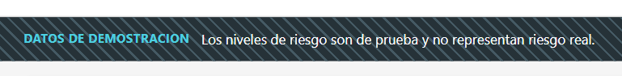
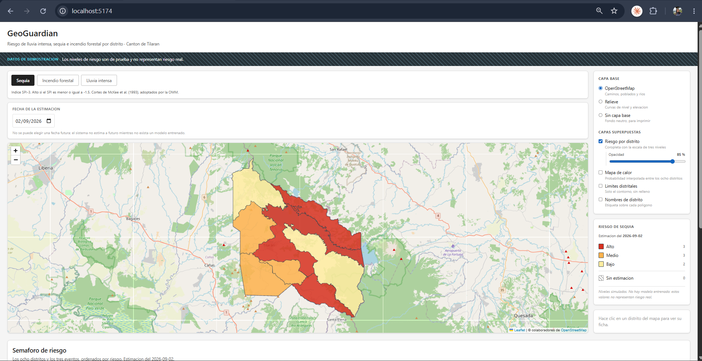
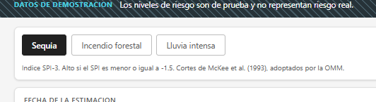
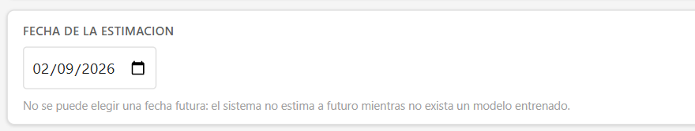
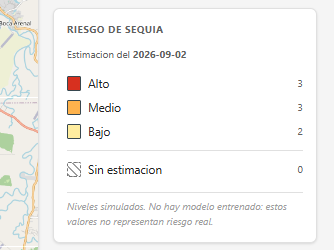
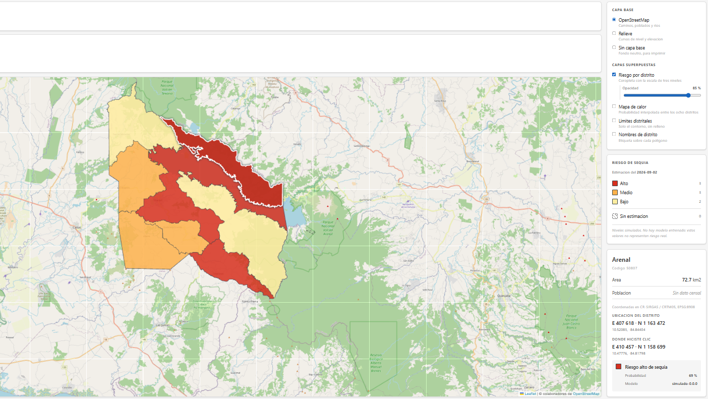
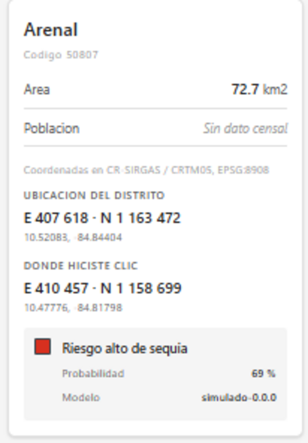
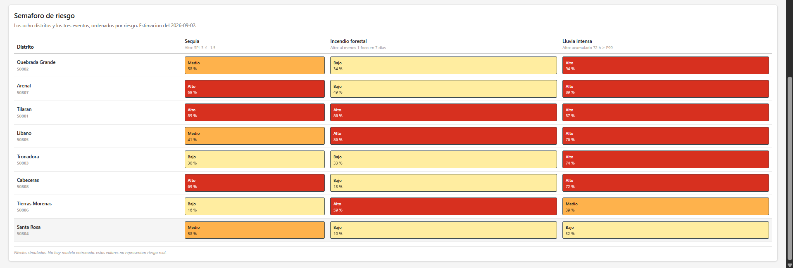
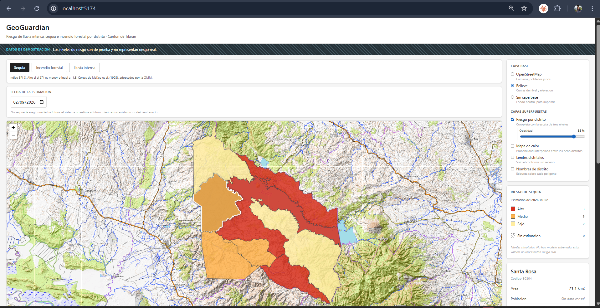

---
author:
  - "Avril Madrigal Elizondo"
  - "Alejandro Josué Rodríguez Zamora"
  - "César Andrés Ubau Calvo"
  - "Luis Alejandro Luna García"
institute: "Universidad Invenio · Ingeniería en Tecnologías de Información · III Trimestre 2026"
date: "10 de septiembre de 2026"
lang: es
---

# Manual de usuario · Visor GeoGuardian

**Historia.** H10.3 · **Autora.** Avril Madrigal Elizondo · **Fecha.** 2026-09-02
**Version del visor.** Texto actualizado al 2026-09-10 sobre el visor publicado;
**las capturas son de la version del 2026-09-02** y se renuevan en la siguiente
revision de esta historia (la pantalla «Hoy en tu distrito» y el lago no aparecen
en ellas todavia)

Este manual es para quien **usa** el visor, no para quien lo programa. Si buscas
como levantarlo, instalarlo o modificarlo, eso esta en `docs/10-manual-tecnico.md`.

---

## Antes que nada: dos direcciones, y cual estas viendo

Hay **dos** visores publicados, y la franja de arriba dice cual tenes delante.

| Direccion | Datos | Franja |
|---|---|---|
| `https://visor-production-40b5.up.railway.app/` | **Reales.** Lo que escribe la tuberia de estimacion sobre las series climaticas y los focos de calor del canton | Sin franja de demostracion. Muestra la fecha de la estimacion y, aparte, el ultimo dia con lluvia medida |
| `https://humanoidcat.github.io/geoguardian/` | **De demostracion.** El visor sin servidor detras, sirviendo su respaldo estatico | La franja de la imagen de abajo, en todas las pantallas |

> **DATOS DE DEMOSTRACION.** Los niveles de riesgo son de prueba y no representan
> riesgo real.

Esa franja **no se puede ocultar desde la interfaz**, y eso es a proposito: un
mapa de colores con nombres de distritos reales invita a creerle. Si la ves, el
visor sirve para una sola cosa: mostrar como se usa. Si no la ves, lo que ves es
la estimacion publicada, y conviene saber leerla (seccion 7).

**Lo que la estimacion real es, y lo que no.** Para lluvia intensa e incendio,
el sistema publica el nivel del estimador que la comparacion eligio; para
lluvia intensa hoy es la **linea base climatologica** —lo que ese mes suele
traer en ese distrito, sobre 35 anios de registro— porque ningun algoritmo de
aprendizaje la supero fuera del ruido. No es un pronostico meteorologico ni
reemplaza los avisos del Instituto Meteorologico Nacional. La sequia aparece
**sin estimacion**: no hay suficientes episodios historicos para modelarla.

---

## 1 · Que muestra el visor

El riesgo de tres eventos en los **ocho distritos del canton de Tilaran**, para
los siete dias siguientes a la fecha elegida:

| Evento | Cuando se considera **medio** | Cuando se considera **alto** |
|---|---|---|
| **Lluvia intensa** | Acumulado de 72 horas por encima del percentil 95 del distrito | Por encima del percentil 99 |
| **Sequia** | Indice SPI-6 entre −1,0 y −1,5 | SPI-6 menor o igual a −1,5 |
| **Incendio forestal** | *No existe nivel medio* | Al menos un foco de calor en la ventana de 7 dias |

Los umbrales no son inventados: los de sequia son los cortes de McKee y otros
(1993), adoptados por la Organizacion Meteorologica Mundial; los de lluvia
siguen el criterio de percentiles extremos del ETCCDI. Cada uno aparece escrito
en pantalla debajo del selector de evento, para que nunca haya que adivinar por
que un distrito esta en rojo.

**Incendio forestal solo se estima en tres distritos** —Santa Rosa, Libano y
Tierras Morenas—, que concentran el 88 % de los focos de calor. Los otros cinco
aparecen «sin estimacion» para ese evento; no es un fallo.

---

## 2 · Como abrirlo

Se abre en el navegador, como cualquier pagina. No hay que instalar nada ni
crear una cuenta. La direccion publica es
`https://visor-production-40b5.up.railway.app/`, y funciona en un telefono.

Si sos vos quien lo esta levantando en su propia maquina, las instrucciones estan
en `docs/10-manual-tecnico.md`, que es el manual de quien lo instala. Este no.

---

## 3 · La pantalla, de un vistazo

De arriba hacia abajo y de izquierda a derecha:

1. **El titulo**, la fecha de la estimacion y el ultimo dia con lluvia medida
   (o, en la copia de demostracion, la franja de aviso).
2. **El selector de evento**: sequia, incendio forestal, lluvia intensa.
3. **La fecha de la estimacion**, y el boton **«Hoy en tu distrito»**, que abre
   una pantalla que dice en palabras que viene esta semana en el distrito
   elegido —*tranquilo*, *atento* o *cuidado*, junto al termino tecnico— y que
   hacer. El mapa abre primero; esa pantalla esta a un clic.
4. **El mapa** del canton, con cada distrito pintado segun su nivel.
5. **A la derecha**, el control de capas, la leyenda, y la ficha del distrito que
   elijas.
6. **Mas abajo**, fuera de la primera pantalla, el **semaforo**: una tabla con los
   ocho distritos y los tres eventos a la vez.

---

## 4 · Elegir el evento

Los tres botones cambian **todo el mapa a la vez**. El que esta activo se ve en
negro.

Debajo aparece siempre la regla del evento elegido. En la imagen, para sequia,
la regla de la version del 2 de septiembre, con el indice a tres meses; hoy el
indice es a seis meses y la regla en pantalla lo dice.

**Una diferencia importante entre eventos:** incendio forestal **no tiene nivel
medio**. Solo alto o bajo. No es un olvido: con los datos historicos disponibles
—242 focos en 24 anios— la condicion que definia el nivel intermedio nunca podia
cumplirse, asi que se elimino en vez de dejar una categoria vacia. Sequia y lluvia
intensa si tienen los tres niveles.

---

## 5 · Elegir la fecha

Cambiar la fecha recarga el mapa y el semaforo con la estimacion de ese dia.

**La estimacion cubre hasta siete dias despues de la ultima corrida.** Mas alla
de esa fecha no hay estimacion, y los distritos aparecen rayados; el visor dice
cual es la ultima fecha disponible en vez de dejarte pedir una que solo puede
devolver vacio.

**Si el visor esta trabajando sin conexion con el servidor**, el selector se
reemplaza por una explicacion en vez de quedar en gris: el respaldo tiene una sola
fecha y no puede servir otra. Un control que parece funcionar y no funciona es peor
que su ausencia.

---

## 6 · Leer el mapa

La leyenda esta en la columna derecha y es la que traduce los colores:

| | Nivel | Que significa el numero al lado |
|---|---|---|
| Rojo | **Alto** | Cuantos distritos estan en ese nivel |
| Naranja | **Medio** | idem |
| Amarillo claro | **Bajo** | idem |
| Rayado | **Sin estimacion** | Distritos para los que no hay dato ese dia |

**«Sin estimacion» no es «riesgo bajo».** Es ausencia de dato, y por eso se dibuja
con una trama y no con un color de la escala: para que no se confunda con un
nivel. Si un distrito aparece rayado, lo que falta es la informacion, no el riesgo.

Arriba de la leyenda esta la fecha a la que corresponde lo que se ve. Si esa fecha
no es la de hoy, la leyenda lo avisa.

---

## 7 · La ficha de un distrito

Al hacer **clic sobre un distrito** en el mapa, aparece su ficha en la columna
derecha. El distrito elegido se resalta con un borde claro, para que se sepa cual
es sin tener que buscarlo.

De cerca:

Lo que trae:

- **Nombre y codigo** del distrito.
- **Area** en kilometros cuadrados.
- **Poblacion**, o «Sin dato censal» cuando no se tiene. Nunca se rellena con un
  numero aproximado.
- **Coordenadas**, en dos formatos.
- **El nivel de riesgo** del evento elegido, con su probabilidad y la version del
  estimador que la produjo, por ejemplo
  `climatologica@2026-09-05 f1=0.346 empate-tecnico`: quien la escribio, la fecha
  de la corrida, su desempeno medido y el veredicto de la comparacion.

### Las coordenadas, y para que sirven

    Coordenadas en CR-SIRGAS / CRTM05, EPSG:8908

    UBICACION DEL DISTRITO
    E 407 618 · N 1 163 472
    10.52083, -84.84404

    DONDE HICISTE CLIC
    E 410 457 · N 1 158 699
    10.47776, -84.81798

**CRTM05 es el sistema de coordenadas oficial de Costa Rica.** Es el que usan el
Registro Nacional, la Comision Nacional de Emergencias y los mapas del pais, asi
que es el formato en el que una posicion se puede pasar por radio o anotar en un
reporte sin que haya que convertirla.

Los numeros grandes estan en metros. Debajo, en gris, van los mismos puntos en
grados, por si hay que pegarlos en una aplicacion de mapas.

**Son dos puntos distintos y conviene no confundirlos:**

- **Ubicacion del distrito** es un punto que representa al distrito entero, y esta
  garantizado que cae **dentro** de sus limites.
- **Donde hiciste clic** es el lugar exacto que tocaste en el mapa.

Si elegis un distrito desde la tabla del semaforo en vez de hacer clic en el mapa,
**el segundo bloque no aparece**, porque no hubo ningun clic que mostrar.

### La probabilidad

El porcentaje es la **probabilidad de que el evento alcance el nivel alto**. No es
«que tan alto» es el riesgo ni una medida de intensidad: es una sola cosa, la
posibilidad de llegar a ese nivel.

Para la linea base climatologica, es la frecuencia con que ese distrito estuvo
en nivel alto en ese mes calendario a lo largo del registro. En la copia de
demostracion, ese numero no significa nada real.

---

## 8 · El semaforo

Debajo del mapa esta el semaforo: **los ocho distritos y los tres eventos en una
sola tabla**, ordenados por riesgo.

El mapa responde a «donde esta el riesgo de este evento». El semaforo responde a
otra pregunta: **«cual hay que atender primero»**, mirando los tres eventos juntos.

Cada celda muestra el nivel y su probabilidad. **Hacer clic en una celda lleva el
mapa a ese distrito y a ese evento**, asi que sirve para saltar de la tabla al
mapa sin buscar a mano.

---

## 9 · Las capas del mapa

En esta imagen esta elegida la capa **Relieve**; compara el fondo con el de la
vista general de la seccion 3, que usa OpenStreetMap. Los colores de riesgo son
los mismos: lo que cambia es el mapa de abajo.

### Capa base — se elige una

| | Para que sirve |
|---|---|
| **OpenStreetMap** | Ubicarse: caminos, poblados y rios |
| **Relieve** | Ver pendiente y elevacion, que explican por que dos distritos vecinos se comportan distinto |
| **Sin capa base** | Fondo neutro, para imprimir o para capturas de documentos |

### Capas superpuestas — se encienden y apagan sueltas

- **Riesgo por distrito** — los colores de la escala. Tiene un control de
  **opacidad** para poder ver el mapa de fondo a traves de ellos.
- **Mapa de calor** — una superficie continua interpolada entre los ocho
  distritos. *Ver la advertencia de abajo.*
- **Vegetacion (NDVI) y agua (NDWI)** — indices calculados desde imagenes
  Sentinel-2, como contexto del terreno.
- **Lago Arenal** — el agua dibujada encima de la coropleta, para que el
  distrito de Tilaran no aparezca pintando 88 km² de lago con su nivel.
- **Limites distritales** — solo el contorno, sin relleno.
- **Nombres de distrito** — la etiqueta sobre cada poligono.

> **Sobre el mapa de calor.** En la version actual, al encenderlo **no se ve
> ninguna superficie**: se dibuja por debajo de la capa de riesgo y esta la tapa.
> Lo unico que aparece son los ocho puntos de origen.
>
> El defecto esta **medido y documentado** en
> `docs/evidencias/computacion-grafica/H5.6-proyeccion-crtm05.md`, seccion «Fuera
> de alcance», con la captura que lo muestra. Esta pendiente de correccion.
>
> Y cuando se corrija, hay que leerla con cuidado: **la superficie es una ayuda
> visual, no una medicion del terreno.** Se calcula interpolando entre ocho puntos,
> asi que los valores intermedios no corresponden a ninguna medicion real.

---

## 10 · Si algo no funciona

**El mapa carga pero los colores no aparecen.** Es probable que el visor no este
alcanzando el servidor de datos. Fijate si arriba dice que esta trabajando con el
respaldo; en ese caso vas a ver una sola fecha disponible.

**Aparece un mensaje de error en rojo.** El visor muestra el error tal cual en vez
de quedarse vacio, a proposito: una pantalla en blanco se lee como «no hay datos»
cuando en realidad hubo una falla. Pasale ese texto a quien administre el sistema.

**Todos los distritos aparecen rayados.** No hay estimacion para la fecha elegida.
Proba con otra fecha.

**El mapa quedo desencuadrado.** Recarga la pagina: al abrir, el visor siempre
ajusta la vista para que el canton entero quepa en pantalla.

---

## Para quien lo revise

Este manual describe el visor **tal como esta hoy**, incluido el defecto del mapa
de calor tal como estaba medido al 2 de septiembre. Se escribio asi a proposito: un manual que describe la version que
uno quisiera tener, y no la que la persona tiene delante, hace perder mas tiempo
del que ahorra.

Cuando ese defecto se corrija, la seccion 9 se actualiza y la advertencia se cae.
**La advertencia cita donde esta medido el defecto**, y no solo que existe, para
que quien lea esto dentro de un mes pueda comprobar si sigue vigente sin
preguntarle a nadie. Cuando el defecto tenga numero de incidencia, va aca tambien.
