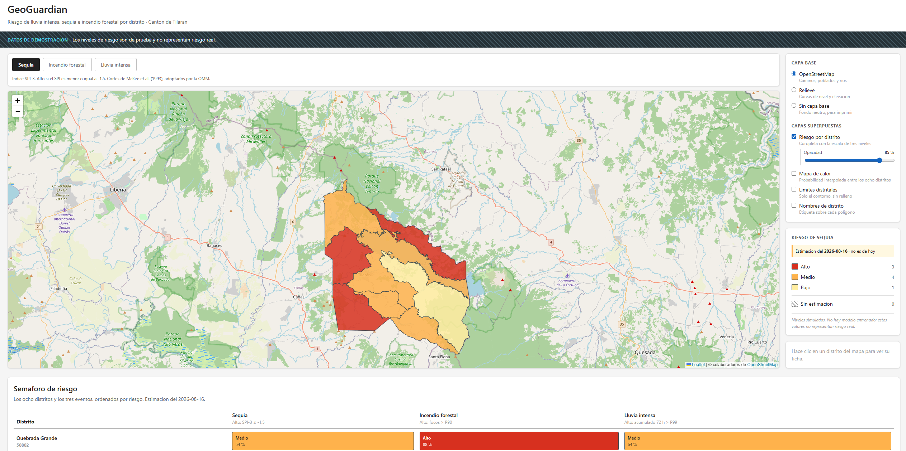

# Evidencia · H11.5 · Publicar el visor como sitio estatico

**Fecha.** 2026-08-24
**Responsable.** Alejandro Josue Rodriguez Zamora
**Materia y criterio de rubrica.** Arquitectura de Software · CICD
**Issue.** #155 · Epica E11 · 3 puntos · Sprint S3, adelantada
**Criterios de aceptacion.** `H11.5-criterios-aceptacion.md`, escritos el 23 de
agosto **antes** de tocar ningun archivo

---

## El sitio

**https://humanoidcat.github.io/geoguardian/**

Se publica solo, desde `main`, con el trabajo `publicar-visor` de
`.github/workflows/ci.yml`. Ningun paso manual.

---

## Los criterios, uno por uno

### CA-1 · Carga desde un subdirectorio

**Cumplido.** Servido el `dist` construido dentro de un subdirectorio, que es
como GitHub Pages lo entrega:

    /geoguardian/                                  200
    /geoguardian/simulados/salud.json              200
    /geoguardian/simulados/distritos.geojson       200
    /geoguardian/simulados/riesgos-sequia.json     200
    ./assets/index-*.js                            200
    ./assets/index-*.css                           200

**Y la ruta vieja sigue rota, que es la prueba de que lo sostiene el arreglo:**

    /simulados/salud.json                          404

Hizo falta `base: './'` en `vite.config.js`. **No alcanzo con eso:** Vite
reescribe `index.html` y los `assets`, pero `RESPALDO` en `cliente.js` son
cadenas que se arman en tiempo de ejecucion. Con `base` puesto y el respaldo sin
tocar, el sitio habria cargado la interfaz **sin ningun dato y sin error
visible**.

### CA-2 · El respaldo estatico se encuentra

**Cumplido.** Las rutas cuelgan de `import.meta.env.BASE_URL`. Medido antes de
arreglarlo, este era el defecto exacto:

    /geoguardian/            ->  200
    /simulados/salud.json    ->  404   <- lo que el bundle pedia

### CA-3 · La API falla y el visor cae al respaldo declarandolo

**Cumplido.** En el sitio publicado `/api/salud` devuelve 404, `negociar()` lo
captura y el visor lee el respaldo. La banda de datos de demostracion se ve en la
captura.

`verificar_h115.py` comprueba que la ruta de la API **siga siendo absoluta de
raiz**: si colgara de `BASE_URL` seguiria sin existir, pero la intencion quedaria
confusa.

### CA-4 · `npm run dev` de Avril no cambia

**Cumplido.** `base: './'` es relativo, asi que el servidor de desarrollo sigue
sirviendo en `http://localhost:5173/`. Verificado levantandolo.

Se descarto `base: '/geoguardian/'`, que habria obligado a entrar a
`localhost:5173/geoguardian/` y le habria cambiado el flujo de trabajo a otra
persona sin pedirselo.

### CA-5 · El despliegue vive en el repositorio

**Cumplido.** El trabajo `publicar-visor` de `ci.yml`, con
`actions/deploy-pages@v4`. No hay configuracion en ningun panel externo.

### CA-6 · Solo se publica desde `main`

**Cumplido.**

    if: github.ref == 'refs/heads/main' && github.event_name == 'push'

### CA-7 · El sitio declara que los datos son simulados

**Cumplido, y reescrito el 24 de agosto.** Hasta esa fecha eran **dos bandas
apiladas** que ocupaban un sexto de la pantalla, con jerga interna
—`contratos v1.4.0`, «la historia H1.3»— y una frase que llevaba once dias siendo
falsa.

Quedo en una linea:

> **Datos de demostracion** — Los niveles de riesgo son de prueba y no
> representan riesgo real.

### CA-8 · Lo comprueba una maquina

**Cumplido.** `docs/herramientas/verificar_h115.py`, **22 comprobaciones sobre el
`dist` construido** y no sobre el codigo fuente. Corre dentro del propio trabajo
de despliegue, antes de subir el artefacto.

Es deliberado que mire el artefacto: en `cliente.js` la ruta se ve bien, y el
defecto solo aparece en el bundle.

---

## Lo que fallo despues de darlo por hecho

**El despliegue no corrio, y nada salio en rojo.**

`publicar-visor` declara `needs: [frontend, gestion]`, y en un `push` el trabajo
`gestion` incluye el cruce del tablero de issues. Una issue mal cerrada —la #23,
de una historia del Sprint 4 que no existe— hizo fallar `gestion`, y el
despliegue quedo **salteado**: en gris, sin logs, sin error.

La proteccion de `main` exige solo tres contextos y `Backlog y documentacion` no
esta entre ellos, asi que el merge paso igual.

**Quedo pendiente**: agregar los dos contextos a la proteccion, para que la
proxima vez no dependa de acordarse.

## Y lo que ningun criterio comprobaba

Los ocho criterios se cumplian mientras el sitio mostraba el canton como **ocho
rectangulos sobre una grilla de tres por tres**. Ninguno preguntaba si el
contenido decia la verdad.

Esta en **I-10**, con las dos reglas que salieron de ahi. La segunda es la que
califica esta evidencia:

> Un verificador en verde dice que no fallo lo que se le pidio comprobar, no que
> el resultado este bien.

---

## Lo que esta historia desbloquea

**H9.2a**, la sesion de usabilidad con el Comite Municipal de Emergencias. Es la
unica pieza de validacion externa que **no** espera a H1.2, y hasta hoy exigia
llevar una laptop con Docker levantado.

## Lo que NO hace, y sigue sin hacer

No publica la API ni la base de datos: fuera de alcance por **D-05**. La cadena
real de despliegue son H11.1 a H11.4, bloqueadas por H6.0.

---

## Horas

    estimada  n/d   la historia salio de una pregunta del PM el 20 de agosto
                    y no se estimo antes de arrancar
    real      4.0

**Lo que no cuenta acá.** El arreglo de las geometrias del 24 de agosto es
**I-10**, un defecto aparte, y su tiempo no es alcance de esta historia.
