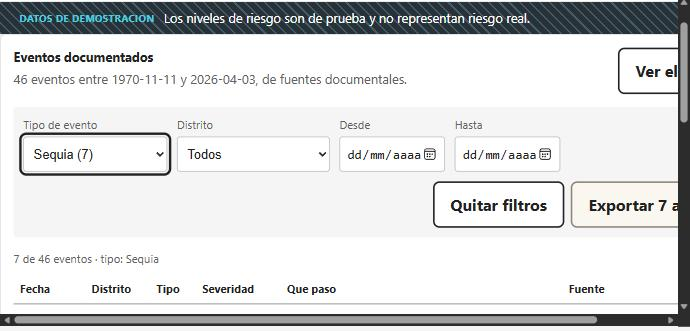
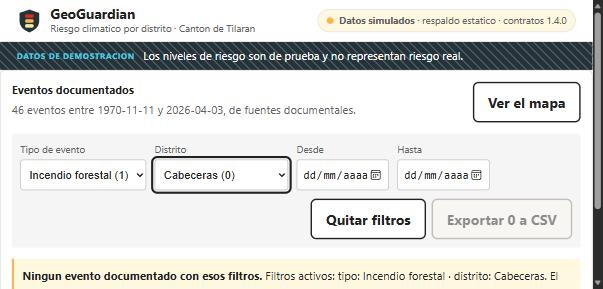
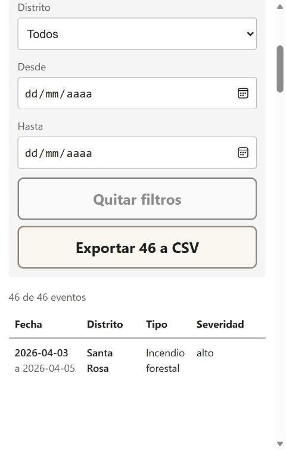
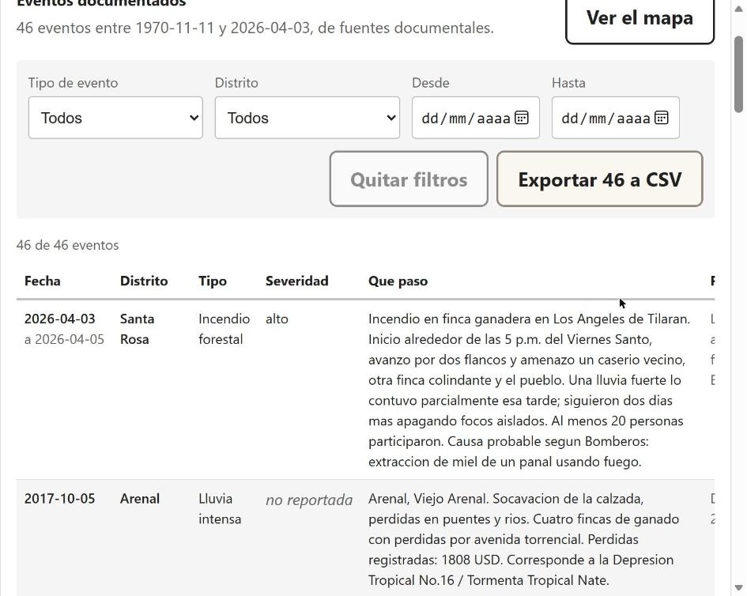
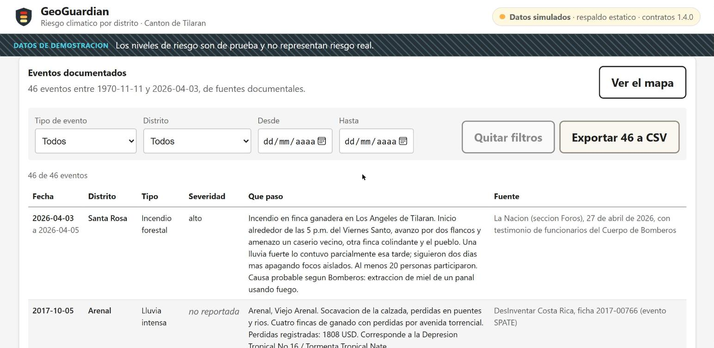

# Evidencia · H7.3 · Historial de eventos filtrable y exportable

**Fecha.** 2026-09-16
**Responsable.** Alejandro Josue Rodriguez Zamora
**Rubrica.** CG-2
**Recibida de Avril** el 2026-09-16, por el reparto del Sprint 4.
**Criterios escritos antes del codigo**, en `H7.3-criterios-aceptacion.md` (PR #342).

---

## Lo que se entrega

| Archivo | Que es |
|---|---|
| `frontend/herramientas/generar_historial.py` | Lleva el catalogo de H4.3 al visor. **Valida primero** |
| `frontend/src/datos/historial.js` | Filtrar y exportar. Funciones puras, sin React |
| `frontend/src/componentes/HistorialEventos.jsx` | La pantalla |
| `frontend/herramientas/verificar_h73.mjs` | 19 comprobaciones, cinco probadas contra su defecto |
| `frontend/public/historial/eventos.json` | 46 eventos, 20 kB. Artefacto derivado |
| `frontend/src/App.jsx`, `frontend/src/index.css` | La tercera vista y sus estilos |

46 eventos documentados entre 1970-11-11 y 2026-04-03, filtrables por tipo,
distrito y rango de fechas, exportables a CSV, **cada uno con su fuente**.

---

## La decision que la define: no se construyo la cadena que no existe

Lo primero fue buscar de donde saca el visor los eventos. **No hay de donde**:

- `RepositorioPostgres.listar_eventos` lanza `TablaPendiente` (linea 610).
- La tabla `analitico.evento` no esta en ninguna migracion.
- Ninguna de las seis rutas de la API expone eventos.

Con 3 puntos, construir tabla, implementacion, ruta y pantalla no cabe. Pero los
eventos **si existen**: H4.3 los dejo en `docs/investigacion/catalogo-eventos.csv`,
escritos desde fuentes documentales y validados contra los contratos congelados.
Lo unico que les faltaba era un camino hasta la pantalla, y ese camino ya estaba
inventado en el proyecto: `frontend/public/`, el respaldo estatico de H6.6.

**Esta historia no crea `analitico.evento`.** Si el proyecto decide despues que
los eventos vienen de la base, esta pantalla cambia de origen y no de forma, y
por eso el CA-1 pide un generador y no un archivo escrito a mano.

---

## La comprobacion

`node frontend/herramientas/verificar_h73.mjs` · **19 comprobaciones, todas OK**

### Lo que se MIDE y lo que se LEE del fuente

**CA-1, CA-3, CA-4, CA-5 y CA-6 se miden**: se abre el CSV, se abre el JSON, y se
importan y **ejecutan** `filtrar`, `describirFiltros` y `aCsv` desde
`frontend/src/datos/historial.js`.

Eso se pudo hacer porque el modulo se escribio importable desde Node: su unica
atadura a Vite, `import.meta.env.BASE_URL`, lleva `?.`. El verificador de H7.2
tiene que declarar que dos de sus criterios los lee del fuente porque el modulo
que miran no se puede ejecutar fuera del navegador. Aca esa limitacion **se quito
en vez de declararse**.

**Dos cosas se leen del fuente, y se dicen:**

| Que | Por que no se mide |
|---|---|
| CA-7, que el modulo no pide nada a la API | Probarlo de verdad exige levantar el visor con la API apagada |
| Parte del CA-5, que el componente exporte lo filtrado | Ocurre en el componente; medirlo exige montarlo |

### CA-1 · El dato es el catalogo validado

    OK  la huella registrada es la del CSV que hay ahora
    OK  46 filas en el CSV y 46 en el JSON
    OK  cada evento del JSON existe igual en el CSV

Tres y no una. La huella sola dice que el CSV no cambio desde que se genero; no
dice que el generador copiara bien. Contar filas tampoco: 46 filas equivocadas
siguen siendo 46.

La huella `sha256` es el mismo mecanismo que **I-59** puso para los PNG del
documento tecnico, y por la misma razon: un artefacto derivado que nadie cruza
contra su fuente termina diciendo algo que dejo de ser cierto.

### CA-2 · Si el catalogo no valida, no se genera nada

Tres sabotajes sobre copias del CSV, mas el control de contraste:

| Sabotaje | Codigo de salida | Escribio archivo |
|---|---|---|
| codigo de distrito de otro canton (`50101`) | 1 | **NO** |
| tipo de evento inventado (`granizo`) | 1 | **NO** |
| fecha de fin anterior a la de inicio | 1 | **NO** |
| **control: el catalogo bueno** | **0** | **SI** |

### CA-3 · Se filtra por lo que la gente pregunta

    OK  filtrar por tipo incendio da 1 y todos son de ese tipo
    OK  filtrar por Tilaran da 19, y el paquete declara 19
    OK  filtrar desde 2017-01-01 deja fuera todo lo anterior
    OK  el orden es de mas reciente a mas antiguo
    OK  ofrecer el filtro de distrito es legitimo: todas las filas traen distrito

La ultima no es decorativa: el criterio condiciona el filtro de distrito a que
**todas** las filas lo traigan, porque filtrar por un campo que la mitad no tiene
produce una lista vacia que parece un defecto. Se midio en vez de suponerlo.

Las fechas se comparan como texto, y eso es correcto: en ISO-8601 el orden
alfabetico es el cronologico. Convertir a `Date` traeria el problema de zona
horaria -`new Date('2017-10-05')` en UTC-6 es el 4 a las 18:00- y un rango
"desde el 5" dejaria fuera al evento del 5.

### CA-4 · Un filtro sin resultados lo dice

    OK  el catalogo tiene al menos un distrito sin eventos, que es el caso a probar
    OK  Cabeceras con tipo incendio da cero
    OK  la pantalla sabe nombrar los filtros: tipo: incendio · distrito: Cabeceras

El caso no se fabrico: **Cabeceras tiene cero eventos documentados** y el propio
validador lo reporta como aviso. Los ocho distritos viajan al desplegable, tambien
el que tiene cero, **con su cuenta al lado**. Ofrecer solo los siete con datos
haria que quien busca Cabeceras concluyera que el filtro esta roto; ofrecerlo con
su cuenta dice la verdad antes del clic.

### CA-5 · Exportar produce un archivo que Excel abre

    OK  empieza con BOM, que es lo que le dice a Excel que es UTF-8
    OK  el separador es ;
    OK  los saltos de linea son CRLF
    OK  1 filas exportadas para 1 filtradas (el catalogo tiene 46)
    OK  1 celdas del catalogo llevan ; o comillas, y ninguna desalinea su fila
    OK  una celda con separador y comillas dentro sigue siendo UNA fila
    OK  el componente exporta lo filtrado: aCsv(visibles) [leido del fuente]

**Se abrio en Excel el 2026-09-16 y salio en columnas.** Es lo que el criterio
pedia y lo que no se podia dar por supuesto desde el verificador. El archivo
exportado se reviso ademas byte a byte:

| | |
|---|---|
| BOM | presente |
| Saltos de linea | 47 de 47 son CRLF |
| Filas | 46 mas cabecera |
| Columnas por fila | **8 en todas**: ninguna fila se partio |
| La unica celda con `;` adentro | entrecomillada |
| Conteo por tipo | incendio 1, lluvia_intensa 38, sequia 7 |

**Y una correccion a lo que este documento afirmaba de mas.** El archivo exportado
**no tiene ni un caracter no ASCII**: el catalogo esta escrito sin tildes
-«Tilaran», «Libano», «informacion»-. El BOM esta bien puesto y es correcto que
este, pero **este archivo no habria mostrado el defecto que el BOM previene
aunque faltara**. Lo comprobado es que el BOM esta, no que haga falta aqui. El dia
que el catalogo lleve una tilde, si hara falta.

Las tres decisiones del formato, cada una por un modo de fallo concreto: **BOM**
porque sin el Excel en Windows lee cp1252 y las tildes salen como `ó`;
**punto y coma** porque donde la coma es el separador decimal el separador de
lista de Excel es `;` y un CSV con comas se abre entero en la columna A; **CRLF**
porque es lo que pide el formato.

La celda fabricada existe porque hoy **una sola** celda de 46 lleva `;` o
comillas. El dia que ninguna lo lleve, la comprobacion sobre el catalogo pasaria
sin mirar nada, que es la forma de I-58.

### CA-6 · Dice de donde salio cada evento

    OK  los 46 eventos traen fuente
    OK  la fuente viaja en el CSV exportado

La procedencia es una columna de la tabla, no una nota al pie. Una lista de
eventos sin fuente no se distingue de una inventada, y esa es la razon de que
H4.3 valga.

### CA-7 · Funciona sin API

    OK  historial.js no importa el cliente de la API   [leido del fuente]
    OK  y no nombra la ruta de la API                  [leido del fuente]

**Y ademas se midio en el visor levantado, con la API caida de verdad.** No hubo
que montar el caso: al abrir el visor el 2026-09-16 la cabecera ya declaraba
«Datos simulados · respaldo estatico», que es el aviso de H6.6 cuando `negociar()`
no alcanza la API. Preguntandole a la pagina:

    la API responde ....... 502
    /historial/eventos.json  200 application/json, 46 eventos

El historial se dibujo entero, con sus filtros y su exportacion, mientras la API
devolvia 502. Es la evidencia que el criterio pedia -`docker compose stop api`-
obtenida sin provocarla.

---

## Lo que salio de romperlo, y no de escribirlo

**Cinco sabotajes al verificador. Los cinco caen; el control limpio sale en 0.**

| Sabotaje | Que comprobacion cae |
|---|---|
| se agrega un evento al CSV y no se regenera | la huella, y la cuenta de filas |
| el filtro de tipo se desactiva | el conteo por tipo, y el del CSV exportado |
| el componente exporta `historial.eventos` | la lectura del fuente del CA-5 |
| se quita el BOM | el BOM |
| se quita el entrecomillado | la celda fabricada |

**Dos defectos aparecieron al romper, no al leer:**

**1. Mi generador salia con codigo 1 despues de haber escrito bien el archivo.**
`args.salida.relative_to(RAIZ)` lanza `ValueError` cuando `--salida` cae fuera del
repositorio, y el guion moria al imprimir. Es el **mismo defecto que
`generar_diagramas.py` ya tiene documentado en su helper `mostrar`**, reproducido
entero en codigo nuevo. Lo destapo el **control de contraste** -la corrida con el
catalogo bueno, que tenia que salir con 0 y salia con 1-, no los tres sabotajes:
sin esa corrida, los tres habrian salido en verde y el defecto se habria ido al
Pull Request.

**2. Un defecto de maquetacion que ningun verificador podia ver.** Con el visor
levantado, «Quitar filtros» y «Exportar» aparecian apilados uno encima del otro
aunque sobrara ancho: el contenedor de los filtros envuelve, y al envolver le
daba al bloque de botones una anchura de una sola columna. Se arreglo con
`flex-wrap: nowrap`, dejando el apilado solo por debajo de 600 px, que ahi si es
lo que se quiere. **Se vio mirando la pantalla, no leyendo el CSS**, y es la razon
de que el CA-8 pida capturas en vez de una comprobacion automatica.

**3. El verificador probaba `aCsv` pero no que el componente le pasara la lista
filtrada.** `aCsv` recibe una lista y exporta esa lista; probarla con la lista
filtrada solo demuestra que no inventa filas. El defecto que el CA-5 quiere
impedir -"si exporta todo, el filtro era decorativo"- ocurriria en el componente.
La descripcion afirmaba mas de lo que la condicion miraba: **la forma exacta de
I-58**, dentro de una historia escrita despues de I-58.

---

## Lo que cuesta

El paquete inicial del visor **no crece de forma apreciable**. Cota superior,
midiendo el fuente con comentarios incluidos:

    historial.js            7 651 B crudo    3 264 B gzip
    HistorialEventos.jsx    9 146 B crudo    2 958 B gzip

Es cota superior porque el minificador borra los comentarios, que aca son la
mayor parte. **Los 20 kB de `eventos.json` no entran al paquete**: se piden en
tiempo de ejecucion, como los indices de H5.5.

---

## Como se regenera

```bash
python frontend/herramientas/generar_historial.py    # valida y escribe
node frontend/herramientas/verificar_h73.mjs         # 19 comprobaciones
npm --prefix frontend run lint
npm --prefix frontend run build
```

---

## Lo que esto NO demuestra

**No demuestra que la pantalla se vea bien.** El verificador comprueba datos y
funciones; que la tabla se lea a 390 px, que los controles se alcancen con
teclado y que el CSV abra bien en Excel son cosas que se comprueban mirando, y
por eso el CA-5 y el CA-8 piden capturas.

**No demuestra que el CSV abra bien en cualquier configuracion regional.** Se
eligio `;` porque es el separador de lista donde la coma es el decimal. En una
configuracion donde el separador de lista sea la coma, abriria mal. Lo que
cambiaria entonces es `SEPARADOR`, una constante de `historial.js`.

**No crea `analitico.evento`, no implementa `listar_eventos` y no agrega ninguna
ruta a la API.** El historial muestra eventos **documentados**, no estimados.

---

## Capturas

Tomadas con el visor levantado en `npm --prefix frontend run dev`, el 2026-09-16.

**CA-3, el filtro de tipo.** Sequia: 7 de 46 eventos, y el boton pasa a decir
«Exportar 7 a CSV».



**CA-4, la combinacion sin resultados.** Incendio forestal en Cabeceras: el
mensaje nombra los dos filtros activos y «Exportar 0 a CSV» queda deshabilitado.



En las dos se ve que los desplegables llevan la cuenta al lado -«Cabeceras (0)»,
«Lluvia intensa (38)»- y que la columna **Fuente** esta en la tabla, que es el
CA-6.

### CA-8, las tres anchuras

Tomadas con el visor de verdad dentro de un `iframe` del ancho pedido: el
documento de adentro tiene su propio viewport, asi que las media queries resuelven
contra el. Se comprobo en cada una que `window.innerWidth` valiera exactamente
390, 768 y 1280 antes de disparar la captura.

**390 px.** Los filtros pasan a una columna y ocupan el ancho entero, los botones
se apilan y llegan de borde a borde, y la tabla se desplaza dentro de su
envoltura sin arrastrar la pagina.



**768 px.** Los cuatro filtros vuelven a una fila y la descripcion ya se lee
entera. La columna de fuente queda a la derecha, alcanzable desplazando la tabla.



**1280 px.** Las seis columnas caben, fuente incluida.



#### Y aqui aparecio el defecto que solo un viewport angosto de verdad muestra

A 390 px la pantalla **estaba rota**: barra horizontal en todo el documento, los
controles y los botones cortados por la derecha. Antes de tocar nada se le
pregunto a la pagina cual era el elemento que desbordaba:

    .aplicacion ..................... 375 px
    .historial ...................... 890 px   <- este
    .historial-desplazable .......... 866 px
    .tabla-historial ................ 866 px

La consecuencia no era solo que se saliera. Como la seccion medida 890 y la tabla
866, **la tabla cabia dentro de su envoltura**, asi que el `overflow-x: auto` de
`.historial-desplazable` no se activaba nunca y el desborde subia hasta el
documento.

**El primer diagnostico fue el equivocado, y se deja escrito.** Se atribuyo al
`min-width: auto` de los elementos flexibles, que es el defecto clasico. Se puso
en `0` y **no cambio nada**: seguia midiendo 890. Midiendo otra vez, los hermanos
-`.cabecera`, `.aviso-simulado`- si median 375. La diferencia estaba en que esta
seccion lleva `margin: 0 auto`, y **un margen automatico en el eje transversal
desactiva el estirado** del elemento flexible, que pasa a dimensionarse por su
contenido.

El arreglo es `width: 100%`: el ancho deja de depender del contenido, da 375 en
el telefono y en el escritorio se recorta a los 1200 de `max-width` con los
margenes automaticos centrandolo igual que antes. Medido despues:

    seccion ......................... 375 px
    envoltura ....................... 351 px
    la tabla desborda DENTRO de su envoltura ... si
    barra horizontal de pagina ................ no

**A 862 px, que es el ancho en que se probo todo lo demas, esto no se nota.**
Ningun verificador podia verlo y ninguna captura de escritorio lo habria
mostrado. Es la razon de que el CA-8 pida tres anchuras reales y no una.

### Sobre las horas

`real 0.9` **es medido, no la cifra del backlog**: es el lapso entre el primer
archivo escrito de esta historia y el ultimo, de 18:37 a 19:30 del 2026-09-16,
tomado de las fechas de modificacion en disco.

**Es un piso y no un total.** No incluye el rato anterior a las 18:37, el de leer
el catalogo, el contrato, el cliente del visor y la estructura del frontend antes
de escribir la primera linea. Eso no dejo rastro en disco y por lo tanto no se
cuenta: preferible un numero que se queda corto y se sabe por que, que uno
redondeado hacia arriba a ojo.

La cifra del backlog para esta historia es **2.9 h**, y esta en la linea de
arriba de la tarea, donde corresponde.
