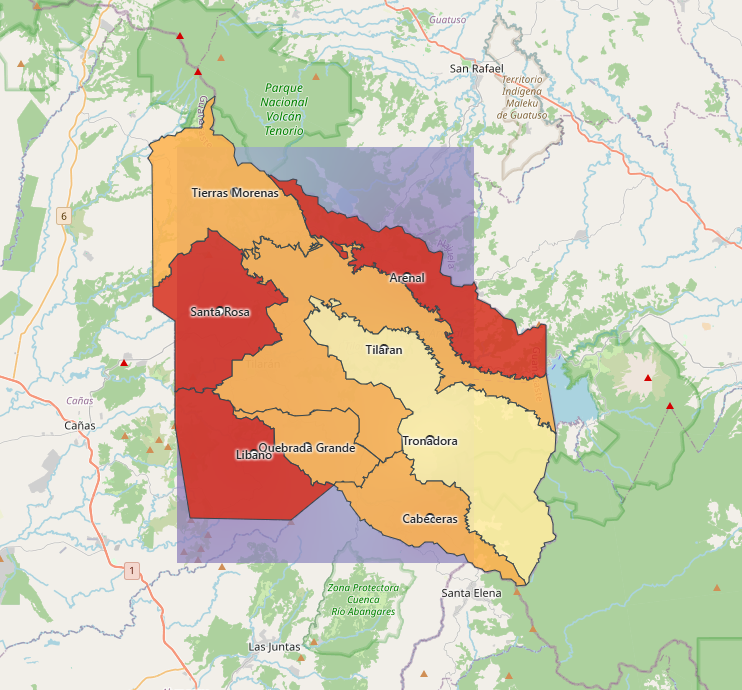

# Retroalimentacion docente sobre el visor publicado

**Fecha.** 2026-08-24
**Quien la da.** El profesor del curso, sobre el sitio publicado
**Quien la recibe.** Alejandro, Lead PM
**Sobre.** https://humanoidcat.github.io/geoguardian/ · historia H11.5

---

## Por que se registra

**Es la primera valoracion del sistema hecha por alguien de afuera del equipo.**
La validacion externa que el proyecto tiene planificada —**H9.2a**, la sesion de
usabilidad con el Comite Municipal de Emergencias— todavia no ocurrio, y depende
de que exista una URL publica. Existe desde hoy.

Esta observacion no la reemplaza: es una persona, no una sesion con instrumento,
y no se aplico el SUS ni el guion de entrevista de **H9.1**. Pero es dato de
afuera y no se descarta por ser informal.

## El contexto en que se dio

El sitio se publico el 20 de agosto y hasta hoy mostraba el canton como ocho
rectangulos sobre una grilla. Eso se corrigio esta manana —ver **I-10**— y lo
que el profesor vio ya tiene las geometrias oficiales del SNIT.

Se le aclaro que es un estado inicial y lo acepto.

---

## Lo observado

### 1. La interfaz esta poco terminada

Textual: *"en UI esta muy quedado y hay que mejorarlo"*.

La causa mas probable, medida sobre la captura: **el canton ocupa alrededor del
10 % del area del mapa**. El resto del encuadre es Guanacaste y el Pacifico.

`MapaCanton.jsx` calcula el encuadre desde la geometria recibida —decision que
hoy se cobro sola, porque las geometrias cambiaron de cuadros a limites reales
sin que el componente cambiara una linea— pero el contenedor es mucho mas ancho
que alto comparado con la forma del canton, y `fitBounds` ajusta por altura.

### 2. El borde oscuro del distrito seleccionado

Un trazo negro y grueso sobre la coropleta calida se lee como un defecto de
render antes que como una seleccion.

### 3. El mapa de calor dibuja un rectangulo

**Es un defecto visible y concreto, no una cuestion de gusto.**

La capa de calor se pinta sobre **el rectangulo que encierra al canton**, con los
bordes rectos a la vista, en vez de recortarse contra los poligonos distritales.
Se ve una caja azulada que no corresponde a ningun limite territorial y que se
extiende sobre cantones vecinos.

> **NOTA AGREGADA EL 2026-08-27. Lo que sigue, hasta el final de esta seccion,
> es del equipo, no del profesor.** Aqui empieza la interpretacion que produjo
> D-28, y es donde esta el defecto que registra **I-14**. El profesor reporto
> **un defecto de recorte**: la capa se salia del canton y habia distritos que no
> marcaba. Le gustaba la transparencia. Nunca objeto interpolar.
>
> La frase *"una segunda cuestion, distinta de la primera"* la escribio el
> equipo, y describe correctamente que son dos cosas. D-28 las junto igual.
>
> **Resultado real:** la capa volvio el 2026-08-27 por **D-30**, con el recorte
> arreglado. El defecto que el profesor si reporto se corrigio y se le puso un
> verificador.

Se describe en pantalla como *"probabilidad interpolada entre los ocho
distritos"*, y ahi hay una **segunda cuestion, distinta de la primera**:
interpolar entre ocho poligonos produce valores intermedios donde no hay
medicion. El riesgo se estima **por distrito** —un valor por poligono, no un
campo continuo—, y un degradado suave sugiere resolucion espacial dentro del
distrito que el dato no tiene.

Es simetrico al problema que resolvieron **I-05** y **D-15**: NASA POWER se
descarto para precipitacion porque su celda no distinguia entre distritos.
Rechazar una fuente por no resolver el canton y despues pintar un degradado entre
ocho valores seria incoherente.

**Resuelto el mismo dia: la capa se retira.** Es **D-28**.

No por el rectangulo, que se arreglaria recortando, sino por lo de fondo. Se
descarto arreglarlo y avisar en la leyenda que la interpolacion es visual: **el
problema no es que no se avise, es que se muestra.** Un degradado continuo
comunica resolucion espacial antes de que nadie lea la leyenda.

**H5.4 queda cerrada** —lo hecho no se borra— con una nota de revision que apunta
a D-28.

### 4. Riesgo de incendio sobre el lago Arenal — comentario al pasar

Noto que la coropleta pinta riesgo de incendio sobre la superficie del lago, y
menciono que con una fuente satelital podria calcularse el area de agua para
excluirla. **Lo planteo como observacion, no como algo que haya que hacer**, y
coincidio en que por tiempo no corresponde ahora.

La causa esta entendida: el poligono oficial del distrito incluye parte del
embalse, y la coropleta colorea el poligono completo.

**No se hace nada.** Va a las limitaciones del documento IEEE, que es donde el
proyecto pone lo que decide no resolver.

---

## Que se hace con esto

| # | Observacion | Destino |
|---|---|---|
| 1 | Encuadre | Solicitud a Avril, con criterios de aceptacion |
| 2 | Borde de seleccion | Solicitud a Avril |
| 3 | Mapa de calor | **Se retira del visor** · D-28 |
| 4 | Lago Arenal | Solo limitacion en el documento IEEE. **No se hace nada** |

Los puntos 1 y 2 se le pasaron a Avril el mismo dia.

**Corregido el 2026-08-27, por I-14.** Dos de las cuatro filas decian mas de lo
que el profesor dijo:

| # | Observacion | Destino real |
|---|---|---|
| 1 | Encuadre | Se ajusto de mas: se encerro el mapa en la forma del canton, leyendo su **captura** como especificacion. **Revertido a ancho completo.** Se conserva el `zoomSnap`, que si acercaba el canton |
| 2 | Borde de seleccion | Correcto. **Se queda** |
| 3 | Mapa de calor | Era un **defecto de recorte**. Arreglado por **D-30**, con verificador en el CI. D-28 queda revertida |
| 4 | Lago Arenal | Sin cambios. **No se hace nada** |

---

## Lo que esta observacion demuestra, y conviene no perder

**Un evaluador externo miro el sistema durante unos minutos y encontro tres cosas
que ninguna comprobacion automatica reporta.**

El mismo dia, el verificador de H11.5 daba **veintidos criterios en verde** sobre
el artefacto publicado. Ninguno mide si el encuadre es util, si una seleccion se
entiende, o si una capa afirma mas de lo que el dato sostiene.

Es la segunda vez en el dia que aparece lo mismo, y por eso quedo escrito como
regla en **I-10**:

> Un verificador en verde dice que no fallo lo que se le pidio comprobar, no que
> el resultado este bien.

Y sostiene, con evidencia externa, la decision de partir **H9.2** en dos: la
usabilidad se mide aparte de la correccion, y antes de que exista un modelo que
evaluar.
